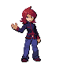
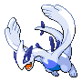

# Cerulean Cave — Trainer Rosters

### Generic Trainers

| Trainer | P1 | P2 | P3 | P4 | P5 | P6 |
|:-------:|:--:|:--:|:--:|:--:|:--:|:--:|
|  Rival Silver |  Lugia Lv. 100 |  Ho-oh Lv. 100 |  Mewtwo Lv. 100 |

