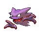

# Cerulean Cave — Wild Pokémon

---

## Pastoral Sound

### Cave, Morning

| Sprite | Pokémon | Encounter Type | Level | Chance |
|:------:|---------|:--------------:|-------|--------|
|  | Golbat | {: style="max-width: 24px;"" } {: style="max-width: 24px;"" } | 60 – 64 | 40% |
|  | Graveler | {: style="max-width: 24px;"" } {: style="max-width: 24px;"" } | 60 – 64 | 15% |
|  | Sandslash | {: style="max-width: 24px;"" } {: style="max-width: 24px;"" } | 60 – 64 | 10% |
|  | Gloom | {: style="max-width: 24px;"" } {: style="max-width: 24px;"" } | 60 – 64 | 10% |
|  | Weepinbell | {: style="max-width: 24px;"" } {: style="max-width: 24px;"" } | 60 – 64 | 10% |
|  | Venomoth | {: style="max-width: 24px;"" } {: style="max-width: 24px;"" } | 60 – 64 | 5% |
|  | Parasect | {: style="max-width: 24px;"" } {: style="max-width: 24px;"" } | 60 – 64 | 5% |
|  | Ditto | {: style="max-width: 24px;"" } {: style="max-width: 24px;"" } | 60 – 64 | 5% |

### Cave, Day

| Sprite | Pokémon | Encounter Type | Level | Chance |
|:------:|---------|:--------------:|-------|--------|
|  | Golbat | {: style="max-width: 24px;"" } {: style="max-width: 24px;"" } | 60 – 64 | 40% |
|  | Haunter | {: style="max-width: 24px;"" } {: style="max-width: 24px;"" } | 60 – 64 | 10% |
|  | Kadabra | {: style="max-width: 24px;"" } {: style="max-width: 24px;"" } | 60 – 64 | 10% |
|  | Graveler | {: style="max-width: 24px;"" } {: style="max-width: 24px;"" } | 60 – 64 | 10% |
|  | Machoke | {: style="max-width: 24px;"" } {: style="max-width: 24px;"" } | 60 – 64 | 10% |
|  | Electrode | {: style="max-width: 24px;"" } {: style="max-width: 24px;"" } | 60 – 64 | 5% |
|  | Wobbuffet | {: style="max-width: 24px;"" } {: style="max-width: 24px;"" } | 60 – 64 | 5% |
|  | Bronzong | {: style="max-width: 24px;"" } {: style="max-width: 24px;"" } | 60 – 64 | 5% |
|  | Magneton | {: style="max-width: 24px;"" } {: style="max-width: 24px;"" } | 60 – 64 | 5% |

### Cave, Night

| Sprite | Pokémon | Encounter Type | Level | Chance |
|:------:|---------|:--------------:|-------|--------|
|  | Golbat | {: style="max-width: 24px;"" } {: style="max-width: 24px;"" } | 60 – 64 | 20% |
|  | Magneton | {: style="max-width: 24px;"" } {: style="max-width: 24px;"" } | 60 – 64 | 20% |
|  | Hypno | {: style="max-width: 24px;"" } {: style="max-width: 24px;"" } | 60 – 64 | 15% |
|  | Arbok | {: style="max-width: 24px;"" } {: style="max-width: 24px;"" } | 60 – 64 | 10% |
|  | Venomoth | {: style="max-width: 24px;"" } {: style="max-width: 24px;"" } | 60 – 64 | 10% |
|  | Rapidash | {: style="max-width: 24px;"" } {: style="max-width: 24px;"" } | 60 – 64 | 10% |
|  | Parasect | {: style="max-width: 24px;"" } {: style="max-width: 24px;"" } | 60 – 64 | 5% |
|  | Kadabra | {: style="max-width: 24px;"" } {: style="max-width: 24px;"" } | 60 – 64 | 5% |
|  | Raichu | {: style="max-width: 24px;"" } {: style="max-width: 24px;"" } | 60 – 64 | 4% |
|  | Ditto | {: style="max-width: 24px;"" } {: style="max-width: 24px;"" } | 60 – 64 | 1% |

### Rock Smash

| Sprite | Pokémon | Encounter Type | Level | Chance |
|:------:|---------|:--------------:|-------|--------|
|  | Nosepass | {: style="max-width: 24px;"" } | 60 – 64 | 100% |

### Meridian Sound

| Sprite | Pokémon | Encounter Type | Level | Chance |
|:------:|---------|:--------------:|-------|--------|
|  | Exploud | {: style="max-width: 24px;"" } | 60 – 64 | 50% |
|  | Alakazam | {: style="max-width: 24px;"" } | 60 – 64 | 50% |

### Pastoral Sound

| Sprite | Pokémon | Encounter Type | Level | Chance |
|:------:|---------|:--------------:|-------|--------|
|  | Porygon | {: style="max-width: 24px;"" } | 60 – 64 | 50% |
|  | Ditto | {: style="max-width: 24px;"" } | 60 – 64 | 50% |

### Surf

| Sprite | Pokémon | Encounter Type | Level | Chance |
|:------:|---------|:--------------:|-------|--------|
|  | Golduck | {: style="max-width: 24px;"" } | 60 – 64 | 60% |
|  | Slowbro | {: style="max-width: 24px;"" } | 60 – 64 | 40% |

### Old Rod

| Sprite | Pokémon | Encounter Type | Level | Chance |
|:------:|---------|:--------------:|-------|--------|
|  | Magikarp | {: style="max-width: 24px;"" } | 10 | 100% |

### Good Rod

| Sprite | Pokémon | Encounter Type | Level | Chance |
|:------:|---------|:--------------:|-------|--------|
|  | Poliwag | {: style="max-width: 24px;"" } | 25 | 60% |
|  | Goldeen | {: style="max-width: 24px;"" } | 25 | 40% |

### Super Rod

| Sprite | Pokémon | Encounter Type | Level | Chance |
|:------:|---------|:--------------:|-------|--------|
|  | Krabby | {: style="max-width: 24px;"" } | 50 | 60% |
|  | Slowbro | {: style="max-width: 24px;"" } | 50 | 30% |
|  | Seadra | {: style="max-width: 24px;"" } | 50 | 5% |
|  | Seaking | {: style="max-width: 24px;"" } | 50 | 5% |

---

## Super Rod

### Cave, Morning

| Sprite | Pokémon | Encounter Type | Level | Chance |
|:------:|---------|:--------------:|-------|--------|
|  | Golbat | {: style="max-width: 24px;"" } {: style="max-width: 24px;"" } | 64 – 68 | 40% |
|  | Graveler | {: style="max-width: 24px;"" } {: style="max-width: 24px;"" } | 64 – 68 | 15% |
|  | Ditto | {: style="max-width: 24px;"" } {: style="max-width: 24px;"" } | 64 – 68 | 10% |
|  | Sandslash | {: style="max-width: 24px;"" } {: style="max-width: 24px;"" } | 64 – 68 | 10% |
|  | Rhyhorn | {: style="max-width: 24px;"" } {: style="max-width: 24px;"" } | 64 – 68 | 10% |
|  | Rhydon | {: style="max-width: 24px;"" } {: style="max-width: 24px;"" } | 64 – 68 | 5% |
|  | Gloom | {: style="max-width: 24px;"" } {: style="max-width: 24px;"" } | 64 – 68 | 5% |
|  | Weepinbell | {: style="max-width: 24px;"" } {: style="max-width: 24px;"" } | 64 – 68 | 5% |

### Cave, Day

| Sprite | Pokémon | Encounter Type | Level | Chance |
|:------:|---------|:--------------:|-------|--------|
|  | Golbat | {: style="max-width: 24px;"" } {: style="max-width: 24px;"" } | 64 – 68 | 20% |
|  | Graveler | {: style="max-width: 24px;"" } {: style="max-width: 24px;"" } | 64 – 68 | 20% |
|  | Wobbuffet | {: style="max-width: 24px;"" } {: style="max-width: 24px;"" } | 64 – 68 | 10% |
|  | Solrock | {: style="max-width: 24px;"" } {: style="max-width: 24px;"" } | 64 – 68 | 10% |
|  | Lunatone | {: style="max-width: 24px;"" } {: style="max-width: 24px;"" } | 64 – 68 | 10% |
|  | Electrode | {: style="max-width: 24px;"" } {: style="max-width: 24px;"" } | 64 – 68 | 10% |
|  | Arbok | {: style="max-width: 24px;"" } {: style="max-width: 24px;"" } | 64 – 68 | 5% |
|  | Sandslash | {: style="max-width: 24px;"" } {: style="max-width: 24px;"" } | 64 – 68 | 5% |
|  | Bronzong | {: style="max-width: 24px;"" } {: style="max-width: 24px;"" } | 64 – 68 | 5% |
|  | Magneton | {: style="max-width: 24px;"" } {: style="max-width: 24px;"" } | 64 – 68 | 5% |

### Cave, Night

| Sprite | Pokémon | Encounter Type | Level | Chance |
|:------:|---------|:--------------:|-------|--------|
|  | Dodrio | {: style="max-width: 24px;"" } {: style="max-width: 24px;"" } | 64 – 68 | 20% |
|  | Venomoth | {: style="max-width: 24px;"" } {: style="max-width: 24px;"" } | 64 – 68 | 20% |
|  | Kadabra | {: style="max-width: 24px;"" } {: style="max-width: 24px;"" } | 64 – 68 | 15% |
|  | Electrode | {: style="max-width: 24px;"" } {: style="max-width: 24px;"" } | 64 – 68 | 10% |
|  | Marowak | {: style="max-width: 24px;"" } {: style="max-width: 24px;"" } | 64 – 68 | 10% |
|  | Rhydon | {: style="max-width: 24px;"" } {: style="max-width: 24px;"" } | 64 – 68 | 10% |
|  | Wigglytuff | {: style="max-width: 24px;"" } {: style="max-width: 24px;"" } | 64 – 68 | 5% |
|  | Chansey | {: style="max-width: 24px;"" } {: style="max-width: 24px;"" } | 64 – 68 | 5% |
|  | Ditto | {: style="max-width: 24px;"" } {: style="max-width: 24px;"" } | 64 – 68 | 5% |

### Meridian Sound

| Sprite | Pokémon | Encounter Type | Level | Chance |
|:------:|---------|:--------------:|-------|--------|
|  | Alakazam | {: style="max-width: 24px;"" } | 64 – 68 | 50% |
|  | Rhyperior | {: style="max-width: 24px;"" } | 64 – 68 | 50% |

### Pastoral Sound

| Sprite | Pokémon | Encounter Type | Level | Chance |
|:------:|---------|:--------------:|-------|--------|
|  | Porygon | {: style="max-width: 24px;"" } | 64 – 68 | 50% |
|  | Chansey | {: style="max-width: 24px;"" } | 64 – 68 | 50% |

---

## Pastoral Sound

### Cave, Morning

| Sprite | Pokémon | Encounter Type | Level | Chance |
|:------:|---------|:--------------:|-------|--------|
|  | Golbat | {: style="max-width: 24px;"" } {: style="max-width: 24px;"" } | 68 – 72 | 40% |
|  | Ditto | {: style="max-width: 24px;"" } {: style="max-width: 24px;"" } | 68 – 72 | 15% |
|  | Graveler | {: style="max-width: 24px;"" } {: style="max-width: 24px;"" } | 68 – 72 | 15% |
|  | Rhydon | {: style="max-width: 24px;"" } {: style="max-width: 24px;"" } | 68 – 72 | 10% |
|  | Rhyhorn | {: style="max-width: 24px;"" } {: style="max-width: 24px;"" } | 68 – 72 | 10% |
|  | Chansey | {: style="max-width: 24px;"" } {: style="max-width: 24px;"" } | 68 – 72 | 5% |
|  | Lickitung | {: style="max-width: 24px;"" } {: style="max-width: 24px;"" } | 68 – 72 | 5% |

### Cave, Day

| Sprite | Pokémon | Encounter Type | Level | Chance |
|:------:|---------|:--------------:|-------|--------|
|  | Golbat | {: style="max-width: 24px;"" } {: style="max-width: 24px;"" } | 68 – 72 | 20% |
|  | Bronzong | {: style="max-width: 24px;"" } {: style="max-width: 24px;"" } | 68 – 72 | 20% |
|  | Dusclops | {: style="max-width: 24px;"" } {: style="max-width: 24px;"" } | 68 – 72 | 10% |
|  | Chimecho | {: style="max-width: 24px;"" } {: style="max-width: 24px;"" } | 68 – 72 | 10% |
|  | Banette | {: style="max-width: 24px;"" } {: style="max-width: 24px;"" } | 68 – 72 | 10% |
|  | Rhydon | {: style="max-width: 24px;"" } {: style="max-width: 24px;"" } | 68 – 72 | 10% |
|  | Magcargo | {: style="max-width: 24px;"" } {: style="max-width: 24px;"" } | 68 – 72 | 5% |
|  | Haunter | {: style="max-width: 24px;"" } {: style="max-width: 24px;"" } | 68 – 72 | 5% |
|  | Magmar | {: style="max-width: 24px;"" } {: style="max-width: 24px;"" } | 68 – 72 | 4% |
|  | Electabuzz | {: style="max-width: 24px;"" } {: style="max-width: 24px;"" } | 68 – 72 | 4% |
|  | Steelix | {: style="max-width: 24px;"" } {: style="max-width: 24px;"" } | 68 – 72 | 2% |

### Cave, Night

| Sprite | Pokémon | Encounter Type | Level | Chance |
|:------:|---------|:--------------:|-------|--------|
|  | Rhydon | {: style="max-width: 24px;"" } {: style="max-width: 24px;"" } | 68 – 72 | 20% |
|  | Electrode | {: style="max-width: 24px;"" } {: style="max-width: 24px;"" } | 68 – 72 | 20% |
|  | Marowak | {: style="max-width: 24px;"" } {: style="max-width: 24px;"" } | 68 – 72 | 15% |
|  | Raichu | {: style="max-width: 24px;"" } {: style="max-width: 24px;"" } | 68 – 72 | 10% |
|  | Parasect | {: style="max-width: 24px;"" } {: style="max-width: 24px;"" } | 68 – 72 | 10% |
|  | Chansey | {: style="max-width: 24px;"" } {: style="max-width: 24px;"" } | 68 – 72 | 10% |
|  | Ditto | {: style="max-width: 24px;"" } {: style="max-width: 24px;"" } | 68 – 72 | 10% |
|  | Sandslash | {: style="max-width: 24px;"" } {: style="max-width: 24px;"" } | 68 – 72 | 5% |

### Rock Smash

| Sprite | Pokémon | Encounter Type | Level | Chance |
|:------:|---------|:--------------:|-------|--------|
|  | Nosepass | {: style="max-width: 24px;"" } | 68 – 72 | 100% |

### Meridian Sound

| Sprite | Pokémon | Encounter Type | Level | Chance |
|:------:|---------|:--------------:|-------|--------|
|  | Dusknoir | {: style="max-width: 24px;"" } | 68 – 72 | 50% |
|  | Lickilicky | {: style="max-width: 24px;"" } | 68 – 72 | 50% |

### Pastoral Sound

| Sprite | Pokémon | Encounter Type | Level | Chance |
|:------:|---------|:--------------:|-------|--------|
|  | Clefairy | {: style="max-width: 24px;"" } | 68 – 72 | 50% |
|  | Arbok | {: style="max-width: 24px;"" } | 68 – 72 | 50% |

### Surf

| Sprite | Pokémon | Encounter Type | Level | Chance |
|:------:|---------|:--------------:|-------|--------|
|  | Gyarados | {: style="max-width: 24px;"" } | 68 – 72 | 60% |
|  | Tentacruel | {: style="max-width: 24px;"" } | 68 – 72 | 30% |
|  | Lanturn | {: style="max-width: 24px;"" } | 68 – 72 | 5% |
|  | Quagsire | {: style="max-width: 24px;"" } | 68 – 72 | 5% |

### Old Rod

| Sprite | Pokémon | Encounter Type | Level | Chance |
|:------:|---------|:--------------:|-------|--------|
|  | Barboach | {: style="max-width: 24px;"" } | 10 | 60% |
|  | Finneon | {: style="max-width: 24px;"" } | 10 | 40% |

### Good Rod

| Sprite | Pokémon | Encounter Type | Level | Chance |
|:------:|---------|:--------------:|-------|--------|
|  | Whiscash | {: style="max-width: 24px;"" } | 25 | 60% |
|  | Lumineon | {: style="max-width: 24px;"" } | 25 | 30% |
|  | Seadra | {: style="max-width: 24px;"" } | 25 | 5% |
|  | Seaking | {: style="max-width: 24px;"" } | 25 | 5% |

### Super Rod

| Sprite | Pokémon | Encounter Type | Level | Chance |
|:------:|---------|:--------------:|-------|--------|
|  | Seadra | {: style="max-width: 24px;"" } | 50 | 60% |
|  | Lumineon | {: style="max-width: 24px;"" } | 50 | 30% |
|  | Whiscash | {: style="max-width: 24px;"" } | 50 | 5% |
|  | Seaking | {: style="max-width: 24px;"" } | 50 | 5% |

