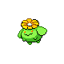

# Cerulean City Wild Pokémon

### Surf

| Sprite | Pokémon | Encounter Type | Level | Chance |
|:------:|---------|:--------------:|-------|--------|
|  | Hoppip | {: style="max-width: 24px;"" } | 20 – 50 | 60% |
|  | Goldeen | {: style="max-width: 24px;"" } | 20 – 50 | 30% |
|  | Skiploom | {: style="max-width: 24px;"" } | 20 – 50 | 7% |
|  | Masquerain | {: style="max-width: 24px;"" } | 20 – 50 | 3% |

### Old Rod

| Sprite | Pokémon | Encounter Type | Level | Chance |
|:------:|---------|:--------------:|-------|--------|
|  | Magikarp | {: style="max-width: 24px;"" } | 10 | 60% |
|  | Goldeen | {: style="max-width: 24px;"" } | 10 | 30% |
|  | Seaking | {: style="max-width: 24px;"" } | 10 | 10% |

### Good Rod

| Sprite | Pokémon | Encounter Type | Level | Chance |
|:------:|---------|:--------------:|-------|--------|
|  | Goldeen | {: style="max-width: 24px;"" } | 25 | 90% |
|  | Seaking | {: style="max-width: 24px;"" } | 25 | 10% |

### Super Rod

| Sprite | Pokémon | Encounter Type | Level | Chance |
|:------:|---------|:--------------:|-------|--------|
|  | Staryu | {: style="max-width: 24px;"" } | 50 | 60% |
|  | Seaking | {: style="max-width: 24px;"" } | 50 | 30% |
|  | Dratini | {: style="max-width: 24px;"" } | 50 | 7% |
|  | Dragonair | {: style="max-width: 24px;"" } | 50 | 3% |

