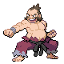

# Cianwood City — Important Trainers

---

## City

### Mystery Man Eusine

| Pokémon | Attributes | Item | Moves |
|:-------:|------------|:----:|-------|
|  | **Lv. 34** Hypno **Ability:** Insomnia  | None | 1. Psychic 2. Hypnosis 3. Focus Blast 4. Nasty Plot |
|  | **Lv. 34** Rotom **Ability:** Levitate   | None | 1. Thunderbolt 2. Shadow Ball 3. Will-O-Wisp 4. Double Team |
|  | **Lv. 34** Electrode **Ability:** Aftermath  | None | 1. Screech 2. Sonic Boom 3. Thunder 4. Explosion |
|  | **Lv. 34** Jumpluff **Ability:** Chlorophyll   | None | 1. Leech Seed 2. Cotton Spore 3. Reflect 4. Aerial Ace |

---

## Gym

### Leader Chuck

| Pokémon | Attributes | Item | Moves |
|:-------:|------------|:----:|-------|
|  | **Lv. 34** Primeape **Ability:** Anger Point  | None | 1. Substitute 2. Focus Punch 3. Thunder Punch 4. Rock Slide |
|  | **Lv. 33** Breloom **Ability:** Poison Heal   | None | 1. Spore 2. Mach Punch 3. Bullet Seed 4. Focus Punch |
|  | **Lv. 33** Hariyama **Ability:** Thick Fat  | None | 1. Fake Out 2. Whirlwind 3. Cross Chop 4. Earthquake |
|  | **Lv. 34** Hitmonlee **Ability:** Reckless  | None | 1. Fake Out 2. Rock Slide 3. Bounce 4. High Jump Kick |
|  | **Lv. 34** Hitmonchan **Ability:** Iron Fist  | None | 1. Substitute 2. Focus Punch 3. Fire Punch 4. Ice Punch |
|  | **Lv. 35** Poliwrath **Ability:** Water Absorb   |  Sitrus Berry | 1. Hypnosis 2. Focus Punch 3. Surf 4. Ice Punch |

