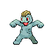
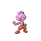

# Trainer Rosters

---

## City

### Important Trainers

1. [Mystery Man Eusine](important_trainers.md#mystery-man-eusine)

---

## Gym

### Generic Trainers

| Trainer | P1 | P2 | P3 | P4 | P5 | P6 |
|:-------:|:--:|:--:|:--:|:--:|:--:|:--:|
|  Black Belt Yoshi |  [Mankey](../../pokemon/mankey.md/) Lv. 32 |  [Meditite](../../pokemon/meditite.md/) Lv. 32 |  [Riolu](../../pokemon/riolu.md/) Lv. 32 |
|  Black Belt Nob |  [Machoke](../../pokemon/machoke.md/) Lv. 31 |  [Monferno](../../pokemon/monferno.md/) Lv. 31 |  [Heracross](../../pokemon/heracross.md/) Lv. 31 |  [Combusken](../../pokemon/combusken.md/) Lv. 31 |
|  Black Belt Lao |  [Croagunk](../../pokemon/croagunk.md/) Lv. 32 |  [Machop](../../pokemon/machop.md/) Lv. 32 |  [Tyrogue](../../pokemon/tyrogue.md/) Lv. 32 |
|  Black Belt Lung |  [Hitmonlee](../../pokemon/hitmonlee.md/) Lv. 32 |  [Hitmonchan](../../pokemon/hitmonchan.md/) Lv. 32 |  [Hitmontop](../../pokemon/hitmontop.md/) Lv. 32 |

### Important Trainers

1. [Leader Chuck](important_trainers.md#leader-chuck)
