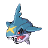

# Cianwood City — Wild Pokémon

### Rock Smash

| Sprite | Pokémon | Encounter Type | Level | Chance |
|:------:|---------|:--------------:|-------|--------|
|  | [Shuckle](../../pokemon/shuckle.md) | encounter_sprites| N/A | 90% |
|  | [Kingler](../../pokemon/kingler.md) | encounter_sprites| N/A | 10% |

### Surf

| Sprite | Pokémon | Encounter Type | Level | Chance |
|:------:|---------|:--------------:|-------|--------|
|  | [Wingull](../../pokemon/wingull.md) | encounter_sprites| N/A | 60% |
|  | [Tentacool](../../pokemon/tentacool.md) | encounter_sprites| N/A | 30% |
|  | [Pelipper](../../pokemon/pelipper.md) | encounter_sprites| N/A | 5% |
|  | [Tentacruel](../../pokemon/tentacruel.md) | encounter_sprites| N/A | 5% |

### Old Rod

| Sprite | Pokémon | Encounter Type | Level | Chance |
|:------:|---------|:--------------:|-------|--------|
|  | [Magikarp](../../pokemon/magikarp.md) | encounter_sprites| 10 | 60% |
|  | [Carvanha](../../pokemon/carvanha.md) | encounter_sprites| 10 | 40% |

### Good Rod

| Sprite | Pokémon | Encounter Type | Level | Chance |
|:------:|---------|:--------------:|-------|--------|
|  | [Carvanha](../../pokemon/carvanha.md) | encounter_sprites| 25 | 60% |
|  | [Clamperl](../../pokemon/clamperl.md) | encounter_sprites| 25 | 40% |

### Super Rod

| Sprite | Pokémon | Encounter Type | Level | Chance |
|:------:|---------|:--------------:|-------|--------|
|  | [Carvanha](../../pokemon/carvanha.md) | encounter_sprites| 50 | 60% |
|  | [Clamperl](../../pokemon/clamperl.md) | encounter_sprites| 50 | 30% |
|  | [Sharpedo](../../pokemon/sharpedo.md) | encounter_sprites| 50 | 10% |

