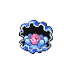

# Cianwood City Wild Pokémon

### Rock Smash

| Sprite | Pokémon | Encounter Type | Level | Chance |
|:------:|---------|:--------------:|-------|--------|
|  | Shuckle | {: style="max-width: 24px;"" } | N/A | 90% |
|  | Kingler | {: style="max-width: 24px;"" } | N/A | 10% |

### Surf

| Sprite | Pokémon | Encounter Type | Level | Chance |
|:------:|---------|:--------------:|-------|--------|
|  | Wingull | {: style="max-width: 24px;"" } | N/A | 60% |
|  | Tentacool | {: style="max-width: 24px;"" } | N/A | 30% |
|  | Pelipper | {: style="max-width: 24px;"" } | N/A | 5% |
|  | Tentacruel | {: style="max-width: 24px;"" } | N/A | 5% |

### Old Rod

| Sprite | Pokémon | Encounter Type | Level | Chance |
|:------:|---------|:--------------:|-------|--------|
|  | Magikarp | {: style="max-width: 24px;"" } | 10 | 60% |
|  | Carvanha | {: style="max-width: 24px;"" } | 10 | 40% |

### Good Rod

| Sprite | Pokémon | Encounter Type | Level | Chance |
|:------:|---------|:--------------:|-------|--------|
|  | Carvanha | {: style="max-width: 24px;"" } | 25 | 60% |
|  | Clamperl | {: style="max-width: 24px;"" } | 25 | 40% |

### Super Rod

| Sprite | Pokémon | Encounter Type | Level | Chance |
|:------:|---------|:--------------:|-------|--------|
|  | Carvanha | {: style="max-width: 24px;"" } | 50 | 60% |
|  | Clamperl | {: style="max-width: 24px;"" } | 50 | 30% |
|  | Sharpedo | {: style="max-width: 24px;"" } | 50 | 10% |

