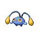

# Cinnabar Island — Wild Pokémon

### Surf

| Sprite | Pokémon | Encounter Type | Level | Chance |
|:------:|---------|:--------------:|-------|--------|
|  | [Tentacool](../../pokemon/tentacool.md) | {: style="max-width: 24px;"" }| 40 – 55 | 90% |
|  | [Tentacruel](../../pokemon/tentacruel.md) | {: style="max-width: 24px;"" }| 40 – 55 | 7% |
|  | [Relicanth](../../pokemon/relicanth.md) | {: style="max-width: 24px;"" }| 40 – 55 | 3% |

### Old Rod

| Sprite | Pokémon | Encounter Type | Level | Chance |
|:------:|---------|:--------------:|-------|--------|
|  | [Tentacool](../../pokemon/tentacool.md) | {: style="max-width: 24px;"" }| 10 | 100% |

### Good Rod

| Sprite | Pokémon | Encounter Type | Level | Chance |
|:------:|---------|:--------------:|-------|--------|
|  | [Tentacool](../../pokemon/tentacool.md) | {: style="max-width: 24px;"" }| 25 | 67% |
|  | [Chinchou](../../pokemon/chinchou.md) | {: style="max-width: 24px;"" }| 25 | 30% |
|  | [Shellder](../../pokemon/shellder.md) | {: style="max-width: 24px;"" }| 25 | 3% |

### Super Rod

| Sprite | Pokémon | Encounter Type | Level | Chance |
|:------:|---------|:--------------:|-------|--------|
|  | [Tentacruel](../../pokemon/tentacruel.md) | {: style="max-width: 24px;"" }| 50 | 60% |
|  | [Shellder](../../pokemon/shellder.md) | {: style="max-width: 24px;"" }| 50 | 33% |
|  | [Lanturn](../../pokemon/lanturn.md) | {: style="max-width: 24px;"" }| 50 | 7% |

