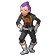
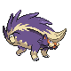

# Important Trainers

### Executive Petrel

| Pokémon | Type | Attributes | Item | Moves |
|:-------:|:----:|------------|:----:|-------|
|  |  | **Lv. 36** Raticate **Ability:** Hustle | None | 1. Hyper Fang 2. Super Fang 3. Crunch 4. Flame Wheel |
|  |   | **Lv. 36** Skuntank **Ability:** Stench | None | 1. Poison Jab 2. Flamethrower 3. Night Slash 4. Double-Edge |
|  |   | **Lv. 36** Golbat **Ability:** Inner Focus | None | 1. Wing Attack 2. Poison Fang 3. Super Fang 4. Hypnosis |
|  |  | **Lv. 37** Weezing **Ability:** Levitate | None | 1. Sludge Bomb 2. Pain Split 3. Fire Blast 4. Thunder |

