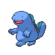
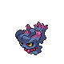

# Cliff Cave Wild Pokémon

### Cave

| Sprite | Pokémon | Encounter Type | Level | Chance |
|:------:|---------|:--------------:|-------|--------|
|  | Graveler | {: style="max-width: 24px;"" } | 30 – 33 | 20% |
|  | Golbat | {: style="max-width: 24px;"" } | 30 – 33 | 20% |
|  | Baltoy | {: style="max-width: 24px;"" } | 30 – 33 | 10% |
|  | Machoke | {: style="max-width: 24px;"" } | 30 – 33 | 10% |
|  | Trapinch | {: style="max-width: 24px;"" } | 30 – 33 | 10% |
|  | Kingler | {: style="max-width: 24px;"" } | 30 – 33 | 10% |
|  | Quagsire | {: style="max-width: 24px;"" } | 30 – 33 | 10% |
|  | Hippopotas | {: style="max-width: 24px;"" } | 30 – 33 | 8% |
|  | Steelix | {: style="max-width: 24px;"" } | 30 – 33 | 2% |

### Rock Smash

| Sprite | Pokémon | Encounter Type | Level | Chance |
|:------:|---------|:--------------:|-------|--------|
|  | Krabby | {: style="max-width: 24px;"" } | 30 – 33 | 90% |
|  | Graveler | {: style="max-width: 24px;"" } | 30 – 33 | 10% |

### Meridian Sound

| Sprite | Pokémon | Encounter Type | Level | Chance |
|:------:|---------|:--------------:|-------|--------|
|  | Claydol | {: style="max-width: 24px;"" } | 30 – 33 | 50% |
|  | Hippowdon | {: style="max-width: 24px;"" } | 30 – 33 | 50% |

### Pastoral Sound

| Sprite | Pokémon | Encounter Type | Level | Chance |
|:------:|---------|:--------------:|-------|--------|
|  | Onix | {: style="max-width: 24px;"" } | 30 – 33 | 50% |
|  | Misdreavus | {: style="max-width: 24px;"" } | 30 – 33 | 50% |

