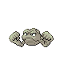

# Dark Cave — Wild Pokémon

---

## Super Rod

### Cave, Morning / Day

| Sprite | Pokémon | Encounter Type | Level | Chance |
|:------:|---------|:--------------:|-------|--------|
|  | Geodude | {: style="max-width: 24px;"" } {: style="max-width: 24px;"" } {: style="max-width: 24px;"" } | 8 – 10 | 20% |
|  | Zubat | {: style="max-width: 24px;"" } {: style="max-width: 24px;"" } {: style="max-width: 24px;"" } | 8 – 10 | 20% |
|  | Bronzor | {: style="max-width: 24px;"" } {: style="max-width: 24px;"" } {: style="max-width: 24px;"" } | 8 – 10 | 10% |
|  | Makuhita | {: style="max-width: 24px;"" } {: style="max-width: 24px;"" } {: style="max-width: 24px;"" } | 8 – 10 | 10% |
|  | Sandshrew | {: style="max-width: 24px;"" } {: style="max-width: 24px;"" } {: style="max-width: 24px;"" } | 8 – 10 | 10% |
|  | Teddiursa | {: style="max-width: 24px;"" } {: style="max-width: 24px;"" } {: style="max-width: 24px;"" } | 8 – 10 | 10% |
|  | Slugma | {: style="max-width: 24px;"" } {: style="max-width: 24px;"" } {: style="max-width: 24px;"" } | 8 – 10 | 10% |
|  | Larvitar | {: style="max-width: 24px;"" } {: style="max-width: 24px;"" } {: style="max-width: 24px;"" } | 8 – 10 | 4% |
|  | Dunsparce | {: style="max-width: 24px;"" } {: style="max-width: 24px;"" } {: style="max-width: 24px;"" } | 8 – 10 | 4% |
|  | Chingling | {: style="max-width: 24px;"" } {: style="max-width: 24px;"" } {: style="max-width: 24px;"" } | 8 – 10 | 2% |

### Cave, Night

| Sprite | Pokémon | Encounter Type | Level | Chance |
|:------:|---------|:--------------:|-------|--------|
|  | Geodude | {: style="max-width: 24px;"" } {: style="max-width: 24px;"" } | 8 – 10 | 20% |
|  | Zubat | {: style="max-width: 24px;"" } {: style="max-width: 24px;"" } | 8 – 10 | 20% |
|  | Bronzor | {: style="max-width: 24px;"" } {: style="max-width: 24px;"" } | 8 – 10 | 10% |
|  | Makuhita | {: style="max-width: 24px;"" } {: style="max-width: 24px;"" } | 8 – 10 | 10% |
|  | Sandshrew | {: style="max-width: 24px;"" } {: style="max-width: 24px;"" } | 8 – 10 | 10% |
|  | Wynaut | {: style="max-width: 24px;"" } {: style="max-width: 24px;"" } | 8 – 10 | 10% |
|  | Slugma | {: style="max-width: 24px;"" } {: style="max-width: 24px;"" } | 8 – 10 | 10% |
|  | Larvitar | {: style="max-width: 24px;"" } {: style="max-width: 24px;"" } | 8 – 10 | 4% |
|  | Dunsparce | {: style="max-width: 24px;"" } {: style="max-width: 24px;"" } | 8 – 10 | 4% |
|  | Chingling | {: style="max-width: 24px;"" } {: style="max-width: 24px;"" } | 8 – 10 | 2% |

### Meridian Sound

| Sprite | Pokémon | Encounter Type | Level | Chance |
|:------:|---------|:--------------:|-------|--------|
|  | Golbat | {: style="max-width: 24px;"" } | 8 – 10 | 100% |

### Pastoral Sound

| Sprite | Pokémon | Encounter Type | Level | Chance |
|:------:|---------|:--------------:|-------|--------|
|  | Chingling | {: style="max-width: 24px;"" } | 8 – 10 | 100% |

### Swarm

| Sprite | Pokémon | Encounter Type | Level | Chance |
|:------:|---------|:--------------:|-------|--------|
|  | Larvitar | {: style="max-width: 24px;"" } | 8 – 10 | 100% |

### Surf

| Sprite | Pokémon | Encounter Type | Level | Chance |
|:------:|---------|:--------------:|-------|--------|
|  | Shellos | {: style="max-width: 24px;"" } | 8 – 10 | 60% |
|  | Wooper | {: style="max-width: 24px;"" } | 8 – 10 | 30% |
|  | Gastrodon | {: style="max-width: 24px;"" } | 8 – 10 | 10% |

### Old Rod

| Sprite | Pokémon | Encounter Type | Level | Chance |
|:------:|---------|:--------------:|-------|--------|
|  | Goldeen | {: style="max-width: 24px;"" } | 10 | 60% |
|  | Barboach | {: style="max-width: 24px;"" } | 10 | 30% |
|  | Wooper | {: style="max-width: 24px;"" } | 10 | 10% |

### Good Rod

| Sprite | Pokémon | Encounter Type | Level | Chance |
|:------:|---------|:--------------:|-------|--------|
|  | Goldeen | {: style="max-width: 24px;"" } | 25 | 60% |
|  | Barboach | {: style="max-width: 24px;"" } | 25 | 30% |
|  | Quagsire | {: style="max-width: 24px;"" } | 25 | 10% |

### Super Rod

| Sprite | Pokémon | Encounter Type | Level | Chance |
|:------:|---------|:--------------:|-------|--------|
|  | Seaking | {: style="max-width: 24px;"" } | 50 | 60% |
|  | Whiscash | {: style="max-width: 24px;"" } | 50 | 30% |
|  | Quagsire | {: style="max-width: 24px;"" } | 50 | 10% |

### Rock Smash

| Sprite | Pokémon | Encounter Type | Level | Chance |
|:------:|---------|:--------------:|-------|--------|
|  | Dunsparce | {: style="max-width: 24px;"" } | 8 – 10 | 90% |
|  | Nosepass | {: style="max-width: 24px;"" } | 8 – 10 | 10% |

---

## Rock Smash

### Cave

| Sprite | Pokémon | Encounter Type | Level | Chance |
|:------:|---------|:--------------:|-------|--------|
|  | Graveler | {: style="max-width: 24px;"" } | 26 – 30 | 20% |
|  | Golbat | {: style="max-width: 24px;"" } | 26 – 30 | 20% |
|  | Teddiursa | {: style="max-width: 24px;"" } | 26 – 30 | 20% |
|  | Slugma | {: style="max-width: 24px;"" } | 26 – 30 | 20% |
|  | Wobbuffet | {: style="max-width: 24px;"" } | 26 – 30 | 15% |
|  | Ursaring | {: style="max-width: 24px;"" } | 26 – 30 | 5% |

### Surf

| Sprite | Pokémon | Encounter Type | Level | Chance |
|:------:|---------|:--------------:|-------|--------|
|  | Shellos | {: style="max-width: 24px;"" } | 26 – 30 | 60% |
|  | Wooper | {: style="max-width: 24px;"" } | 26 – 30 | 30% |
|  | Gastrodon | {: style="max-width: 24px;"" } | 26 – 30 | 10% |

### Old Rod

| Sprite | Pokémon | Encounter Type | Level | Chance |
|:------:|---------|:--------------:|-------|--------|
|  | Goldeen | {: style="max-width: 24px;"" } | 10 | 60% |
|  | Barboach | {: style="max-width: 24px;"" } | 10 | 30% |
|  | Wooper | {: style="max-width: 24px;"" } | 10 | 10% |

### Good Rod

| Sprite | Pokémon | Encounter Type | Level | Chance |
|:------:|---------|:--------------:|-------|--------|
|  | Goldeen | {: style="max-width: 24px;"" } | 25 | 60% |
|  | Barboach | {: style="max-width: 24px;"" } | 25 | 30% |
|  | Quagsire | {: style="max-width: 24px;"" } | 25 | 10% |

### Super Rod

| Sprite | Pokémon | Encounter Type | Level | Chance |
|:------:|---------|:--------------:|-------|--------|
|  | Seaking | {: style="max-width: 24px;"" } | 50 | 60% |
|  | Whiscash | {: style="max-width: 24px;"" } | 50 | 30% |
|  | Quagsire | {: style="max-width: 24px;"" } | 50 | 10% |

### Meridian Sound

| Sprite | Pokémon | Encounter Type | Level | Chance |
|:------:|---------|:--------------:|-------|--------|
|  | Golem | {: style="max-width: 24px;"" } | 26 – 30 | 50% |
|  | Ursaring | {: style="max-width: 24px;"" } | 26 – 30 | 50% |

### Pastoral Sound

| Sprite | Pokémon | Encounter Type | Level | Chance |
|:------:|---------|:--------------:|-------|--------|
|  | Quagsire | {: style="max-width: 24px;"" } | 26 – 30 | 100% |

