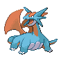

# Important Trainers

### Leader Claire

| Pokémon | Attributes | Item | Moves |
|:-------:|------------|:----:|-------|
|  | **Lv. 76** [Gyarados](../../pokemon/gyarados.md/) **Ability:** Intimidate | None | 1. Dragon Dance 2. Stone Edge 3. Earthquake 4. Waterfall |
|  | **Lv. 76** [Salamence](../../pokemon/salamence.md/) **Ability:** Intimidate | None | 1. Outrage 2. Hydro Pump 3. Draco Meteor 4. Dragon Pulse |
|  | **Lv. 78** [Kingdra](../../pokemon/kingdra.md/) **Ability:** Sniper | None | 1. Dragon Dance 2. Waterfall 3. Outrage 4. Draco Meteor |

### Champion Lance

| Pokémon | Attributes | Item | Moves |
|:-------:|------------|:----:|-------|
|  | **Lv. 84** [Charizard](../../pokemon/charizard.md/) **Ability:** Blaze | None | 1. Sunny Day 2. Overheat 3. Fire Blast 4. Air Slash |
|  | **Lv. 84** [Flygon](../../pokemon/flygon.md/) **Ability:** Levitate | None | 1. Outrage 2. Earthquake 3. U-Turn 4. Thunder Punch |
|  | **Lv. 88** [Dragonite](../../pokemon/dragonite.md/) **Ability:** Inner Focus | None | 1. Agility 2. Outrage 3. Fire Blast 4. Earthquake |

