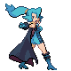

# Important Trainers

### Leader Clair

| Pokémon | Attributes | Item | Moves |
|:-------:|------------|:----:|-------|
|  | **Lv. 76** Gyarados **Ability:** Intimidate | None | 1. Dragon Dance 2. Stone Edge 3. Earthquake 4. Waterfall |
|  | **Lv. 76** Salamence **Ability:** Intimidate | None | 1. Outrage 2. Hydro Pump 3. Draco Meteor 4. Dragon Pulse |
|  | **Lv. 78** Kingdra **Ability:** Sniper | None | 1. Dragon Dance 2. Waterfall 3. Outrage 4. Draco Meteor |

### Champion Lance

| Pokémon | Attributes | Item | Moves |
|:-------:|------------|:----:|-------|
|  | **Lv. 84** Charizard **Ability:** Blaze | None | 1. Sunny Day 2. Overheat 3. Fire Blast 4. Air Slash |
|  | **Lv. 84** Flygon **Ability:** Levitate | None | 1. Outrage 2. Earthquake 3. U-Turn 4. Thunder Punch |
|  | **Lv. 88** Dragonite **Ability:** Inner Focus | None | 1. Agility 2. Outrage 3. Fire Blast 4. Earthquake |

### Rival Silver

=== "Totodile"

	| Pokémon | Attributes | Item | Moves |
	|:-------:|------------|:----:|-------|
	|  | **Lv. 78** Meganium **Ability:** Overgrow | None | 1. Swords Dance 2. Reflect 3. Seed Bomb 4. Earthquake |
	|  | **Lv. 77** Kingdra **Ability:** Swift Swim | None | 1. Surf 2. Ice Beam 3. Dragon Pulse 4. Double Team |
	|  | **Lv. 77** Magmortar **Ability:** Flame Body | None | 1. Flamethrower 2. Psychic 3. Thunderbolt 4. Focus Blast |
	
=== "Chikorita"

	| Pokémon | Attributes | Item | Moves |
	|:-------:|------------|:----:|-------|
	|  | **Lv. 78** Typhlosion **Ability:** Blaze | None | 1. Eruption 2. Fire Blast 3. Focus Blast 4. Earthquake |
	|  | **Lv. 77** Kingdra **Ability:** Swift Swim | None | 1. Surf 2. Ice Beam 3. Dragon Pulse 4. Double Team |
	|  | **Lv. 77** Electivire **Ability:** Motor Drive | None | 1. Thunder Punch 2. Ice Punch 3. Earthquake 4. Brick Break |
	
=== "Cyndaquil"

	| Pokémon | Attributes | Item | Moves |
	|:-------:|------------|:----:|-------|
	|  | **Lv. 78** Feraligatr **Ability:** Torrent | None | 1. Aqua Tail 2. Ice Fang 3. Earthquake 4. Rock Slide |
	|  | **Lv. 77** Magmortar **Ability:** Flame Body | None | 1. Flamethrower 2. Psychic 3. Thunderbolt 4. Focus Blast |
	|  | **Lv. 77** Electivire **Ability:** Motor Drive | None | 1. Thunder Punch 2. Ice Punch 3. Earthquake 4. Brick Break |
	
