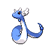

# Trainer Rosters

### Generic Trainers

| Trainer | P1 | P2 | P3 | P4 | P5 | P6 |
|:-------:|:--:|:--:|:--:|:--:|:--:|:--:|
|  Ace Trainer Kobe |  Dragonair Lv. 47 |
|  Ace Trainer Piper |  Gabite Lv. 46 |  Dragonair Lv. 46 |  Shelgon Lv. 46 |
|  Twins Clea & Gil |  Vibrava Lv. 47 |  Altaria Lv. 47 |
|  Rival Silver |  Meganium Lv. 78 |  Kingdra Lv. 77 |  Magmortar Lv. 77 |
|  Rival Silver |  Typhlosion Lv. 78 |  Electivire Lv. 77 |  Kingdra Lv. 77 |
|  Rival Silver |  Feraligatr Lv. 78 |  Electivire Lv. 77 |  Magmortar Lv. 77 |

### Important Trainers

1. [Leader Clair](important_trainers.md#leader-clair)
1. [Champion Lance](important_trainers.md#champion-lance)
