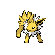
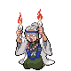

# Ecruteak City — Trainer Rosters

---

## City

### Generic Trainers

| Trainer | P1 | P2 | P3 | P4 | P5 | P6 |
|:-------:|:--:|:--:|:--:|:--:|:--:|:--:|
|  Team Rocket Grunt |  [Koffing](../../pokemon/koffing.md/) Lv. 25 |  [Golbat](../../pokemon/golbat.md/) Lv. 25 |
|  Kimono Girl Zuki |  [Umbreon](../../pokemon/umbreon.md/) Lv. 50 |
|  Kimono Girl Naoko |  [Espeon](../../pokemon/espeon.md/) Lv. 50 |
|  Kimono Girl Izumi |  [Leafeon](../../pokemon/leafeon.md/) Lv. 50 |
|  Kimono Girl Misa |  [Glaceon](../../pokemon/glaceon.md/) Lv. 50 |
|  Kimono Girl Miki |  [Flareon](../../pokemon/flareon.md/) Lv. 50 |
|  Kimono Girl Sayo |  [Jolteon](../../pokemon/jolteon.md/) Lv. 50 |
|  Kimono Girl Kuni |  [Vaporeon](../../pokemon/vaporeon.md/) Lv. 50 |

### Important Trainers

1. [Kimono Girls](important_trainers.md#kimono-girls)

---

## Gym

### Generic Trainers

| Trainer | P1 | P2 | P3 | P4 | P5 | P6 |
|:-------:|:--:|:--:|:--:|:--:|:--:|:--:|
|  Medium Georgina |  [Gastly](../../pokemon/gastly.md/) Lv. 26 |  [Duskull](../../pokemon/duskull.md/) Lv. 26 |  [Shuppet](../../pokemon/shuppet.md/) Lv. 26 |
|  Medium Grace |  [Haunter](../../pokemon/haunter.md/) Lv. 27 |  [Sableye](../../pokemon/sableye.md/) Lv. 27 |
|  Medium Edith |  [Drifloon](../../pokemon/drifloon.md/) Lv. 26 |  [Misdreavus](../../pokemon/misdreavus.md/) Lv. 26 |  [Froslass](../../pokemon/froslass.md/) Lv. 26 |
|  Medium Martha |  [Drifblim](../../pokemon/drifblim.md/) Lv. 28 |

### Important Trainers

1. [Leader Morty](important_trainers.md#leader-morty)
