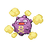

# Ecruteak City — Trainer Rosters

---

## City

### Generic Trainers

| Trainer | P1 | P2 | P3 | P4 | P5 | P6 |
|:-------:|:--:|:--:|:--:|:--:|:--:|:--:|
|  Team Rocket Grunt |  Koffing Lv. 25 |  Golbat Lv. 25 |
|  Kimono Girl Zuki |  Umbreon Lv. 50 |
|  Kimono Girl Naoko |  Espeon Lv. 50 |
|  Kimono Girl Izumi |  Leafeon Lv. 50 |
|  Kimono Girl Misa |  Glaceon Lv. 50 |
|  Kimono Girl Miki |  Flareon Lv. 50 |
|  Kimono Girl Sayo |  Jolteon Lv. 50 |
|  Kimono Girl Kuni |  Vaporeon Lv. 50 |

### Important Trainers

1. [Kimono Girls](important_trainers.md#kimono-girls)

---

## Gym

### Generic Trainers

| Trainer | P1 | P2 | P3 | P4 | P5 | P6 |
|:-------:|:--:|:--:|:--:|:--:|:--:|:--:|
|  Medium Georgina |  Gastly Lv. 26 |  Duskull Lv. 26 |  Shuppet Lv. 26 |
|  Medium Grace |  Haunter Lv. 27 |  Sableye Lv. 27 |
|  Medium Edith |  Drifloon Lv. 26 |  Misdreavus Lv. 26 |  Froslass Lv. 26 |
|  Medium Martha |  Drifblim Lv. 28 |

### Important Trainers

1. [Leader Morty](important_trainers.md#leader-morty)
