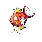

# Ecruteak City — Wild Pokémon

### Surf

| Sprite | Pokémon | Encounter Type | Level | Chance |
|:------:|---------|:--------------:|-------|--------|
|  | Poliwag | {: style="max-width: 24px;"" } | N/A | 90% |
|  | Poliwhirl | {: style="max-width: 24px;"" } | N/A | 10% |

### Old Rod

| Sprite | Pokémon | Encounter Type | Level | Chance |
|:------:|---------|:--------------:|-------|--------|
|  | Magikarp | {: style="max-width: 24px;"" } | 10 | 100% |

### Good Rod

| Sprite | Pokémon | Encounter Type | Level | Chance |
|:------:|---------|:--------------:|-------|--------|
|  | Magikarp | {: style="max-width: 24px;"" } | 25 | 60% |
|  | Poliwag | {: style="max-width: 24px;"" } | 25 | 40% |

### Super Rod

| Sprite | Pokémon | Encounter Type | Level | Chance |
|:------:|---------|:--------------:|-------|--------|
|  | Poliwhirl | {: style="max-width: 24px;"" } | 50 | 60% |
|  | Gyarados | {: style="max-width: 24px;"" } | 50 | 40% |

