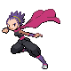
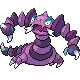

# Important Trainers

---

## Gym

### Leader Janine

| Pokémon | Type | Attributes | Item | Moves |
|:-------:|:----:|------------|:----:|-------|
|  |   | **Lv. 58** Ariados **Ability:** Sniper | None | 1. Bug Bite 2. Agility 3. Spider Web 4. Baton Pass |
|  |   | **Lv. 58** Toxicroak **Ability:** Dry Skin | None | 1. Cross Chop 2. Poison Jab 3. Stone Edge 4. Sucker Punch |
|  |   | **Lv. 58** Drapion **Ability:** Sniper |  Sitrus Berry | 1. Cross Poison 2. Earthquake 3. Crunch 4. Aqua Tail |
|  |  | **Lv. 60** Weezing **Ability:** Levitate | None | 1. Flamethrower 2. Thunderbolt 3. Will-O-Wisp 4. Pain Split |
|  |   | **Lv. 60** Qwilfish **Ability:** Intimidate | None | 1. Surf 2. Poison Jab 3. Thunder Wave 4. Aqua Jet |
|  |   | **Lv. 64** Venomoth **Ability:** Tinted Lens |  Sitrus Berry | 1. Psychic 2. Bug Buzz 3. Sleep Powder 4. Giga Drain |

