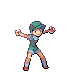

# Fuchsia City — Trainer Rosters

---

## Gym

### Generic Trainers

| Trainer | P1 | P2 | P3 | P4 | P5 | P6 |
|:-------:|:--:|:--:|:--:|:--:|:--:|:--:|
|  Picnicker Cindy |  Nidoqueen Lv. 62 |
|  Camper Barry |  Nidoking Lv. 63 |
|  Lass Alice |  Tentacruel Lv. 60 |  Seviper Lv. 60 |  Arbok Lv. 60 |
|  Lass Linda |  Beedrill Lv. 60 |  Victreebel Lv. 60 |  Roserade Lv. 60 |

### Important Trainers

1. [Leader Janine](important_trainers.md#leader-janine)
