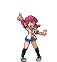
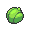

# Important Trainers

---

## Gym

### Leader Whitney

| Pokémon | Type | Attributes | Item | Moves |
|:-------:|:----:|------------|:----:|-------|
|  |  | **Lv. 21** Lickitung **Ability:** Own Tempo | None | 1. Power Whip 2. Disable 3. Body Slam 4. Attract |
|  |  | **Lv. 21** Lopunny **Ability:** Limber | None | 1. Attract 2. Jump Kick 3. Agility 4. Dizzy Punch |
|  |  | **Lv. 21** Stantler **Ability:** Intimidate | None | 1. Hypnosis 2. Stomp 3. Zen Headbutt 4. Attract |
|  |   | **Lv. 22** Wigglytuff **Ability:** Cute Charm | None | 1. Ice Beam 2. Wish 3. Psychic 4. Attract |
|  |  | **Lv. 22** Clefable **Ability:** Magic Guard |  Sitrus Berry | 1. Water Pulse 2. Reflect 3. Charge Beam 4. Attract |
|  |  | **Lv. 22** Miltank **Ability:** Scrappy |  Lum Berry | 1. Milk Drink 2. Body Slam 3. Rollout 4. Attract |

---

## City

### Rival Silver

=== "Totodile"

	| Pokémon | Type | Attributes | Item | Moves |
	|:-------:|:----:|------------|:----:|-------|
	|  |   | **Lv. 45** Honchkrow **Ability:** Insomnia | None | 1. Drill Peck 2. Toxic 3. Protect 4. Roost |
	|  |   | **Lv. 45** Gengar **Ability:** Levitate | None | 1. Shadow Ball 2. Giga Drain 3. Thunder 4. Hypnosis |
	|  |  | **Lv. 45** Alakazam **Ability:** Synchronize | None | 1. Psychic 2. Shock Wave 3. Energy Ball 4. Thunder Wave |
	|  |  | **Lv. 44** Seadra **Ability:** Poison Point | None | 1. Surf 2. Focus Energy 3. Ice Beam 4. Dragon Breath |
	|  |  | **Lv. 44** Magmar **Ability:** Flame Body | None | 1. Flamethrower 2. Will-O-Wisp 3. Focus Blast 4. Psychic |
	|  |  | **Lv. 46** Meganium **Ability:** Overgrow | None | 1. Seed Bomb 2. Reflect 3. Swords Dance 4. Body Slam |
	
=== "Chikorita"

	| Pokémon | Type | Attributes | Item | Moves |
	|:-------:|:----:|------------|:----:|-------|
	|  |   | **Lv. 45** Honchkrow **Ability:** Insomnia | None | 1. Drill Peck 2. Toxic 3. Protect 4. Roost |
	|  |   | **Lv. 45** Gengar **Ability:** Levitate | None | 1. Shadow Ball 2. Giga Drain 3. Thunder 4. Hypnosis |
	|  |  | **Lv. 45** Alakazam **Ability:** Synchronize | None | 1. Psychic 2. Shock Wave 3. Energy Ball 4. Thunder Wave |
	|  |  | **Lv. 44** Seadra **Ability:** Poison Point | None | 1. Surf 2. Focus Energy 3. Ice Beam 4. Dragon Breath |
	|  |  | **Lv. 44** Electabuzz **Ability:** Static | None | 1. Thunderbolt 2. Thunder Wave 3. Psychic 4. Focus Blast |
	|  |  | **Lv. 46** Typhlosion **Ability:** Blaze | None | 1. Flamethrower 2. Focus Blast 3. Rock Slide 4. Shadow Claw |
	
=== "Cyndaquil"

	| Pokémon | Type | Attributes | Item | Moves |
	|:-------:|:----:|------------|:----:|-------|
	|  |   | **Lv. 45** Honchkrow **Ability:** Insomnia | None | 1. Drill Peck 2. Toxic 3. Protect 4. Roost |
	|  |   | **Lv. 45** Gengar **Ability:** Levitate | None | 1. Shadow Ball 2. Giga Drain 3. Thunder 4. Hypnosis |
	|  |  | **Lv. 45** Alakazam **Ability:** Synchronize | None | 1. Psychic 2. Shock Wave 3. Energy Ball 4. Thunder Wave |
	|  |  | **Lv. 44** Magmar **Ability:** Flame Body | None | 1. Flamethrower 2. Will-O-Wisp 3. Focus Blast 4. Psychic |
	|  |  | **Lv. 44** Electabuzz **Ability:** Static | None | 1. Thunderbolt 2. Thunder Wave 3. Psychic 4. Focus Blast |
	|  |  | **Lv. 46** Feraligatr **Ability:** Torrent | None | 1. Waterfall 2. Crunch 3. Ice Fang 4. Swords Dance |
	
