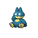
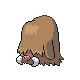

# Goldenrod City — Trainer Rosters

---

## Gym

### Generic Trainers

| Trainer | P1 | P2 | P3 | P4 | P5 | P6 |
|:-------:|:--:|:--:|:--:|:--:|:--:|:--:|
|  Beauty Victoria |  [Whismur](../../pokemon/whismur.md/) Lv. 20 |  [Teddiursa](../../pokemon/teddiursa.md/) Lv. 20 |  [Snubbull](../../pokemon/snubbull.md/) Lv. 20 |  [Loudred](../../pokemon/loudred.md/) Lv. 20 |
|  Beauty Samantha |  [Meowth](../../pokemon/meowth.md/) Lv. 20 |  [Munchlax](../../pokemon/munchlax.md/) Lv. 20 |  [Kecleon](../../pokemon/kecleon.md/) Lv. 20 |
|  Lass Carrie |  [Furret](../../pokemon/furret.md/) Lv. 20 |  [Bibarel](../../pokemon/bibarel.md/) Lv. 20 |  [Raticate](../../pokemon/raticate.md/) Lv. 20 |  [Dunsparce](../../pokemon/dunsparce.md/) Lv. 20 |
|  Lass Cathy |  [Jigglypuff](../../pokemon/jigglypuff.md/) Lv. 21 |  [Happiny](../../pokemon/happiny.md/) Lv. 21 |  [Clefairy](../../pokemon/clefairy.md/) Lv. 21 |

### Important Trainers

1. [Leader Whitney](important_trainers.md#leader-whitney)

---

## City

### Generic Trainers

| Trainer | P1 | P2 | P3 | P4 | P5 | P6 |
|:-------:|:--:|:--:|:--:|:--:|:--:|:--:|
|  Team Rocket Grunt |  [Persian](../../pokemon/persian.md/) Lv. 45 |
|  Team Rocket Grunt |  [Rhyhorn](../../pokemon/rhyhorn.md/) Lv. 43 |  [Haunter](../../pokemon/haunter.md/) Lv. 43 |  [Venomoth](../../pokemon/venomoth.md/) Lv. 43 |
|  Burglar Duncan |  [Magmar](../../pokemon/magmar.md/) Lv. 43 |  [Grimer](../../pokemon/grimer.md/) Lv. 43 |  [Magcargo](../../pokemon/magcargo.md/) Lv. 44 |
|  Burglar Orson |  [Growlithe](../../pokemon/growlithe.md/) Lv. 43 |  [Koffing](../../pokemon/koffing.md/) Lv. 43 |  [Rapidash](../../pokemon/rapidash.md/) Lv. 44 |
|  Team Rocket Grunt |  [Skarmory](../../pokemon/skarmory.md/) Lv. 44 |  [Piloswine](../../pokemon/piloswine.md/) Lv. 44 |
|  Team Rocket Grunt |  [Doduo](../../pokemon/doduo.md/) Lv. 44 |  [Dodrio](../../pokemon/dodrio.md/) Lv. 44 |
|  Team Rocket Grunt |  [Exploud](../../pokemon/exploud.md/) Lv. 45 |
|  Team Rocket Grunt |  [Tauros](../../pokemon/tauros.md/) Lv. 44 |  [Weezing](../../pokemon/weezing.md/) Lv. 44 |
|  Team Rocket Grunt |  [Hitmonlee](../../pokemon/hitmonlee.md/) Lv. 44 |  [Steelix](../../pokemon/steelix.md/) Lv. 44 |

### Important Trainers

1. [Rival Silver](important_trainers.md#rival-silver)
