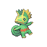

# Trainer Rosters

---

## Gym

### Generic Trainers

| Trainer | P1 | P2 | P3 | P4 | P5 | P6 |
|:-------:|:--:|:--:|:--:|:--:|:--:|:--:|
|  Beauty Victoria |  Whismur Lv. 20 |  Teddiursa Lv. 20 |  Snubbull Lv. 20 |  Loudred Lv. 20 |
|  Beauty Samantha |  Meowth Lv. 20 |  Munchlax Lv. 20 |  Kecleon Lv. 20 |
|  Lass Carrie |  Furret Lv. 20 |  Bibarel Lv. 20 |  Raticate Lv. 20 |  Dunsparce Lv. 20 |
|  Lass Cathy |  Jigglypuff Lv. 21 |  Happiny Lv. 21 |  Clefairy Lv. 21 |

### Important Trainers

1. [Leader Whitney](important_trainers.md#leader-whitney)

---

## City

### Generic Trainers

| Trainer | P1 | P2 | P3 | P4 | P5 | P6 |
|:-------:|:--:|:--:|:--:|:--:|:--:|:--:|
|  Team Rocket Grunt |  Persian Lv. 45 |
|  Team Rocket Grunt |  Rhyhorn Lv. 43 |  Haunter Lv. 43 |  Venomoth Lv. 43 |
|  Burglar Duncan |  Magmar Lv. 43 |  Grimer Lv. 43 |  Magcargo Lv. 44 |
|  Burglar Orson |  Growlithe Lv. 43 |  Koffing Lv. 43 |  Rapidash Lv. 44 |
|  Team Rocket Grunt |  Skarmory Lv. 44 |  Piloswine Lv. 44 |
|  Team Rocket Grunt |  Doduo Lv. 44 |  Dodrio Lv. 44 |
|  Team Rocket Grunt |  Exploud Lv. 45 |
|  Team Rocket Grunt |  Tauros Lv. 44 |  Weezing Lv. 44 |
|  Team Rocket Grunt |  Hitmonlee Lv. 44 |  Steelix Lv. 44 |

### Important Trainers

1. [Rival Silver](important_trainers.md#rival-silver)
