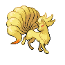
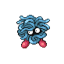
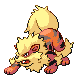

# Important Trainers

### Lyra

| Pokémon | Type | Attributes | Item | Moves |
|:-------:|:----:|------------|:----:|-------|
|  |  | **Lv. 21** Nidorina **Ability:** Poison Point | None | 1. Double Kick 2. Blizzard 3. Aerial Ace 4. Thunder |
|  |   | **Lv. 21** Marill **Ability:** Thick Fat | None | 1. Bubble Beam 2. Double Team 3. Blizzard 4. Focus Punch |
|  |   | **Lv. 21** Roselia **Ability:** Natural Cure | None | 1. Magical Leaf 2. Leech Seed 3. Grass Knot 4. Stun Spore |
|  |  | **Lv. 23** Ninetales **Ability:** Flash Fire |  Sitrus Berry | 1. Flamethrower 2. Safeguard 3. Confuse Ray 4. Ominous Wind |

### Ethan

| Pokémon | Type | Attributes | Item | Moves |
|:-------:|:----:|------------|:----:|-------|
|  |  | **Lv. 21** Nidorino **Ability:** Poison Point | None | 1. Double Kick 2. Blizzard 3. Peck 4. Thunder |
|  |   | **Lv. 21** Marill **Ability:** Thick Fat | None | 1. Bubble Beam 2. Double Team 3. Blizzard 4. Focus Punch |
|  |  | **Lv. 21** Tangela **Ability:** Chlorophyll | None | 1. Sleep Powder 2. Growth 3. Grass Knot 4. Solar Beam |
|  |  | **Lv. 23** Arcanine **Ability:** Intimidate |  Sitrus Berry | 1. Heat Wave 2. Rock Smash 3. Roar 4. Iron Head |

