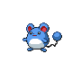
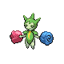
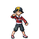
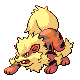
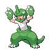
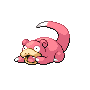
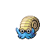
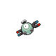
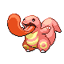
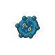

# Goldenrod Tunnel — Trainer Rosters

### Generic Trainers

| Trainer | P1 | P2 | P3 | P4 | P5 | P6 |
|:-------:|:--:|:--:|:--:|:--:|:--:|:--:|
|  PKMN Trainer Lyra |  Nidorina Lv. 21 |  Marill Lv. 21 |  Roselia Lv. 21 |  Ninetales Lv. 23 |
|  PKMN Trainer Ethan |  Nidorino Lv. 21 |  Marill Lv. 21 |  Tangela Lv. 21 |  Arcanine Lv. 23 |
|  Poke Maniac Donald |  Slowpoke Lv. 20 |  Omanyte Lv. 20 |  Cubone Lv. 20 |
|  Super Nerd Teru |  Magnemite Lv. 19 |  Voltorb Lv. 19 |  Porygon Lv. 19 |
|  Poke Maniac Issac |  Lickitung Lv. 22 |
|  Super Nerd Eric |  Grimer Lv. 20 |  Bronzor Lv. 20 |  Kabuto Lv. 20 |

### Important Trainers

1. [Lyra](important_trainers.md#lyra)
1. [Ethan](important_trainers.md#ethan)
