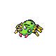

# Ilex Forest — Wild Pokémon

### Grass, Morning

| Sprite | Pokémon | Encounter Type | Level | Chance |
|:------:|---------|:--------------:|-------|--------|
|  | [Shroomish](../../pokemon/shroomish.md) | encounter_sprites| 15 – 18 | 20% |
|  | [Ledyba](../../pokemon/ledyba.md) | encounter_sprites| 15 – 18 | 20% |
|  | [Pineco](../../pokemon/pineco.md) | encounter_sprites| 15 – 18 | 10% |
|  | [Exeggcute](../../pokemon/exeggcute.md) | encounter_sprites| 15 – 18 | 10% |
|  | [Buneary](../../pokemon/buneary.md) | encounter_sprites| 15 – 18 | 10% |
|  | [Budew](../../pokemon/budew.md) | encounter_sprites| 15 – 18 | 10% |
|  | [Pikachu](../../pokemon/pikachu.md) | encounter_sprites| 15 – 18 | 5% |
|  | [Butterfree](../../pokemon/butterfree.md) | encounter_sprites| 15 – 18 | 5% |
|  | [Beedrill](../../pokemon/beedrill.md) | encounter_sprites| 15 – 18 | 5% |
|  | [Roselia](../../pokemon/roselia.md) | encounter_sprites| 15 – 18 | 5% |

### Grass, Day

| Sprite | Pokémon | Encounter Type | Level | Chance |
|:------:|---------|:--------------:|-------|--------|
|  | [Shroomish](../../pokemon/shroomish.md) | encounter_sprites| 15 – 18 | 20% |
|  | [Wurmple](../../pokemon/wurmple.md) | encounter_sprites| 15 – 18 | 20% |
|  | [Pineco](../../pokemon/pineco.md) | encounter_sprites| 15 – 18 | 10% |
|  | [Exeggcute](../../pokemon/exeggcute.md) | encounter_sprites| 15 – 18 | 10% |
|  | [Buneary](../../pokemon/buneary.md) | encounter_sprites| 15 – 18 | 10% |
|  | [Budew](../../pokemon/budew.md) | encounter_sprites| 15 – 18 | 10% |
|  | [Pikachu](../../pokemon/pikachu.md) | encounter_sprites| 15 – 18 | 5% |
|  | [Beautifly](../../pokemon/beautifly.md) | encounter_sprites| 15 – 18 | 5% |
|  | [Dustox](../../pokemon/dustox.md) | encounter_sprites| 15 – 18 | 5% |
|  | [Roselia](../../pokemon/roselia.md) | encounter_sprites| 15 – 18 | 5% |

### Grass, Night

| Sprite | Pokémon | Encounter Type | Level | Chance |
|:------:|---------|:--------------:|-------|--------|
|  | [Paras](../../pokemon/paras.md) | encounter_sprites| 15 – 18 | 20% |
|  | [Spinarak](../../pokemon/spinarak.md) | encounter_sprites| 15 – 18 | 20% |
|  | [Pineco](../../pokemon/pineco.md) | encounter_sprites| 15 – 18 | 10% |
|  | [Oddish](../../pokemon/oddish.md) | encounter_sprites| 15 – 18 | 10% |
|  | [Buneary](../../pokemon/buneary.md) | encounter_sprites| 15 – 18 | 10% |
|  | [Venonat](../../pokemon/venonat.md) | encounter_sprites| 15 – 18 | 10% |
|  | [Pikachu](../../pokemon/pikachu.md) | encounter_sprites| 15 – 18 | 5% |
|  | [Murkrow](../../pokemon/murkrow.md) | encounter_sprites| 15 – 18 | 5% |
|  | [Misdreavus](../../pokemon/misdreavus.md) | encounter_sprites| 15 – 18 | 5% |
|  | [Carnivine](../../pokemon/carnivine.md) | encounter_sprites| 15 – 18 | 5% |

### Surf

| Sprite | Pokémon | Encounter Type | Level | Chance |
|:------:|---------|:--------------:|-------|--------|
|  | [Psyduck](../../pokemon/psyduck.md) | encounter_sprites| 15 – 18 | 90% |
|  | [Golduck](../../pokemon/golduck.md) | encounter_sprites| 15 – 18 | 10% |

### Old Rod

| Sprite | Pokémon | Encounter Type | Level | Chance |
|:------:|---------|:--------------:|-------|--------|
|  | [Magikarp](../../pokemon/magikarp.md) | encounter_sprites| 10 | 60% |
|  | [Poliwag](../../pokemon/poliwag.md) | encounter_sprites| 10 | 40% |

### Good Rod

| Sprite | Pokémon | Encounter Type | Level | Chance |
|:------:|---------|:--------------:|-------|--------|
|  | [Poliwhirl](../../pokemon/poliwhirl.md) | encounter_sprites| 25 | 90% |
|  | [Gyarados](../../pokemon/gyarados.md) | encounter_sprites| 25 | 10% |

### Super Rod

| Sprite | Pokémon | Encounter Type | Level | Chance |
|:------:|---------|:--------------:|-------|--------|
|  | [Poliwhirl](../../pokemon/poliwhirl.md) | encounter_sprites| 50 | 60% |
|  | [Gyarados](../../pokemon/gyarados.md) | encounter_sprites| 50 | 30% |
|  | [Poliwrath](../../pokemon/poliwrath.md) | encounter_sprites| 50 | 5% |
|  | [Politoed](../../pokemon/politoed.md) | encounter_sprites| 50 | 5% |

### Meridian Sound

| Sprite | Pokémon | Encounter Type | Level | Chance |
|:------:|---------|:--------------:|-------|--------|
|  | [Gloom](../../pokemon/gloom.md) | encounter_sprites| 15 – 18 | 50% |
|  | [Venomoth](../../pokemon/venomoth.md) | encounter_sprites| 15 – 18 | 50% |

### Pastoral Sound

| Sprite | Pokémon | Encounter Type | Level | Chance |
|:------:|---------|:--------------:|-------|--------|
|  | [Pichu](../../pokemon/pichu.md) | encounter_sprites| 15 – 18 | 100% |

