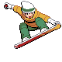
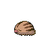
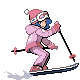
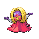
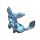

# Mahogany Town — Trainer Rosters

---

## Gym

### Generic Trainers

| Trainer | P1 | P2 | P3 | P4 | P5 | P6 |
|:-------:|:--:|:--:|:--:|:--:|:--:|:--:|
|  Boarder Patton |  Swinub Lv. 41 |  Snorunt Lv. 41 |  Smoochum Lv. 41 |
|  Skier Diana |  Seel Lv. 42 |  Delibird Lv. 42 |
|  Boarder Deandre |  Cloyster Lv. 42 |  Piloswine Lv. 42 |  Jynx Lv. 42 |
|  Boarder Gerardo |  Sneasel Lv. 42 |  Sealeo Lv. 43 |
|  Skier Jill |  Snover Lv. 42 |  Glalie Lv. 42 |  Glaceon Lv. 42 |

### Important Trainers

1. [Leader Pryce](important_trainers.md#leader-pryce)
