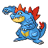

# Mt. Moon — Important Trainers

### Rival Silver

=== "Totodile"

	| Pokémon | Attributes | Item | Moves |
	|:-------:|------------|:----:|-------|
	|  | **Lv. 57** Honchkrow **Ability:** Insomnia   | None | 1. Drill Peck 2. Sucker Punch 3. Thunder Wave 4. Double Team |
	|  | **Lv. 56** Gengar **Ability:** Levitate   | None | 1. Shadow Ball 2. Thunderbolt 3. Sludge Bomb 4. Focus Blast |
	|  | **Lv. 56** Alakazam **Ability:** Synchronize  | None | 1. Shadow Ball 2. Psychic 3. Energy Ball 4. Focus Blast |
	|  | **Lv. 58** Kingdra **Ability:** Swift Swim   | None | 1. Surf 2. Ice Beam 3. Dragon Pulse 4. Double Team |
	|  | **Lv. 58** Magmortar **Ability:** Flame Body  | None | 1. Flamethrower 2. Psychic 3. Thunderbolt 4. Focus Blast |
	|  | **Lv. 60** Meganium **Ability:** Overgrow  | None | 1. Swords Dance 2. Reflect 3. Seed Bomb 4. Earthquake |
	
=== "Chikorita"

	| Pokémon | Attributes | Item | Moves |
	|:-------:|------------|:----:|-------|
	|  | **Lv. 57** Honchkrow **Ability:** Insomnia   | None | 1. Drill Peck 2. Sucker Punch 3. Thunder Wave 4. Double Team |
	|  | **Lv. 56** Gengar **Ability:** Levitate   | None | 1. Shadow Ball 2. Thunderbolt 3. Sludge Bomb 4. Focus Blast |
	|  | **Lv. 56** Alakazam **Ability:** Synchronize  | None | 1. Shadow Ball 2. Psychic 3. Energy Ball 4. Focus Blast |
	|  | **Lv. 58** Kingdra **Ability:** Swift Swim   | None | 1. Surf 2. Ice Beam 3. Dragon Pulse 4. Double Team |
	|  | **Lv. 58** Electivire **Ability:** Motor Drive  | None | 1. Thunder Punch 2. Ice Punch 3. Earthquake 4. Brick Break |
	|  | **Lv. 60** Typhlosion **Ability:** Blaze  | None | 1. Eruption 2. Fire Blast 3. Focus Blast 4. Earthquake |
	
=== "Cyndaquil"

	| Pokémon | Attributes | Item | Moves |
	|:-------:|------------|:----:|-------|
	|  | **Lv. 57** Honchkrow **Ability:** Insomnia   | None | 1. Drill Peck 2. Sucker Punch 3. Thunder Wave 4. Double Team |
	|  | **Lv. 56** Gengar **Ability:** Levitate   | None | 1. Shadow Ball 2. Thunderbolt 3. Sludge Bomb 4. Focus Blast |
	|  | **Lv. 56** Alakazam **Ability:** Synchronize  | None | 1. Shadow Ball 2. Psychic 3. Energy Ball 4. Focus Blast |
	|  | **Lv. 58** Magmortar **Ability:** Flame Body  | None | 1. Flamethrower 2. Psychic 3. Thunderbolt 4. Focus Blast |
	|  | **Lv. 58** Electivire **Ability:** Motor Drive  | None | 1. Thunder Punch 2. Ice Punch 3. Earthquake 4. Brick Break |
	|  | **Lv. 60** Feraligatr **Ability:** Torrent  | None | 1. Aqua Tail 2. Ice Fang 3. Earthquake 4. Rock Slide |
	
