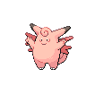

# Mt. Moon — Wild Pokémon

---

## Super Rod

### Cave

| Sprite | Pokémon | Encounter Type | Level | Chance |
|:------:|---------|:--------------:|-------|--------|
|  | Golbat | {: style="max-width: 24px;"" } | 47 – 51 | 30% |
|  | Clefairy | {: style="max-width: 24px;"" } | 47 – 51 | 20% |
|  | Graveler | {: style="max-width: 24px;"" } | 47 – 51 | 20% |
|  | Sandslash | {: style="max-width: 24px;"" } | 47 – 51 | 15% |
|  | Parasect | {: style="max-width: 24px;"" } | 47 – 51 | 15% |

### Meridian Sound

| Sprite | Pokémon | Encounter Type | Level | Chance |
|:------:|---------|:--------------:|-------|--------|
|  | Crobat | {: style="max-width: 24px;"" } | 47 – 51 | 50% |
|  | Golem | {: style="max-width: 24px;"" } | 47 – 51 | 50% |

### Pastoral Sound

| Sprite | Pokémon | Encounter Type | Level | Chance |
|:------:|---------|:--------------:|-------|--------|
|  | Chimecho | {: style="max-width: 24px;"" } | 47 – 51 | 100% |

---

## Pastoral Sound

### Cave

| Sprite | Pokémon | Encounter Type | Level | Chance |
|:------:|---------|:--------------:|-------|--------|
|  | Golbat | {: style="max-width: 24px;"" } | 48 – 50 | 24% |
|  | Clefairy | {: style="max-width: 24px;"" } | 48 – 50 | 20% |
|  | Graveler | {: style="max-width: 24px;"" } | 48 – 50 | 14% |
|  | Sandslash | {: style="max-width: 24px;"" } | 48 – 50 | 10% |
|  | Parasect | {: style="max-width: 24px;"" } | 48 – 50 | 10% |
|  | Chimecho | {: style="max-width: 24px;"" } | 48 – 50 | 10% |
|  | Solrock | {: style="max-width: 24px;"" } | 48 – 50 | 5% |
|  | Lunatone | {: style="max-width: 24px;"" } | 48 – 50 | 5% |
|  | Clefable | {: style="max-width: 24px;"" } | 48 – 50 | 1% |

### Meridian Sound

| Sprite | Pokémon | Encounter Type | Level | Chance |
|:------:|---------|:--------------:|-------|--------|
|  | Clefable | {: style="max-width: 24px;"" } | 48 – 50 | 100% |

### Pastoral Sound

| Sprite | Pokémon | Encounter Type | Level | Chance |
|:------:|---------|:--------------:|-------|--------|
|  | Chimecho | {: style="max-width: 24px;"" } | 48 – 50 | 100% |

---

## Pastoral Sound

### Surf

| Sprite | Pokémon | Encounter Type | Level | Chance |
|:------:|---------|:--------------:|-------|--------|
|  | Wooper | {: style="max-width: 24px;"" } | 40 – 50 | 63% |
|  | Poliwhirl | {: style="max-width: 24px;"" } | 40 – 50 | 32% |
|  | Quagsire | {: style="max-width: 24px;"" } | 40 – 50 | 5% |

### Old Rod

| Sprite | Pokémon | Encounter Type | Level | Chance |
|:------:|---------|:--------------:|-------|--------|
|  | Magikarp | {: style="max-width: 24px;"" } | 10 | 100% |

### Good Rod

| Sprite | Pokémon | Encounter Type | Level | Chance |
|:------:|---------|:--------------:|-------|--------|
|  | Magikarp | {: style="max-width: 24px;"" } | 25 | 90% |
|  | Poliwag | {: style="max-width: 24px;"" } | 25 | 10% |

### Super Rod

| Sprite | Pokémon | Encounter Type | Level | Chance |
|:------:|---------|:--------------:|-------|--------|
|  | Poliwhirl | {: style="max-width: 24px;"" } | 50 | 100% |

