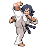
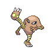

# Trainer Rosters

### Generic Trainers

| Trainer | P1 | P2 | P3 | P4 | P5 | P6 |
|:-------:|:--:|:--:|:--:|:--:|:--:|:--:|
|  Poke Maniac Harrison |  Lickitung Lv. 38 |  Kangaskhan Lv. 38 |  Magneton Lv. 38 |
|  Super Nerd Markus |  Slowbro Lv. 39 |
|  Super Nerd Hugh |  Kingdra Lv. 48 |
|  Black Belt Kiyo |  Hitmonlee Lv. 50 |  Hitmonchan Lv. 50 |

