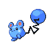

# Mt. Mortar Wild Pokémon

---

## Super Rod

### Cave

| Sprite | Pokémon | Encounter Type | Level | Chance |
|:------:|---------|:--------------:|-------|--------|
|  | Graveler | {: style="max-width: 24px;"" } | 31 – 34 | 30% |
|  | Golbat | {: style="max-width: 24px;"" } | 31 – 34 | 30% |
|  | Rhyhorn | {: style="max-width: 24px;"" } | 31 – 34 | 10% |
|  | Lairon | {: style="max-width: 24px;"" } | 31 – 34 | 10% |
|  | Meditite | {: style="max-width: 24px;"" } | 31 – 34 | 10% |
|  | Marill | {: style="max-width: 24px;"" } | 31 – 34 | 10% |

### Surf

| Sprite | Pokémon | Encounter Type | Level | Chance |
|:------:|---------|:--------------:|-------|--------|
|  | Marill | {: style="max-width: 24px;"" } | 31 – 34 | 95% |
|  | Azumarill | {: style="max-width: 24px;"" } | 31 – 34 | 5% |

### Meridian Sound

| Sprite | Pokémon | Encounter Type | Level | Chance |
|:------:|---------|:--------------:|-------|--------|
|  | Rhydon | {: style="max-width: 24px;"" } | 31 – 34 | 50% |
|  | Medicham | {: style="max-width: 24px;"" } | 31 – 34 | 50% |

### Pastoral Sound

| Sprite | Pokémon | Encounter Type | Level | Chance |
|:------:|---------|:--------------:|-------|--------|
|  | Azurill | {: style="max-width: 24px;"" } | 31 – 34 | 100% |

### Swarm

| Sprite | Pokémon | Encounter Type | Level | Chance |
|:------:|---------|:--------------:|-------|--------|
|  | Solrock | {: style="max-width: 24px;"" } | 31 – 34 | 100% |
|  | Lunatone | {: style="max-width: 24px;"" } | 31 – 34 | 100% |

### Old Rod

| Sprite | Pokémon | Encounter Type | Level | Chance |
|:------:|---------|:--------------:|-------|--------|
|  | Goldeen | {: style="max-width: 24px;"" } | 10 | 100% |

### Good Rod

| Sprite | Pokémon | Encounter Type | Level | Chance |
|:------:|---------|:--------------:|-------|--------|
|  | Goldeen | {: style="max-width: 24px;"" } | 25 | 65% |
|  | Barboach | {: style="max-width: 24px;"" } | 25 | 35% |

### Super Rod

| Sprite | Pokémon | Encounter Type | Level | Chance |
|:------:|---------|:--------------:|-------|--------|
|  | Goldeen | {: style="max-width: 24px;"" } | 50 | 60% |
|  | Barboach | {: style="max-width: 24px;"" } | 50 | 30% |
|  | Seaking | {: style="max-width: 24px;"" } | 50 | 5% |
|  | Whiscash | {: style="max-width: 24px;"" } | 50 | 5% |

---

## Super Rod

### Cave

| Sprite | Pokémon | Encounter Type | Level | Chance |
|:------:|---------|:--------------:|-------|--------|
|  | Graveler | {: style="max-width: 24px;"" } | 33 – 37 | 20% |
|  | Golbat | {: style="max-width: 24px;"" } | 33 – 37 | 20% |
|  | Rhyhorn | {: style="max-width: 24px;"" } | 33 – 37 | 10% |
|  | Lairon | {: style="max-width: 24px;"" } | 33 – 37 | 10% |
|  | Marill | {: style="max-width: 24px;"" } | 33 – 37 | 10% |
|  | Hariyama | {: style="max-width: 24px;"" } | 33 – 37 | 10% |
|  | Clefairy | {: style="max-width: 24px;"" } | 33 – 37 | 5% |
|  | Medicham | {: style="max-width: 24px;"" } | 33 – 37 | 5% |
|  | Solrock | {: style="max-width: 24px;"" } | 33 – 37 | 5% |
|  | Lunatone | {: style="max-width: 24px;"" } | 33 – 37 | 5% |

### Meridian Sound

| Sprite | Pokémon | Encounter Type | Level | Chance |
|:------:|---------|:--------------:|-------|--------|
|  | Rhydon | {: style="max-width: 24px;"" } | 33 – 37 | 50% |
|  | Azumarill | {: style="max-width: 24px;"" } | 33 – 37 | 50% |

### Pastoral Sound

| Sprite | Pokémon | Encounter Type | Level | Chance |
|:------:|---------|:--------------:|-------|--------|
|  | Cleffa | {: style="max-width: 24px;"" } | 33 – 37 | 50% |
|  | Clefairy | {: style="max-width: 24px;"" } | 33 – 37 | 50% |

---

## Pastoral Sound

### Cave

| Sprite | Pokémon | Encounter Type | Level | Chance |
|:------:|---------|:--------------:|-------|--------|
|  | Graveler | {: style="max-width: 24px;"" } | 41 – 45 | 20% |
|  | Golbat | {: style="max-width: 24px;"" } | 41 – 45 | 20% |
|  | Rhydon | {: style="max-width: 24px;"" } | 41 – 45 | 10% |
|  | Lairon | {: style="max-width: 24px;"" } | 41 – 45 | 10% |
|  | Azumarill | {: style="max-width: 24px;"" } | 41 – 45 | 10% |
|  | Hariyama | {: style="max-width: 24px;"" } | 41 – 45 | 10% |
|  | Clefairy | {: style="max-width: 24px;"" } | 41 – 45 | 5% |
|  | Medicham | {: style="max-width: 24px;"" } | 41 – 45 | 5% |
|  | Solrock | {: style="max-width: 24px;"" } | 41 – 45 | 5% |
|  | Lunatone | {: style="max-width: 24px;"" } | 41 – 45 | 5% |

### Surf

| Sprite | Pokémon | Encounter Type | Level | Chance |
|:------:|---------|:--------------:|-------|--------|
|  | Marill | {: style="max-width: 24px;"" } | 41 – 45 | 95% |
|  | Azumarill | {: style="max-width: 24px;"" } | 41 – 45 | 5% |

### Meridian Sound

| Sprite | Pokémon | Encounter Type | Level | Chance |
|:------:|---------|:--------------:|-------|--------|
|  | Golem | {: style="max-width: 24px;"" } | 41 – 45 | 50% |
|  | Clefable | {: style="max-width: 24px;"" } | 41 – 45 | 50% |

### Pastoral Sound

| Sprite | Pokémon | Encounter Type | Level | Chance |
|:------:|---------|:--------------:|-------|--------|
|  | Cleffa | {: style="max-width: 24px;"" } | 41 – 45 | 50% |
|  | Azurill | {: style="max-width: 24px;"" } | 41 – 45 | 50% |

### Old Rod

| Sprite | Pokémon | Encounter Type | Level | Chance |
|:------:|---------|:--------------:|-------|--------|
|  | Goldeen | {: style="max-width: 24px;"" } | 10 | 100% |

### Good Rod

| Sprite | Pokémon | Encounter Type | Level | Chance |
|:------:|---------|:--------------:|-------|--------|
|  | Goldeen | {: style="max-width: 24px;"" } | 25 | 65% |
|  | Barboach | {: style="max-width: 24px;"" } | 25 | 35% |

### Super Rod

| Sprite | Pokémon | Encounter Type | Level | Chance |
|:------:|---------|:--------------:|-------|--------|
|  | Goldeen | {: style="max-width: 24px;"" } | 50 | 60% |
|  | Barboach | {: style="max-width: 24px;"" } | 50 | 30% |
|  | Seaking | {: style="max-width: 24px;"" } | 50 | 5% |
|  | Whiscash | {: style="max-width: 24px;"" } | 50 | 5% |

---

## Super Rod

### Cave

| Sprite | Pokémon | Encounter Type | Level | Chance |
|:------:|---------|:--------------:|-------|--------|
|  | Graveler | {: style="max-width: 24px;"" } | 33 – 35 | 20% |
|  | Golbat | {: style="max-width: 24px;"" } | 33 – 35 | 20% |
|  | Rhyhorn | {: style="max-width: 24px;"" } | 33 – 35 | 10% |
|  | Lairon | {: style="max-width: 24px;"" } | 33 – 35 | 10% |
|  | Machoke | {: style="max-width: 24px;"" } | 33 – 35 | 10% |
|  | Hariyama | {: style="max-width: 24px;"" } | 33 – 35 | 10% |
|  | Clefairy | {: style="max-width: 24px;"" } | 33 – 35 | 5% |
|  | Marill | {: style="max-width: 24px;"" } | 33 – 35 | 5% |
|  | Metang | {: style="max-width: 24px;"" } | 33 – 35 | 5% |
|  | Pupitar | {: style="max-width: 24px;"" } | 33 – 35 | 5% |

### Surf

| Sprite | Pokémon | Encounter Type | Level | Chance |
|:------:|---------|:--------------:|-------|--------|
|  | Marill | {: style="max-width: 24px;"" } | 33 – 35 | 95% |
|  | Azumarill | {: style="max-width: 24px;"" } | 33 – 35 | 5% |

### Meridian Sound

| Sprite | Pokémon | Encounter Type | Level | Chance |
|:------:|---------|:--------------:|-------|--------|
|  | Clefable | {: style="max-width: 24px;"" } | 33 – 35 | 50% |
|  | Azumarill | {: style="max-width: 24px;"" } | 33 – 35 | 50% |

### Pastoral Sound

| Sprite | Pokémon | Encounter Type | Level | Chance |
|:------:|---------|:--------------:|-------|--------|
|  | Riolu | {: style="max-width: 24px;"" } | 33 – 35 | 100% |

### Old Rod

| Sprite | Pokémon | Encounter Type | Level | Chance |
|:------:|---------|:--------------:|-------|--------|
|  | Goldeen | {: style="max-width: 24px;"" } | 10 | 100% |

### Good Rod

| Sprite | Pokémon | Encounter Type | Level | Chance |
|:------:|---------|:--------------:|-------|--------|
|  | Goldeen | {: style="max-width: 24px;"" } | 25 | 65% |
|  | Barboach | {: style="max-width: 24px;"" } | 25 | 35% |

### Super Rod

| Sprite | Pokémon | Encounter Type | Level | Chance |
|:------:|---------|:--------------:|-------|--------|
|  | Goldeen | {: style="max-width: 24px;"" } | 50 | 60% |
|  | Barboach | {: style="max-width: 24px;"" } | 50 | 30% |
|  | Seaking | {: style="max-width: 24px;"" } | 50 | 5% |
|  | Whiscash | {: style="max-width: 24px;"" } | 50 | 5% |

