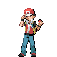

# Mt. Silver — Important Trainers

---

## Cave

### PKMN Trainer Red

| Pokémon | Attributes | Item | Moves |
|:-------:|------------|:----:|-------|
| | **Lv. 94** [Pikachu](../../pokemon/pikachu.md/) **Ability:** Static  |  Light Ball | 1. Endure 2. Endeavor 3. Thunder 4. Grass Knot |
| | **Lv. 88** [Espeon](../../pokemon/espeon.md/) **Ability:** Synchronize  |  Light Clay | 1. Psychic 2. Grass Knot 3. Reflect 4. Shadow Ball |
| | **Lv. 88** [Snorlax](../../pokemon/snorlax.md/) **Ability:** Immunity  |  Chesto Berry | 1. Rest 2. Sleep Talk 3. Body Slam 4. Crunch |
| | **Lv. 90** [Venusaur](../../pokemon/venusaur.md/) **Ability:** Overgrow   |  Occa Berry | 1. Swords Dance 2. Power Whip 3. Earthquake 4. Sleep Powder |
| | **Lv. 90** [Charizard](../../pokemon/charizard.md/) **Ability:** Blaze   |  Passho Berry | 1. Fire Blast 2. Focus Blast 3. Air Slash 4. Dragon Pulse |
| | **Lv. 90** [Blastoise](../../pokemon/blastoise.md/) **Ability:** Torrent  |  Rindo Berry | 1. Signal Beam 2. Hydro Pump 3. Blizzard 4. Fake Out |

