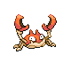

# Mt. Silver — Wild Pokémon

---

## Super Rod

### Grass, Morning / Day

| Sprite | Pokémon | Encounter Type | Level | Chance |
|:------:|---------|:--------------:|-------|--------|
|  | [Tangela](../../pokemon/tangela.md) | {: style="max-width: 24px;"" } {: style="max-width: 24px;"" } {: style="max-width: 24px;"" }| 59 - 65 | 35% |
|  | [Manectric](../../pokemon/manectric.md) | {: style="max-width: 24px;"" } {: style="max-width: 24px;"" } {: style="max-width: 24px;"" }| 59 - 65 | 25% |
|  | [Rapidash](../../pokemon/rapidash.md) | {: style="max-width: 24px;"" } {: style="max-width: 24px;"" } {: style="max-width: 24px;"" }| 59 - 65 | 10% |
|  | [Ursaring](../../pokemon/ursaring.md) | {: style="max-width: 24px;"" } {: style="max-width: 24px;"" } {: style="max-width: 24px;"" }| 59 - 65 | 10% |
|  | [Donphan](../../pokemon/donphan.md) | {: style="max-width: 24px;"" } {: style="max-width: 24px;"" } {: style="max-width: 24px;"" }| 59 - 65 | 10% |
|  | [Dodrio](../../pokemon/dodrio.md) | {: style="max-width: 24px;"" } {: style="max-width: 24px;"" } {: style="max-width: 24px;"" }| 59 - 65 | 10% |

### Grass, Night

| Sprite | Pokémon | Encounter Type | Level | Chance |
|:------:|---------|:--------------:|-------|--------|
|  | [Tangela](../../pokemon/tangela.md) | {: style="max-width: 24px;"" } {: style="max-width: 24px;"" }| 59 - 65 | 25% |
|  | [Manectric](../../pokemon/manectric.md) | {: style="max-width: 24px;"" } {: style="max-width: 24px;"" }| 59 - 65 | 20% |
|  | [Rapidash](../../pokemon/rapidash.md) | {: style="max-width: 24px;"" } {: style="max-width: 24px;"" }| 59 - 65 | 10% |
|  | [Ursaring](../../pokemon/ursaring.md) | {: style="max-width: 24px;"" } {: style="max-width: 24px;"" }| 59 - 65 | 10% |
|  | [Donphan](../../pokemon/donphan.md) | {: style="max-width: 24px;"" } {: style="max-width: 24px;"" }| 59 - 65 | 10% |
|  | [Quagsire](../../pokemon/quagsire.md) | {: style="max-width: 24px;"" } {: style="max-width: 24px;"" }| 59 - 65 | 10% |
|  | [Dusclops](../../pokemon/dusclops.md) | {: style="max-width: 24px;"" } {: style="max-width: 24px;"" }| 59 - 65 | 10% |
|  | [Sneasel](../../pokemon/sneasel.md) | {: style="max-width: 24px;"" } {: style="max-width: 24px;"" }| 59 - 65 | 5% |

### Meridian Sound

| Sprite | Pokémon | Encounter Type | Level | Chance |
|:------:|---------|:--------------:|-------|--------|
|  | [Tangrowth](../../pokemon/tangrowth.md) | {: style="max-width: 24px;"" }| 59 - 65 | 100% |

### Pastoral Sound

| Sprite | Pokémon | Encounter Type | Level | Chance |
|:------:|---------|:--------------:|-------|--------|
|  | [Arbok](../../pokemon/arbok.md) | {: style="max-width: 24px;"" }| 59 - 65 | 100% |

### Surf

| Sprite | Pokémon | Encounter Type | Level | Chance |
|:------:|---------|:--------------:|-------|--------|
|  | [Poliwag](../../pokemon/poliwag.md) | {: style="max-width: 24px;"" }| 59 - 65 | 90% |
|  | [Poliwhirl](../../pokemon/poliwhirl.md) | {: style="max-width: 24px;"" }| 59 - 65 | 10% |

### Old Rod

| Sprite | Pokémon | Encounter Type | Level | Chance |
|:------:|---------|:--------------:|-------|--------|
|  | [Luvdisc](../../pokemon/luvdisc.md) | {: style="max-width: 24px;"" }| 10 | 90% |
|  | [Poliwag](../../pokemon/poliwag.md) | {: style="max-width: 24px;"" }| 10 | 10% |

### Good Rod

| Sprite | Pokémon | Encounter Type | Level | Chance |
|:------:|---------|:--------------:|-------|--------|
|  | [Luvdisc](../../pokemon/luvdisc.md) | {: style="max-width: 24px;"" }| 25 | 60% |
|  | [Poliwag](../../pokemon/poliwag.md) | {: style="max-width: 24px;"" }| 25 | 30% |
|  | [Poliwhirl](../../pokemon/poliwhirl.md) | {: style="max-width: 24px;"" }| 25 | 10% |

### Super Rod

| Sprite | Pokémon | Encounter Type | Level | Chance |
|:------:|---------|:--------------:|-------|--------|
|  | [Poliwhirl](../../pokemon/poliwhirl.md) | {: style="max-width: 24px;"" }| 50 | 60% |
|  | [Luvdisc](../../pokemon/luvdisc.md) | {: style="max-width: 24px;"" }| 50 | 30% |
|  | [Gyarados](../../pokemon/gyarados.md) | {: style="max-width: 24px;"" }| 50 | 10% |

---

## Super Rod

### Cave, Morning / Day

| Sprite | Pokémon | Encounter Type | Level | Chance |
|:------:|---------|:--------------:|-------|--------|
|  | [Phanpy](../../pokemon/phanpy.md) | {: style="max-width: 24px;"" } {: style="max-width: 24px;"" } {: style="max-width: 24px;"" }| 50 – 64 | 20% |
|  | [Teddiursa](../../pokemon/teddiursa.md) | {: style="max-width: 24px;"" } {: style="max-width: 24px;"" } {: style="max-width: 24px;"" }| 50 – 64 | 20% |
|  | [Donphan](../../pokemon/donphan.md) | {: style="max-width: 24px;"" } {: style="max-width: 24px;"" } {: style="max-width: 24px;"" }| 50 – 64 | 15% |
|  | [Ursaring](../../pokemon/ursaring.md) | {: style="max-width: 24px;"" } {: style="max-width: 24px;"" } {: style="max-width: 24px;"" }| 50 – 64 | 15% |
|  | [Quagsire](../../pokemon/quagsire.md) | {: style="max-width: 24px;"" } {: style="max-width: 24px;"" } {: style="max-width: 24px;"" }| 50 – 64 | 10% |
|  | [Magmar](../../pokemon/magmar.md) | {: style="max-width: 24px;"" } {: style="max-width: 24px;"" } {: style="max-width: 24px;"" }| 50 – 64 | 10% |
|  | [Larvitar](../../pokemon/larvitar.md) | {: style="max-width: 24px;"" } {: style="max-width: 24px;"" } {: style="max-width: 24px;"" }| 50 – 64 | 5% |
|  | [Graveler](../../pokemon/graveler.md) | {: style="max-width: 24px;"" } {: style="max-width: 24px;"" } {: style="max-width: 24px;"" }| 50 – 64 | 5% |

### Cave, Night

| Sprite | Pokémon | Encounter Type | Level | Chance |
|:------:|---------|:--------------:|-------|--------|
|  | [Quagsire](../../pokemon/quagsire.md) | {: style="max-width: 24px;"" } {: style="max-width: 24px;"" }| 50 – 64 | 20% |
|  | [Golbat](../../pokemon/golbat.md) | {: style="max-width: 24px;"" } {: style="max-width: 24px;"" }| 50 – 64 | 20% |
|  | [Golduck](../../pokemon/golduck.md) | {: style="max-width: 24px;"" } {: style="max-width: 24px;"" }| 50 – 64 | 20% |
|  | [Graveler](../../pokemon/graveler.md) | {: style="max-width: 24px;"" } {: style="max-width: 24px;"" }| 50 – 64 | 20% |
|  | [Donphan](../../pokemon/donphan.md) | {: style="max-width: 24px;"" } {: style="max-width: 24px;"" }| 50 – 64 | 5% |
|  | [Ursaring](../../pokemon/ursaring.md) | {: style="max-width: 24px;"" } {: style="max-width: 24px;"" }| 50 – 64 | 5% |
|  | [Larvitar](../../pokemon/larvitar.md) | {: style="max-width: 24px;"" } {: style="max-width: 24px;"" }| 50 – 64 | 5% |
|  | [Misdreavus](../../pokemon/misdreavus.md) | {: style="max-width: 24px;"" } {: style="max-width: 24px;"" }| 50 – 64 | 5% |

### Meridian Sound

| Sprite | Pokémon | Encounter Type | Level | Chance |
|:------:|---------|:--------------:|-------|--------|
|  | [Pupitar](../../pokemon/pupitar.md) | {: style="max-width: 24px;"" }| 50 – 64 | 100% |

### Pastoral Sound

| Sprite | Pokémon | Encounter Type | Level | Chance |
|:------:|---------|:--------------:|-------|--------|
|  | [Larvitar](../../pokemon/larvitar.md) | {: style="max-width: 24px;"" }| 50 – 64 | 100% |

### Surf

| Sprite | Pokémon | Encounter Type | Level | Chance |
|:------:|---------|:--------------:|-------|--------|
|  | [Golbat](../../pokemon/golbat.md) | {: style="max-width: 24px;"" }| 50 – 64 | 60% |
|  | [Seadra](../../pokemon/seadra.md) | {: style="max-width: 24px;"" }| 50 – 64 | 30% |
|  | [Horsea](../../pokemon/horsea.md) | {: style="max-width: 24px;"" }| 50 – 64 | 10% |

### Old Rod

| Sprite | Pokémon | Encounter Type | Level | Chance |
|:------:|---------|:--------------:|-------|--------|
|  | [Goldeen](../../pokemon/goldeen.md) | {: style="max-width: 24px;"" }| 10 | 60% |
|  | [Krabby](../../pokemon/krabby.md) | {: style="max-width: 24px;"" }| 10 | 30% |
|  | [Corphish](../../pokemon/corphish.md) | {: style="max-width: 24px;"" }| 10 | 10% |

### Good Rod

| Sprite | Pokémon | Encounter Type | Level | Chance |
|:------:|---------|:--------------:|-------|--------|
|  | [Goldeen](../../pokemon/goldeen.md) | {: style="max-width: 24px;"" }| 25 | 60% |
|  | [Krabby](../../pokemon/krabby.md) | {: style="max-width: 24px;"" }| 25 | 30% |
|  | [Corphish](../../pokemon/corphish.md) | {: style="max-width: 24px;"" }| 25 | 10% |

### Super Rod

| Sprite | Pokémon | Encounter Type | Level | Chance |
|:------:|---------|:--------------:|-------|--------|
|  | [Seaking](../../pokemon/seaking.md) | {: style="max-width: 24px;"" }| 50 | 60% |
|  | [Kingler](../../pokemon/kingler.md) | {: style="max-width: 24px;"" }| 50 | 30% |
|  | [Crawdaunt](../../pokemon/crawdaunt.md) | {: style="max-width: 24px;"" }| 50 | 10% |

---

## Super Rod

### Cave, Morning / Day

| Sprite | Pokémon | Encounter Type | Level | Chance |
|:------:|---------|:--------------:|-------|--------|
|  | [Parasect](../../pokemon/parasect.md) | {: style="max-width: 24px;"" } {: style="max-width: 24px;"" } {: style="max-width: 24px;"" }| 50 – 64 | 45% |
|  | [Golduck](../../pokemon/golduck.md) | {: style="max-width: 24px;"" } {: style="max-width: 24px;"" } {: style="max-width: 24px;"" }| 50 – 64 | 20% |
|  | [Quagsire](../../pokemon/quagsire.md) | {: style="max-width: 24px;"" } {: style="max-width: 24px;"" } {: style="max-width: 24px;"" }| 50 – 64 | 15% |
|  | [Shelgon](../../pokemon/shelgon.md) | {: style="max-width: 24px;"" } {: style="max-width: 24px;"" } {: style="max-width: 24px;"" }| 50 – 64 | 15% |
|  | [Bagon](../../pokemon/bagon.md) | {: style="max-width: 24px;"" } {: style="max-width: 24px;"" } {: style="max-width: 24px;"" }| 50 – 64 | 5% |

### Cave, Night

| Sprite | Pokémon | Encounter Type | Level | Chance |
|:------:|---------|:--------------:|-------|--------|
|  | [Parasect](../../pokemon/parasect.md) | {: style="max-width: 24px;"" } {: style="max-width: 24px;"" }| 50 – 64 | 35% |
|  | [Golduck](../../pokemon/golduck.md) | {: style="max-width: 24px;"" } {: style="max-width: 24px;"" }| 50 – 64 | 20% |
|  | [Quagsire](../../pokemon/quagsire.md) | {: style="max-width: 24px;"" } {: style="max-width: 24px;"" }| 50 – 64 | 15% |
|  | [Shelgon](../../pokemon/shelgon.md) | {: style="max-width: 24px;"" } {: style="max-width: 24px;"" }| 50 – 64 | 15% |
|  | [Misdreavus](../../pokemon/misdreavus.md) | {: style="max-width: 24px;"" } {: style="max-width: 24px;"" }| 50 – 64 | 10% |
|  | [Bagon](../../pokemon/bagon.md) | {: style="max-width: 24px;"" } {: style="max-width: 24px;"" }| 50 – 64 | 5% |

### Meridian Sound

| Sprite | Pokémon | Encounter Type | Level | Chance |
|:------:|---------|:--------------:|-------|--------|
|  | [Shelgon](../../pokemon/shelgon.md) | {: style="max-width: 24px;"" }| 50 – 64 | 100% |

### Pastoral Sound

| Sprite | Pokémon | Encounter Type | Level | Chance |
|:------:|---------|:--------------:|-------|--------|
|  | [Paras](../../pokemon/paras.md) | {: style="max-width: 24px;"" }| 50 – 64 | 50% |
|  | [Bagon](../../pokemon/bagon.md) | {: style="max-width: 24px;"" }| 50 – 64 | 50% |

---

## Pastoral Sound

### Cave, Morning / Day

| Sprite | Pokémon | Encounter Type | Level | Chance |
|:------:|---------|:--------------:|-------|--------|
|  | [Golbat](../../pokemon/golbat.md) | {: style="max-width: 24px;"" } {: style="max-width: 24px;"" } {: style="max-width: 24px;"" }| 64 – 68 | 20% |
|  | [Graveler](../../pokemon/graveler.md) | {: style="max-width: 24px;"" } {: style="max-width: 24px;"" } {: style="max-width: 24px;"" }| 64 – 68 | 20% |
|  | [Steelix](../../pokemon/steelix.md) | {: style="max-width: 24px;"" } {: style="max-width: 24px;"" } {: style="max-width: 24px;"" }| 64 – 68 | 20% |
|  | [Rhydon](../../pokemon/rhydon.md) | {: style="max-width: 24px;"" } {: style="max-width: 24px;"" } {: style="max-width: 24px;"" }| 64 – 68 | 20% |
|  | [Quagsire](../../pokemon/quagsire.md) | {: style="max-width: 24px;"" } {: style="max-width: 24px;"" } {: style="max-width: 24px;"" }| 64 – 68 | 10% |
|  | [Pupitar](../../pokemon/pupitar.md) | {: style="max-width: 24px;"" } {: style="max-width: 24px;"" } {: style="max-width: 24px;"" }| 64 – 68 | 10% |

### Cave, Night

| Sprite | Pokémon | Encounter Type | Level | Chance |
|:------:|---------|:--------------:|-------|--------|
|  | [Golbat](../../pokemon/golbat.md) | {: style="max-width: 24px;"" } {: style="max-width: 24px;"" }| 64 – 68 | 20% |
|  | [Graveler](../../pokemon/graveler.md) | {: style="max-width: 24px;"" } {: style="max-width: 24px;"" }| 64 – 68 | 20% |
|  | [Steelix](../../pokemon/steelix.md) | {: style="max-width: 24px;"" } {: style="max-width: 24px;"" }| 64 – 68 | 20% |
|  | [Rhydon](../../pokemon/rhydon.md) | {: style="max-width: 24px;"" } {: style="max-width: 24px;"" }| 64 – 68 | 20% |
|  | [Misdreavus](../../pokemon/misdreavus.md) | {: style="max-width: 24px;"" } {: style="max-width: 24px;"" }| 64 – 68 | 10% |
|  | [Quagsire](../../pokemon/quagsire.md) | {: style="max-width: 24px;"" } {: style="max-width: 24px;"" }| 64 – 68 | 5% |
|  | [Pupitar](../../pokemon/pupitar.md) | {: style="max-width: 24px;"" } {: style="max-width: 24px;"" }| 64 – 68 | 5% |

### Meridian Sound

| Sprite | Pokémon | Encounter Type | Level | Chance |
|:------:|---------|:--------------:|-------|--------|
|  | [Rhyperior](../../pokemon/rhyperior.md) | {: style="max-width: 24px;"" }| 64 – 68 | 100% |

### Pastoral Sound

| Sprite | Pokémon | Encounter Type | Level | Chance |
|:------:|---------|:--------------:|-------|--------|
|  | [Pupitar](../../pokemon/pupitar.md) | {: style="max-width: 24px;"" }| 64 – 68 | 100% |

---

## Pastoral Sound

### Cave, Morning / Day

| Sprite | Pokémon | Encounter Type | Level | Chance |
|:------:|---------|:--------------:|-------|--------|
|  | [Golbat](../../pokemon/golbat.md) | {: style="max-width: 24px;"" } {: style="max-width: 24px;"" } {: style="max-width: 24px;"" }| 62 – 66 | 25% |
|  | [Graveler](../../pokemon/graveler.md) | {: style="max-width: 24px;"" } {: style="max-width: 24px;"" } {: style="max-width: 24px;"" }| 62 – 66 | 25% |
|  | [Magneton](../../pokemon/magneton.md) | {: style="max-width: 24px;"" } {: style="max-width: 24px;"" } {: style="max-width: 24px;"" }| 62 – 66 | 20% |
|  | [Mawile](../../pokemon/mawile.md) | {: style="max-width: 24px;"" } {: style="max-width: 24px;"" } {: style="max-width: 24px;"" }| 62 – 66 | 10% |
|  | [Sableye](../../pokemon/sableye.md) | {: style="max-width: 24px;"" } {: style="max-width: 24px;"" } {: style="max-width: 24px;"" }| 62 – 66 | 10% |
|  | [Solrock](../../pokemon/solrock.md) | {: style="max-width: 24px;"" } {: style="max-width: 24px;"" } {: style="max-width: 24px;"" }| 62 – 66 | 10% |

### Cave, Night

| Sprite | Pokémon | Encounter Type | Level | Chance |
|:------:|---------|:--------------:|-------|--------|
|  | [Golbat](../../pokemon/golbat.md) | {: style="max-width: 24px;"" } {: style="max-width: 24px;"" }| 62 – 66 | 25% |
|  | [Graveler](../../pokemon/graveler.md) | {: style="max-width: 24px;"" } {: style="max-width: 24px;"" }| 62 – 66 | 20% |
|  | [Dusclops](../../pokemon/dusclops.md) | {: style="max-width: 24px;"" } {: style="max-width: 24px;"" }| 62 – 66 | 10% |
|  | [Magneton](../../pokemon/magneton.md) | {: style="max-width: 24px;"" } {: style="max-width: 24px;"" }| 62 – 66 | 10% |
|  | [Mawile](../../pokemon/mawile.md) | {: style="max-width: 24px;"" } {: style="max-width: 24px;"" }| 62 – 66 | 10% |
|  | [Sableye](../../pokemon/sableye.md) | {: style="max-width: 24px;"" } {: style="max-width: 24px;"" }| 62 – 66 | 10% |
|  | [Lunatone](../../pokemon/lunatone.md) | {: style="max-width: 24px;"" } {: style="max-width: 24px;"" }| 62 – 66 | 10% |
|  | [Misdreavus](../../pokemon/misdreavus.md) | {: style="max-width: 24px;"" } {: style="max-width: 24px;"" }| 62 – 66 | 5% |

### Meridian Sound

| Sprite | Pokémon | Encounter Type | Level | Chance |
|:------:|---------|:--------------:|-------|--------|
|  | [Magnezone](../../pokemon/magnezone.md) | {: style="max-width: 24px;"" }| 62 – 66 | 100% |

### Pastoral Sound

| Sprite | Pokémon | Encounter Type | Level | Chance |
|:------:|---------|:--------------:|-------|--------|
|  | [Solrock](../../pokemon/solrock.md) | {: style="max-width: 24px;"" }| 62 – 66 | 50% |
|  | [Lunatone](../../pokemon/lunatone.md) | {: style="max-width: 24px;"" }| 62 – 66 | 50% |

---

## Pastoral Sound

### Grass, Morning / Day

| Sprite | Pokémon | Encounter Type | Level | Chance |
|:------:|---------|:--------------:|-------|--------|
|  | [Abomasnow](../../pokemon/abomasnow.md) | {: style="max-width: 24px;"" } {: style="max-width: 24px;"" } {: style="max-width: 24px;"" }| 54 - 65 | 30% |
|  | [Medicham](../../pokemon/medicham.md) | {: style="max-width: 24px;"" } {: style="max-width: 24px;"" } {: style="max-width: 24px;"" }| 54 - 65 | 20% |
|  | [Loudred](../../pokemon/loudred.md) | {: style="max-width: 24px;"" } {: style="max-width: 24px;"" } {: style="max-width: 24px;"" }| 54 - 65 | 20% |
|  | [Sneasel](../../pokemon/sneasel.md) | {: style="max-width: 24px;"" } {: style="max-width: 24px;"" } {: style="max-width: 24px;"" }| 54 - 65 | 10% |
|  | [Piloswine](../../pokemon/piloswine.md) | {: style="max-width: 24px;"" } {: style="max-width: 24px;"" } {: style="max-width: 24px;"" }| 54 - 65 | 10% |
|  | [Snover](../../pokemon/snover.md) | {: style="max-width: 24px;"" } {: style="max-width: 24px;"" } {: style="max-width: 24px;"" }| 54 - 65 | 5% |
|  | [Absol](../../pokemon/absol.md) | {: style="max-width: 24px;"" } {: style="max-width: 24px;"" } {: style="max-width: 24px;"" }| 54 - 65 | 5% |

### Grass, Night

| Sprite | Pokémon | Encounter Type | Level | Chance |
|:------:|---------|:--------------:|-------|--------|
|  | [Abomasnow](../../pokemon/abomasnow.md) | {: style="max-width: 24px;"" } {: style="max-width: 24px;"" }| 54 - 65 | 20% |
|  | [Loudred](../../pokemon/loudred.md) | {: style="max-width: 24px;"" } {: style="max-width: 24px;"" }| 54 - 65 | 20% |
|  | [Medicham](../../pokemon/medicham.md) | {: style="max-width: 24px;"" } {: style="max-width: 24px;"" }| 54 - 65 | 10% |
|  | [Noctowl](../../pokemon/noctowl.md) | {: style="max-width: 24px;"" } {: style="max-width: 24px;"" }| 54 - 65 | 10% |
|  | [Golbat](../../pokemon/golbat.md) | {: style="max-width: 24px;"" } {: style="max-width: 24px;"" }| 54 - 65 | 10% |
|  | [Sneasel](../../pokemon/sneasel.md) | {: style="max-width: 24px;"" } {: style="max-width: 24px;"" }| 54 - 65 | 10% |
|  | [Piloswine](../../pokemon/piloswine.md) | {: style="max-width: 24px;"" } {: style="max-width: 24px;"" }| 54 - 65 | 10% |
|  | [Snover](../../pokemon/snover.md) | {: style="max-width: 24px;"" } {: style="max-width: 24px;"" }| 54 - 65 | 5% |
|  | [Absol](../../pokemon/absol.md) | {: style="max-width: 24px;"" } {: style="max-width: 24px;"" }| 54 - 65 | 5% |

### Meridian Sound

| Sprite | Pokémon | Encounter Type | Level | Chance |
|:------:|---------|:--------------:|-------|--------|
|  | [Mamoswine](../../pokemon/mamoswine.md) | {: style="max-width: 24px;"" }| 54 - 65 | 50% |
|  | [Weavile](../../pokemon/weavile.md) | {: style="max-width: 24px;"" }| 54 - 65 | 50% |

### Pastoral Sound

| Sprite | Pokémon | Encounter Type | Level | Chance |
|:------:|---------|:--------------:|-------|--------|
|  | [Absol](../../pokemon/absol.md) | {: style="max-width: 24px;"" }| 54 - 65 | 100% |

---

## Pastoral Sound

### Grass, Morning / Day

| Sprite | Pokémon | Encounter Type | Level | Chance |
|:------:|---------|:--------------:|-------|--------|
|  | [Onix](../../pokemon/onix.md) | {: style="max-width: 24px;"" } {: style="max-width: 24px;"" } {: style="max-width: 24px;"" }| 60 – 64 | 30% |
|  | [Gligar](../../pokemon/gligar.md) | {: style="max-width: 24px;"" } {: style="max-width: 24px;"" } {: style="max-width: 24px;"" }| 60 – 64 | 20% |
|  | [Graveler](../../pokemon/graveler.md) | {: style="max-width: 24px;"" } {: style="max-width: 24px;"" } {: style="max-width: 24px;"" }| 60 – 64 | 20% |
|  | [Lairon](../../pokemon/lairon.md) | {: style="max-width: 24px;"" } {: style="max-width: 24px;"" } {: style="max-width: 24px;"" }| 60 – 64 | 10% |
|  | [Machoke](../../pokemon/machoke.md) | {: style="max-width: 24px;"" } {: style="max-width: 24px;"" } {: style="max-width: 24px;"" }| 60 – 64 | 10% |
|  | [Skarmory](../../pokemon/skarmory.md) | {: style="max-width: 24px;"" } {: style="max-width: 24px;"" } {: style="max-width: 24px;"" }| 60 – 64 | 5% |

### Grass, Night

| Sprite | Pokémon | Encounter Type | Level | Chance |
|:------:|---------|:--------------:|-------|--------|
|  | [Golbat](../../pokemon/golbat.md) | {: style="max-width: 24px;"" } {: style="max-width: 24px;"" }| 60 – 64 | 40% |
|  | [Gligar](../../pokemon/gligar.md) | {: style="max-width: 24px;"" } {: style="max-width: 24px;"" }| 60 – 64 | 10% |
|  | [Onix](../../pokemon/onix.md) | {: style="max-width: 24px;"" } {: style="max-width: 24px;"" }| 60 – 64 | 10% |
|  | [Graveler](../../pokemon/graveler.md) | {: style="max-width: 24px;"" } {: style="max-width: 24px;"" }| 60 – 64 | 10% |
|  | [Lairon](../../pokemon/lairon.md) | {: style="max-width: 24px;"" } {: style="max-width: 24px;"" }| 60 – 64 | 10% |
|  | [Machoke](../../pokemon/machoke.md) | {: style="max-width: 24px;"" } {: style="max-width: 24px;"" }| 60 – 64 | 5% |
|  | [Vibrava](../../pokemon/vibrava.md) | {: style="max-width: 24px;"" } {: style="max-width: 24px;"" }| 60 – 64 | 5% |
|  | [Skarmory](../../pokemon/skarmory.md) | {: style="max-width: 24px;"" } {: style="max-width: 24px;"" }| 60 – 64 | 5% |

### Meridian Sound

| Sprite | Pokémon | Encounter Type | Level | Chance |
|:------:|---------|:--------------:|-------|--------|
|  | [Gliscor](../../pokemon/gliscor.md) | {: style="max-width: 24px;"" }| 60 – 64 | 50% |
|  | [Flygon](../../pokemon/flygon.md) | {: style="max-width: 24px;"" }| 60 – 64 | 50% |

### Pastoral Sound

| Sprite | Pokémon | Encounter Type | Level | Chance |
|:------:|---------|:--------------:|-------|--------|
|  | [Skarmory](../../pokemon/skarmory.md) | {: style="max-width: 24px;"" }| 60 – 64 | 100% |

---

## Pastoral Sound

### Cave, Morning / Day

| Sprite | Pokémon | Encounter Type | Level | Chance |
|:------:|---------|:--------------:|-------|--------|
|  | [Golbat](../../pokemon/golbat.md) | {: style="max-width: 24px;"" } {: style="max-width: 24px;"" } {: style="max-width: 24px;"" }| 64 – 68 | 25% |
|  | [Gabite](../../pokemon/gabite.md) | {: style="max-width: 24px;"" } {: style="max-width: 24px;"" } {: style="max-width: 24px;"" }| 64 – 68 | 20% |
|  | [Bronzong](../../pokemon/bronzong.md) | {: style="max-width: 24px;"" } {: style="max-width: 24px;"" } {: style="max-width: 24px;"" }| 64 – 68 | 15% |
|  | [Mawile](../../pokemon/mawile.md) | {: style="max-width: 24px;"" } {: style="max-width: 24px;"" } {: style="max-width: 24px;"" }| 64 – 68 | 10% |
|  | [Sableye](../../pokemon/sableye.md) | {: style="max-width: 24px;"" } {: style="max-width: 24px;"" } {: style="max-width: 24px;"" }| 64 – 68 | 10% |
|  | [Magneton](../../pokemon/magneton.md) | {: style="max-width: 24px;"" } {: style="max-width: 24px;"" } {: style="max-width: 24px;"" }| 64 – 68 | 10% |
|  | [Machoke](../../pokemon/machoke.md) | {: style="max-width: 24px;"" } {: style="max-width: 24px;"" } {: style="max-width: 24px;"" }| 64 – 68 | 10% |

### Cave, Night

| Sprite | Pokémon | Encounter Type | Level | Chance |
|:------:|---------|:--------------:|-------|--------|
|  | [Golbat](../../pokemon/golbat.md) | {: style="max-width: 24px;"" } {: style="max-width: 24px;"" }| 64 – 68 | 25% |
|  | [Gabite](../../pokemon/gabite.md) | {: style="max-width: 24px;"" } {: style="max-width: 24px;"" }| 64 – 68 | 20% |
|  | [Bronzong](../../pokemon/bronzong.md) | {: style="max-width: 24px;"" } {: style="max-width: 24px;"" }| 64 – 68 | 15% |
|  | [Mawile](../../pokemon/mawile.md) | {: style="max-width: 24px;"" } {: style="max-width: 24px;"" }| 64 – 68 | 10% |
|  | [Sableye](../../pokemon/sableye.md) | {: style="max-width: 24px;"" } {: style="max-width: 24px;"" }| 64 – 68 | 10% |
|  | [Machoke](../../pokemon/machoke.md) | {: style="max-width: 24px;"" } {: style="max-width: 24px;"" }| 64 – 68 | 10% |
|  | [Magneton](../../pokemon/magneton.md) | {: style="max-width: 24px;"" } {: style="max-width: 24px;"" }| 64 – 68 | 5% |
|  | [Dusclops](../../pokemon/dusclops.md) | {: style="max-width: 24px;"" } {: style="max-width: 24px;"" }| 64 – 68 | 5% |

### Meridian Sound

| Sprite | Pokémon | Encounter Type | Level | Chance |
|:------:|---------|:--------------:|-------|--------|
|  | [Machamp](../../pokemon/machamp.md) | {: style="max-width: 24px;"" }| 64 – 68 | 100% |

### Pastoral Sound

| Sprite | Pokémon | Encounter Type | Level | Chance |
|:------:|---------|:--------------:|-------|--------|
|  | [Mawile](../../pokemon/mawile.md) | {: style="max-width: 24px;"" }| 64 – 68 | 50% |
|  | [Sableye](../../pokemon/sableye.md) | {: style="max-width: 24px;"" }| 64 – 68 | 50% |

