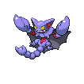

# Mt. Silver — Wild Pokémon

---

## Super Rod

### Grass, Morning / Day

| Sprite | Pokémon | Encounter Type | Level | Chance |
|:------:|---------|:--------------:|-------|--------|
|  | Tangela | {: style="max-width: 24px;"" } {: style="max-width: 24px;"" } {: style="max-width: 24px;"" } | 59 - 65 | 35% |
|  | Manectric | {: style="max-width: 24px;"" } {: style="max-width: 24px;"" } {: style="max-width: 24px;"" } | 59 - 65 | 25% |
|  | Rapidash | {: style="max-width: 24px;"" } {: style="max-width: 24px;"" } {: style="max-width: 24px;"" } | 59 - 65 | 10% |
|  | Ursaring | {: style="max-width: 24px;"" } {: style="max-width: 24px;"" } {: style="max-width: 24px;"" } | 59 - 65 | 10% |
|  | Donphan | {: style="max-width: 24px;"" } {: style="max-width: 24px;"" } {: style="max-width: 24px;"" } | 59 - 65 | 10% |
|  | Dodrio | {: style="max-width: 24px;"" } {: style="max-width: 24px;"" } {: style="max-width: 24px;"" } | 59 - 65 | 10% |

### Grass, Night

| Sprite | Pokémon | Encounter Type | Level | Chance |
|:------:|---------|:--------------:|-------|--------|
|  | Tangela | {: style="max-width: 24px;"" } {: style="max-width: 24px;"" } | 59 - 65 | 25% |
|  | Manectric | {: style="max-width: 24px;"" } {: style="max-width: 24px;"" } | 59 - 65 | 20% |
|  | Rapidash | {: style="max-width: 24px;"" } {: style="max-width: 24px;"" } | 59 - 65 | 10% |
|  | Ursaring | {: style="max-width: 24px;"" } {: style="max-width: 24px;"" } | 59 - 65 | 10% |
|  | Donphan | {: style="max-width: 24px;"" } {: style="max-width: 24px;"" } | 59 - 65 | 10% |
|  | Quagsire | {: style="max-width: 24px;"" } {: style="max-width: 24px;"" } | 59 - 65 | 10% |
|  | Dusclops | {: style="max-width: 24px;"" } {: style="max-width: 24px;"" } | 59 - 65 | 10% |
|  | Sneasel | {: style="max-width: 24px;"" } {: style="max-width: 24px;"" } | 59 - 65 | 5% |

### Meridian Sound

| Sprite | Pokémon | Encounter Type | Level | Chance |
|:------:|---------|:--------------:|-------|--------|
|  | Tangrowth | {: style="max-width: 24px;"" } | 59 - 65 | 100% |

### Pastoral Sound

| Sprite | Pokémon | Encounter Type | Level | Chance |
|:------:|---------|:--------------:|-------|--------|
|  | Arbok | {: style="max-width: 24px;"" } | 59 - 65 | 100% |

### Surf

| Sprite | Pokémon | Encounter Type | Level | Chance |
|:------:|---------|:--------------:|-------|--------|
|  | Poliwag | {: style="max-width: 24px;"" } | 59 - 65 | 90% |
|  | Poliwhirl | {: style="max-width: 24px;"" } | 59 - 65 | 10% |

### Old Rod

| Sprite | Pokémon | Encounter Type | Level | Chance |
|:------:|---------|:--------------:|-------|--------|
|  | Luvdisc | {: style="max-width: 24px;"" } | 10 | 90% |
|  | Poliwag | {: style="max-width: 24px;"" } | 10 | 10% |

### Good Rod

| Sprite | Pokémon | Encounter Type | Level | Chance |
|:------:|---------|:--------------:|-------|--------|
|  | Luvdisc | {: style="max-width: 24px;"" } | 25 | 60% |
|  | Poliwag | {: style="max-width: 24px;"" } | 25 | 30% |
|  | Poliwhirl | {: style="max-width: 24px;"" } | 25 | 10% |

### Super Rod

| Sprite | Pokémon | Encounter Type | Level | Chance |
|:------:|---------|:--------------:|-------|--------|
|  | Poliwhirl | {: style="max-width: 24px;"" } | 50 | 60% |
|  | Luvdisc | {: style="max-width: 24px;"" } | 50 | 30% |
|  | Gyarados | {: style="max-width: 24px;"" } | 50 | 10% |

---

## Super Rod

### Cave, Morning / Day

| Sprite | Pokémon | Encounter Type | Level | Chance |
|:------:|---------|:--------------:|-------|--------|
|  | Phanpy | {: style="max-width: 24px;"" } {: style="max-width: 24px;"" } {: style="max-width: 24px;"" } | 50 – 64 | 20% |
|  | Teddiursa | {: style="max-width: 24px;"" } {: style="max-width: 24px;"" } {: style="max-width: 24px;"" } | 50 – 64 | 20% |
|  | Donphan | {: style="max-width: 24px;"" } {: style="max-width: 24px;"" } {: style="max-width: 24px;"" } | 50 – 64 | 15% |
|  | Ursaring | {: style="max-width: 24px;"" } {: style="max-width: 24px;"" } {: style="max-width: 24px;"" } | 50 – 64 | 15% |
|  | Quagsire | {: style="max-width: 24px;"" } {: style="max-width: 24px;"" } {: style="max-width: 24px;"" } | 50 – 64 | 10% |
|  | Magmar | {: style="max-width: 24px;"" } {: style="max-width: 24px;"" } {: style="max-width: 24px;"" } | 50 – 64 | 10% |
|  | Larvitar | {: style="max-width: 24px;"" } {: style="max-width: 24px;"" } {: style="max-width: 24px;"" } | 50 – 64 | 5% |
|  | Graveler | {: style="max-width: 24px;"" } {: style="max-width: 24px;"" } {: style="max-width: 24px;"" } | 50 – 64 | 5% |

### Cave, Night

| Sprite | Pokémon | Encounter Type | Level | Chance |
|:------:|---------|:--------------:|-------|--------|
|  | Quagsire | {: style="max-width: 24px;"" } {: style="max-width: 24px;"" } | 50 – 64 | 20% |
|  | Golbat | {: style="max-width: 24px;"" } {: style="max-width: 24px;"" } | 50 – 64 | 20% |
|  | Golduck | {: style="max-width: 24px;"" } {: style="max-width: 24px;"" } | 50 – 64 | 20% |
|  | Graveler | {: style="max-width: 24px;"" } {: style="max-width: 24px;"" } | 50 – 64 | 20% |
|  | Donphan | {: style="max-width: 24px;"" } {: style="max-width: 24px;"" } | 50 – 64 | 5% |
|  | Ursaring | {: style="max-width: 24px;"" } {: style="max-width: 24px;"" } | 50 – 64 | 5% |
|  | Larvitar | {: style="max-width: 24px;"" } {: style="max-width: 24px;"" } | 50 – 64 | 5% |
|  | Misdreavus | {: style="max-width: 24px;"" } {: style="max-width: 24px;"" } | 50 – 64 | 5% |

### Meridian Sound

| Sprite | Pokémon | Encounter Type | Level | Chance |
|:------:|---------|:--------------:|-------|--------|
|  | Pupitar | {: style="max-width: 24px;"" } | 50 – 64 | 100% |

### Pastoral Sound

| Sprite | Pokémon | Encounter Type | Level | Chance |
|:------:|---------|:--------------:|-------|--------|
|  | Larvitar | {: style="max-width: 24px;"" } | 50 – 64 | 100% |

### Surf

| Sprite | Pokémon | Encounter Type | Level | Chance |
|:------:|---------|:--------------:|-------|--------|
|  | Golbat | {: style="max-width: 24px;"" } | 50 – 64 | 60% |
|  | Seadra | {: style="max-width: 24px;"" } | 50 – 64 | 30% |
|  | Horsea | {: style="max-width: 24px;"" } | 50 – 64 | 10% |

### Old Rod

| Sprite | Pokémon | Encounter Type | Level | Chance |
|:------:|---------|:--------------:|-------|--------|
|  | Goldeen | {: style="max-width: 24px;"" } | 10 | 60% |
|  | Krabby | {: style="max-width: 24px;"" } | 10 | 30% |
|  | Corphish | {: style="max-width: 24px;"" } | 10 | 10% |

### Good Rod

| Sprite | Pokémon | Encounter Type | Level | Chance |
|:------:|---------|:--------------:|-------|--------|
|  | Goldeen | {: style="max-width: 24px;"" } | 25 | 60% |
|  | Krabby | {: style="max-width: 24px;"" } | 25 | 30% |
|  | Corphish | {: style="max-width: 24px;"" } | 25 | 10% |

### Super Rod

| Sprite | Pokémon | Encounter Type | Level | Chance |
|:------:|---------|:--------------:|-------|--------|
|  | Seaking | {: style="max-width: 24px;"" } | 50 | 60% |
|  | Kingler | {: style="max-width: 24px;"" } | 50 | 30% |
|  | Crawdaunt | {: style="max-width: 24px;"" } | 50 | 10% |

---

## Super Rod

### Cave, Morning / Day

| Sprite | Pokémon | Encounter Type | Level | Chance |
|:------:|---------|:--------------:|-------|--------|
|  | Parasect | {: style="max-width: 24px;"" } {: style="max-width: 24px;"" } {: style="max-width: 24px;"" } | 50 – 64 | 45% |
|  | Golduck | {: style="max-width: 24px;"" } {: style="max-width: 24px;"" } {: style="max-width: 24px;"" } | 50 – 64 | 20% |
|  | Quagsire | {: style="max-width: 24px;"" } {: style="max-width: 24px;"" } {: style="max-width: 24px;"" } | 50 – 64 | 15% |
|  | Shelgon | {: style="max-width: 24px;"" } {: style="max-width: 24px;"" } {: style="max-width: 24px;"" } | 50 – 64 | 15% |
|  | Bagon | {: style="max-width: 24px;"" } {: style="max-width: 24px;"" } {: style="max-width: 24px;"" } | 50 – 64 | 5% |

### Cave, Night

| Sprite | Pokémon | Encounter Type | Level | Chance |
|:------:|---------|:--------------:|-------|--------|
|  | Parasect | {: style="max-width: 24px;"" } {: style="max-width: 24px;"" } | 50 – 64 | 35% |
|  | Golduck | {: style="max-width: 24px;"" } {: style="max-width: 24px;"" } | 50 – 64 | 20% |
|  | Quagsire | {: style="max-width: 24px;"" } {: style="max-width: 24px;"" } | 50 – 64 | 15% |
|  | Shelgon | {: style="max-width: 24px;"" } {: style="max-width: 24px;"" } | 50 – 64 | 15% |
|  | Misdreavus | {: style="max-width: 24px;"" } {: style="max-width: 24px;"" } | 50 – 64 | 10% |
|  | Bagon | {: style="max-width: 24px;"" } {: style="max-width: 24px;"" } | 50 – 64 | 5% |

### Meridian Sound

| Sprite | Pokémon | Encounter Type | Level | Chance |
|:------:|---------|:--------------:|-------|--------|
|  | Shelgon | {: style="max-width: 24px;"" } | 50 – 64 | 100% |

### Pastoral Sound

| Sprite | Pokémon | Encounter Type | Level | Chance |
|:------:|---------|:--------------:|-------|--------|
|  | Paras | {: style="max-width: 24px;"" } | 50 – 64 | 50% |
|  | Bagon | {: style="max-width: 24px;"" } | 50 – 64 | 50% |

---

## Pastoral Sound

### Cave, Morning / Day

| Sprite | Pokémon | Encounter Type | Level | Chance |
|:------:|---------|:--------------:|-------|--------|
|  | Golbat | {: style="max-width: 24px;"" } {: style="max-width: 24px;"" } {: style="max-width: 24px;"" } | 64 – 68 | 20% |
|  | Graveler | {: style="max-width: 24px;"" } {: style="max-width: 24px;"" } {: style="max-width: 24px;"" } | 64 – 68 | 20% |
|  | Steelix | {: style="max-width: 24px;"" } {: style="max-width: 24px;"" } {: style="max-width: 24px;"" } | 64 – 68 | 20% |
|  | Rhydon | {: style="max-width: 24px;"" } {: style="max-width: 24px;"" } {: style="max-width: 24px;"" } | 64 – 68 | 20% |
|  | Quagsire | {: style="max-width: 24px;"" } {: style="max-width: 24px;"" } {: style="max-width: 24px;"" } | 64 – 68 | 10% |
|  | Pupitar | {: style="max-width: 24px;"" } {: style="max-width: 24px;"" } {: style="max-width: 24px;"" } | 64 – 68 | 10% |

### Cave, Night

| Sprite | Pokémon | Encounter Type | Level | Chance |
|:------:|---------|:--------------:|-------|--------|
|  | Golbat | {: style="max-width: 24px;"" } {: style="max-width: 24px;"" } | 64 – 68 | 20% |
|  | Graveler | {: style="max-width: 24px;"" } {: style="max-width: 24px;"" } | 64 – 68 | 20% |
|  | Steelix | {: style="max-width: 24px;"" } {: style="max-width: 24px;"" } | 64 – 68 | 20% |
|  | Rhydon | {: style="max-width: 24px;"" } {: style="max-width: 24px;"" } | 64 – 68 | 20% |
|  | Misdreavus | {: style="max-width: 24px;"" } {: style="max-width: 24px;"" } | 64 – 68 | 10% |
|  | Quagsire | {: style="max-width: 24px;"" } {: style="max-width: 24px;"" } | 64 – 68 | 5% |
|  | Pupitar | {: style="max-width: 24px;"" } {: style="max-width: 24px;"" } | 64 – 68 | 5% |

### Meridian Sound

| Sprite | Pokémon | Encounter Type | Level | Chance |
|:------:|---------|:--------------:|-------|--------|
|  | Rhyperior | {: style="max-width: 24px;"" } | 64 – 68 | 100% |

### Pastoral Sound

| Sprite | Pokémon | Encounter Type | Level | Chance |
|:------:|---------|:--------------:|-------|--------|
|  | Pupitar | {: style="max-width: 24px;"" } | 64 – 68 | 100% |

---

## Pastoral Sound

### Cave, Morning / Day

| Sprite | Pokémon | Encounter Type | Level | Chance |
|:------:|---------|:--------------:|-------|--------|
|  | Golbat | {: style="max-width: 24px;"" } {: style="max-width: 24px;"" } {: style="max-width: 24px;"" } | 62 – 66 | 25% |
|  | Graveler | {: style="max-width: 24px;"" } {: style="max-width: 24px;"" } {: style="max-width: 24px;"" } | 62 – 66 | 25% |
|  | Magneton | {: style="max-width: 24px;"" } {: style="max-width: 24px;"" } {: style="max-width: 24px;"" } | 62 – 66 | 20% |
|  | Mawile | {: style="max-width: 24px;"" } {: style="max-width: 24px;"" } {: style="max-width: 24px;"" } | 62 – 66 | 10% |
|  | Sableye | {: style="max-width: 24px;"" } {: style="max-width: 24px;"" } {: style="max-width: 24px;"" } | 62 – 66 | 10% |
|  | Solrock | {: style="max-width: 24px;"" } {: style="max-width: 24px;"" } {: style="max-width: 24px;"" } | 62 – 66 | 10% |

### Cave, Night

| Sprite | Pokémon | Encounter Type | Level | Chance |
|:------:|---------|:--------------:|-------|--------|
|  | Golbat | {: style="max-width: 24px;"" } {: style="max-width: 24px;"" } | 62 – 66 | 25% |
|  | Graveler | {: style="max-width: 24px;"" } {: style="max-width: 24px;"" } | 62 – 66 | 20% |
|  | Dusclops | {: style="max-width: 24px;"" } {: style="max-width: 24px;"" } | 62 – 66 | 10% |
|  | Magneton | {: style="max-width: 24px;"" } {: style="max-width: 24px;"" } | 62 – 66 | 10% |
|  | Mawile | {: style="max-width: 24px;"" } {: style="max-width: 24px;"" } | 62 – 66 | 10% |
|  | Sableye | {: style="max-width: 24px;"" } {: style="max-width: 24px;"" } | 62 – 66 | 10% |
|  | Lunatone | {: style="max-width: 24px;"" } {: style="max-width: 24px;"" } | 62 – 66 | 10% |
|  | Misdreavus | {: style="max-width: 24px;"" } {: style="max-width: 24px;"" } | 62 – 66 | 5% |

### Meridian Sound

| Sprite | Pokémon | Encounter Type | Level | Chance |
|:------:|---------|:--------------:|-------|--------|
|  | Magnezone | {: style="max-width: 24px;"" } | 62 – 66 | 100% |

### Pastoral Sound

| Sprite | Pokémon | Encounter Type | Level | Chance |
|:------:|---------|:--------------:|-------|--------|
|  | Solrock | {: style="max-width: 24px;"" } | 62 – 66 | 50% |
|  | Lunatone | {: style="max-width: 24px;"" } | 62 – 66 | 50% |

---

## Pastoral Sound

### Grass, Morning / Day

| Sprite | Pokémon | Encounter Type | Level | Chance |
|:------:|---------|:--------------:|-------|--------|
|  | Abomasnow | {: style="max-width: 24px;"" } {: style="max-width: 24px;"" } {: style="max-width: 24px;"" } | 54 - 65 | 30% |
|  | Medicham | {: style="max-width: 24px;"" } {: style="max-width: 24px;"" } {: style="max-width: 24px;"" } | 54 - 65 | 20% |
|  | Loudred | {: style="max-width: 24px;"" } {: style="max-width: 24px;"" } {: style="max-width: 24px;"" } | 54 - 65 | 20% |
|  | Sneasel | {: style="max-width: 24px;"" } {: style="max-width: 24px;"" } {: style="max-width: 24px;"" } | 54 - 65 | 10% |
|  | Piloswine | {: style="max-width: 24px;"" } {: style="max-width: 24px;"" } {: style="max-width: 24px;"" } | 54 - 65 | 10% |
|  | Snover | {: style="max-width: 24px;"" } {: style="max-width: 24px;"" } {: style="max-width: 24px;"" } | 54 - 65 | 5% |
|  | Absol | {: style="max-width: 24px;"" } {: style="max-width: 24px;"" } {: style="max-width: 24px;"" } | 54 - 65 | 5% |

### Grass, Night

| Sprite | Pokémon | Encounter Type | Level | Chance |
|:------:|---------|:--------------:|-------|--------|
|  | Abomasnow | {: style="max-width: 24px;"" } {: style="max-width: 24px;"" } | 54 - 65 | 20% |
|  | Loudred | {: style="max-width: 24px;"" } {: style="max-width: 24px;"" } | 54 - 65 | 20% |
|  | Medicham | {: style="max-width: 24px;"" } {: style="max-width: 24px;"" } | 54 - 65 | 10% |
|  | Noctowl | {: style="max-width: 24px;"" } {: style="max-width: 24px;"" } | 54 - 65 | 10% |
|  | Golbat | {: style="max-width: 24px;"" } {: style="max-width: 24px;"" } | 54 - 65 | 10% |
|  | Sneasel | {: style="max-width: 24px;"" } {: style="max-width: 24px;"" } | 54 - 65 | 10% |
|  | Piloswine | {: style="max-width: 24px;"" } {: style="max-width: 24px;"" } | 54 - 65 | 10% |
|  | Snover | {: style="max-width: 24px;"" } {: style="max-width: 24px;"" } | 54 - 65 | 5% |
|  | Absol | {: style="max-width: 24px;"" } {: style="max-width: 24px;"" } | 54 - 65 | 5% |

### Meridian Sound

| Sprite | Pokémon | Encounter Type | Level | Chance |
|:------:|---------|:--------------:|-------|--------|
|  | Mamoswine | {: style="max-width: 24px;"" } | 54 - 65 | 50% |
|  | Weavile | {: style="max-width: 24px;"" } | 54 - 65 | 50% |

### Pastoral Sound

| Sprite | Pokémon | Encounter Type | Level | Chance |
|:------:|---------|:--------------:|-------|--------|
|  | Absol | {: style="max-width: 24px;"" } | 54 - 65 | 100% |

---

## Pastoral Sound

### Grass, Morning / Day

| Sprite | Pokémon | Encounter Type | Level | Chance |
|:------:|---------|:--------------:|-------|--------|
|  | Onix | {: style="max-width: 24px;"" } {: style="max-width: 24px;"" } {: style="max-width: 24px;"" } | 60 – 64 | 30% |
|  | Gligar | {: style="max-width: 24px;"" } {: style="max-width: 24px;"" } {: style="max-width: 24px;"" } | 60 – 64 | 20% |
|  | Graveler | {: style="max-width: 24px;"" } {: style="max-width: 24px;"" } {: style="max-width: 24px;"" } | 60 – 64 | 20% |
|  | Lairon | {: style="max-width: 24px;"" } {: style="max-width: 24px;"" } {: style="max-width: 24px;"" } | 60 – 64 | 10% |
|  | Machoke | {: style="max-width: 24px;"" } {: style="max-width: 24px;"" } {: style="max-width: 24px;"" } | 60 – 64 | 10% |
|  | Skarmory | {: style="max-width: 24px;"" } {: style="max-width: 24px;"" } {: style="max-width: 24px;"" } | 60 – 64 | 5% |

### Grass, Night

| Sprite | Pokémon | Encounter Type | Level | Chance |
|:------:|---------|:--------------:|-------|--------|
|  | Golbat | {: style="max-width: 24px;"" } {: style="max-width: 24px;"" } | 60 – 64 | 40% |
|  | Gligar | {: style="max-width: 24px;"" } {: style="max-width: 24px;"" } | 60 – 64 | 10% |
|  | Onix | {: style="max-width: 24px;"" } {: style="max-width: 24px;"" } | 60 – 64 | 10% |
|  | Graveler | {: style="max-width: 24px;"" } {: style="max-width: 24px;"" } | 60 – 64 | 10% |
|  | Lairon | {: style="max-width: 24px;"" } {: style="max-width: 24px;"" } | 60 – 64 | 10% |
|  | Machoke | {: style="max-width: 24px;"" } {: style="max-width: 24px;"" } | 60 – 64 | 5% |
|  | Vibrava | {: style="max-width: 24px;"" } {: style="max-width: 24px;"" } | 60 – 64 | 5% |
|  | Skarmory | {: style="max-width: 24px;"" } {: style="max-width: 24px;"" } | 60 – 64 | 5% |

### Meridian Sound

| Sprite | Pokémon | Encounter Type | Level | Chance |
|:------:|---------|:--------------:|-------|--------|
|  | Gliscor | {: style="max-width: 24px;"" } | 60 – 64 | 50% |
|  | Flygon | {: style="max-width: 24px;"" } | 60 – 64 | 50% |

### Pastoral Sound

| Sprite | Pokémon | Encounter Type | Level | Chance |
|:------:|---------|:--------------:|-------|--------|
|  | Skarmory | {: style="max-width: 24px;"" } | 60 – 64 | 100% |

---

## Pastoral Sound

### Cave, Morning / Day

| Sprite | Pokémon | Encounter Type | Level | Chance |
|:------:|---------|:--------------:|-------|--------|
|  | Golbat | {: style="max-width: 24px;"" } {: style="max-width: 24px;"" } {: style="max-width: 24px;"" } | 64 – 68 | 25% |
|  | Gabite | {: style="max-width: 24px;"" } {: style="max-width: 24px;"" } {: style="max-width: 24px;"" } | 64 – 68 | 20% |
|  | Bronzong | {: style="max-width: 24px;"" } {: style="max-width: 24px;"" } {: style="max-width: 24px;"" } | 64 – 68 | 15% |
|  | Mawile | {: style="max-width: 24px;"" } {: style="max-width: 24px;"" } {: style="max-width: 24px;"" } | 64 – 68 | 10% |
|  | Sableye | {: style="max-width: 24px;"" } {: style="max-width: 24px;"" } {: style="max-width: 24px;"" } | 64 – 68 | 10% |
|  | Magneton | {: style="max-width: 24px;"" } {: style="max-width: 24px;"" } {: style="max-width: 24px;"" } | 64 – 68 | 10% |
|  | Machoke | {: style="max-width: 24px;"" } {: style="max-width: 24px;"" } {: style="max-width: 24px;"" } | 64 – 68 | 10% |

### Cave, Night

| Sprite | Pokémon | Encounter Type | Level | Chance |
|:------:|---------|:--------------:|-------|--------|
|  | Golbat | {: style="max-width: 24px;"" } {: style="max-width: 24px;"" } | 64 – 68 | 25% |
|  | Gabite | {: style="max-width: 24px;"" } {: style="max-width: 24px;"" } | 64 – 68 | 20% |
|  | Bronzong | {: style="max-width: 24px;"" } {: style="max-width: 24px;"" } | 64 – 68 | 15% |
|  | Mawile | {: style="max-width: 24px;"" } {: style="max-width: 24px;"" } | 64 – 68 | 10% |
|  | Sableye | {: style="max-width: 24px;"" } {: style="max-width: 24px;"" } | 64 – 68 | 10% |
|  | Machoke | {: style="max-width: 24px;"" } {: style="max-width: 24px;"" } | 64 – 68 | 10% |
|  | Magneton | {: style="max-width: 24px;"" } {: style="max-width: 24px;"" } | 64 – 68 | 5% |
|  | Dusclops | {: style="max-width: 24px;"" } {: style="max-width: 24px;"" } | 64 – 68 | 5% |

### Meridian Sound

| Sprite | Pokémon | Encounter Type | Level | Chance |
|:------:|---------|:--------------:|-------|--------|
|  | Machamp | {: style="max-width: 24px;"" } | 64 – 68 | 100% |

### Pastoral Sound

| Sprite | Pokémon | Encounter Type | Level | Chance |
|:------:|---------|:--------------:|-------|--------|
|  | Mawile | {: style="max-width: 24px;"" } | 64 – 68 | 50% |
|  | Sableye | {: style="max-width: 24px;"" } | 64 – 68 | 50% |

