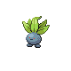

# National Park — Trainer Rosters

### Generic Trainers

| Trainer | P1 | P2 | P3 | P4 | P5 | P6 |
|:-------:|:--:|:--:|:--:|:--:|:--:|:--:|
|  Pokefan Beverly |  Granbull Lv. 23 |
| ") School Kid Jack [(!)](#rematches) |  Oddish Lv. 20 |  Croagunk Lv. 20 |  Phanpy Lv. 20 |  Skitty Lv. 20 |
|  Pokefan William |  Mime Jr. Lv. 19 |  Sudowoodo Lv. 22 |
| ") Lass Krise [(!)](#rematches) |  Oddish Lv. 19 |  Gloom Lv. 21 |

### Rematches

| Trainer | P1 | P2 | P3 | P4 | P5 | P6 |
|:-------:|:--:|:--:|:--:|:--:|:--:|:--:|
| ") School Kid Jack (M4a-10a) |  Gloom Lv. 44 |  Skitty Lv. 46 |  Donphan Lv. 46 |  Toxicroak Lv. 48 |
| ") School Kid Jack (M4a-10a) |  Vileplume Lv. 54 |  Toxicroak Lv. 52 |  Donphan Lv. 52 |  Delcatty Lv. 54 |
| ") School Kid Jack (M4a-10a) |  Vileplume Lv. 68 |  Toxicroak Lv. 66 |  Delcatty Lv. 68 |  Donphan Lv. 72 |
| ") Lass Krise (Su4a-10a) |  Vileplume Lv. 48 |  Marowak Lv. 48 |
| ") Lass Krise (Su4a-10a) |  Vileplume Lv. 53 |  Marowak Lv. 53 |
| ") Lass Krise (Su4a-10a) |  Vileplume Lv. 68 |  Marowak Lv. 68 |  Kangaskhan Lv. 68 |

