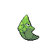
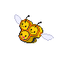
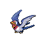
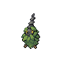
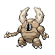
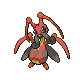
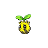
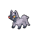
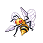

# National Park Wild Pokémon

### Grass, Morning

| Sprite | Pokémon | Encounter Type | Level | Chance |
|:------:|---------|:--------------:|-------|--------|
|  | Metapod | {: style="max-width: 24px;"" } {: style="max-width: 24px;"" } | 17 – 19 | 20% |
|  | Kakuna | {: style="max-width: 24px;"" } {: style="max-width: 24px;"" } | 17 – 19 | 20% |
|  | Combee | {: style="max-width: 24px;"" } {: style="max-width: 24px;"" } | 17 – 19 | 10% |
|  | Taillow | {: style="max-width: 24px;"" } {: style="max-width: 24px;"" } | 17 – 19 | 10% |
|  | Nincada | {: style="max-width: 24px;"" } {: style="max-width: 24px;"" } | 17 – 19 | 10% |
|  | Burmy | {: style="max-width: 24px;"" } {: style="max-width: 24px;"" } | 17 – 19 | 10% |
|  | Scyther | {: style="max-width: 24px;"" } {: style="max-width: 24px;"" } | 17 – 19 | 5% |
|  | Pinsir | {: style="max-width: 24px;"" } {: style="max-width: 24px;"" } | 17 – 19 | 5% |
|  | Heracross | {: style="max-width: 24px;"" } {: style="max-width: 24px;"" } | 17 – 19 | 5% |
|  | Kricketune | {: style="max-width: 24px;"" } {: style="max-width: 24px;"" } | 17 – 19 | 5% |

### Grass, Day

| Sprite | Pokémon | Encounter Type | Level | Chance |
|:------:|---------|:--------------:|-------|--------|
|  | Metapod | {: style="max-width: 24px;"" } {: style="max-width: 24px;"" } | 17 – 19 | 20% |
|  | Kakuna | {: style="max-width: 24px;"" } {: style="max-width: 24px;"" } | 17 – 19 | 20% |
|  | Combee | {: style="max-width: 24px;"" } {: style="max-width: 24px;"" } | 17 – 19 | 10% |
|  | Taillow | {: style="max-width: 24px;"" } {: style="max-width: 24px;"" } | 17 – 19 | 10% |
|  | Sunkern | {: style="max-width: 24px;"" } {: style="max-width: 24px;"" } | 17 – 19 | 10% |
|  | Burmy | {: style="max-width: 24px;"" } {: style="max-width: 24px;"" } | 17 – 19 | 10% |
|  | Scyther | {: style="max-width: 24px;"" } {: style="max-width: 24px;"" } | 17 – 19 | 5% |
|  | Pinsir | {: style="max-width: 24px;"" } {: style="max-width: 24px;"" } | 17 – 19 | 5% |
|  | Heracross | {: style="max-width: 24px;"" } {: style="max-width: 24px;"" } | 17 – 19 | 5% |
|  | Kricketune | {: style="max-width: 24px;"" } {: style="max-width: 24px;"" } | 17 – 19 | 5% |

### Grass, Night

| Sprite | Pokémon | Encounter Type | Level | Chance |
|:------:|---------|:--------------:|-------|--------|
|  | Metapod | {: style="max-width: 24px;"" } {: style="max-width: 24px;"" } | 17 – 19 | 20% |
|  | Kakuna | {: style="max-width: 24px;"" } {: style="max-width: 24px;"" } | 17 – 19 | 20% |
|  | Combee | {: style="max-width: 24px;"" } {: style="max-width: 24px;"" } | 17 – 19 | 10% |
|  | Poochyena | {: style="max-width: 24px;"" } {: style="max-width: 24px;"" } | 17 – 19 | 10% |
|  | Nincada | {: style="max-width: 24px;"" } {: style="max-width: 24px;"" } | 17 – 19 | 10% |
|  | Burmy | {: style="max-width: 24px;"" } {: style="max-width: 24px;"" } | 17 – 19 | 10% |
|  | Scyther | {: style="max-width: 24px;"" } {: style="max-width: 24px;"" } | 17 – 19 | 5% |
|  | Pinsir | {: style="max-width: 24px;"" } {: style="max-width: 24px;"" } | 17 – 19 | 5% |
|  | Heracross | {: style="max-width: 24px;"" } {: style="max-width: 24px;"" } | 17 – 19 | 5% |
|  | Kricketune | {: style="max-width: 24px;"" } {: style="max-width: 24px;"" } | 17 – 19 | 5% |

### Meridian Sound

| Sprite | Pokémon | Encounter Type | Level | Chance |
|:------:|---------|:--------------:|-------|--------|
|  | Butterfree | {: style="max-width: 24px;"" } | 17 – 19 | 50% |
|  | Beedrill | {: style="max-width: 24px;"" } | 17 – 19 | 50% |

### Pastoral Sound

| Sprite | Pokémon | Encounter Type | Level | Chance |
|:------:|---------|:--------------:|-------|--------|
|  | Scyther | {: style="max-width: 24px;"" } | 17 – 19 | SG |
|  | Pinsir | {: style="max-width: 24px;"" } | 17 – 19 | SS |
|  | Heracross | {: style="max-width: 24px;"" } | 17 – 19 | SG/SS |

