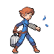

# Olivine City — Trainer Rosters

---

## City

### Generic Trainers

| Trainer | P1 | P2 | P3 | P4 | P5 | P6 |
|:-------:|:--:|:--:|:--:|:--:|:--:|:--:|
|  Beauty Charlotte |  Bellossom Lv. 30 |

---

## Lighthouse

### Generic Trainers

| Trainer | P1 | P2 | P3 | P4 | P5 | P6 |
|:-------:|:--:|:--:|:--:|:--:|:--:|:--:|
| ") Gentleman Alfred [(!)](#rematches) |  Noctowl Lv. 30 |  Arcanine Lv. 30 |
| ") Sailor Huey [(!)](#rematches) |  Crawdaunt Lv. 31 |
|  Bird Keeper Theo |  Dodrio Lv. 32 |
|  Gentleman Preston |  Ninetales Lv. 30 |  Nidoking Lv. 30 |
|  Lass Connie |  Azumarill Lv. 31 |
|  Sailor Kent |  Wartortle Lv. 29 |  Pelipper Lv. 29 |
|  Bird Keeper Dennis |  Swablu Lv. 29 |  Staravia Lv. 29 |  Fearow Lv. 29 |
|  Sailor Terrell |  Politoed Lv. 32 |
|  Sailor Roberto |  Wingull Lv. 29 |  Machoke Lv. 29 |

### Rematches

| Trainer | P1 | P2 | P3 | P4 | P5 | P6 |
|:-------:|:--:|:--:|:--:|:--:|:--:|:--:|
| ") Gentleman Alfred (T10a-8p) |  Noctowl Lv. 46 |  Nidoking Lv. 46 |  Arcanine Lv. 46 |
| ") Gentleman Alfred (T10a-8p) |  Noctowl Lv. 52 |  Nidoking Lv. 52 |  Arcanine Lv. 52 |
| ") Gentleman Alfred (T10a-8p) |  Noctowl Lv. 68 |  Nidoking Lv. 68 |  Arcanine Lv. 68 |
| ") Sailor Huey (W8p-5a) |  Sharpedo Lv. 46 |  Crawdaunt Lv. 46 |
| ") Sailor Huey (W8p-5a) |  Sharpedo Lv. 52 |  Crawdaunt Lv. 52 |
| ") Sailor Huey (W8p-5a) |  Sharpedo Lv. 68 |  Crawdaunt Lv. 72 |

---

## Gym

### Important Trainers

1. [Leader Jasmine](important_trainers.md#leader-jasmine)
