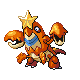

# Olivine City — Trainer Rosters

---

## City

### Generic Trainers

| Trainer | P1 | P2 | P3 | P4 | P5 | P6 |
|:-------:|:--:|:--:|:--:|:--:|:--:|:--:|
|  Beauty Charlotte |  [Bellossom](../../pokemon/bellossom.md/) Lv. 30 |

---

## Lighthouse

### Generic Trainers

| Trainer | P1 | P2 | P3 | P4 | P5 | P6 |
|:-------:|:--:|:--:|:--:|:--:|:--:|:--:|
| ") Gentleman Alfred [(!)](#rematches) |  [Noctowl](../../pokemon/noctowl.md/) Lv. 30 |  [Arcanine](../../pokemon/arcanine.md/) Lv. 30 |
| ") Sailor Huey [(!)](#rematches) |  [Crawdaunt](../../pokemon/crawdaunt.md/) Lv. 31 |
|  Bird Keeper Theo |  [Dodrio](../../pokemon/dodrio.md/) Lv. 32 |
|  Gentleman Preston |  [Ninetales](../../pokemon/ninetales.md/) Lv. 30 |  [Nidoking](../../pokemon/nidoking.md/) Lv. 30 |
|  Lass Connie |  [Azumarill](../../pokemon/azumarill.md/) Lv. 31 |
|  Sailor Kent |  [Wartortle](../../pokemon/wartortle.md/) Lv. 29 |  [Pelipper](../../pokemon/pelipper.md/) Lv. 29 |
|  Bird Keeper Dennis |  [Swablu](../../pokemon/swablu.md/) Lv. 29 |  [Staravia](../../pokemon/staravia.md/) Lv. 29 |  [Fearow](../../pokemon/fearow.md/) Lv. 29 |
|  Sailor Terrell |  [Politoed](../../pokemon/politoed.md/) Lv. 32 |
|  Sailor Roberto |  [Wingull](../../pokemon/wingull.md/) Lv. 29 |  [Machoke](../../pokemon/machoke.md/) Lv. 29 |

### Rematches

| Trainer | P1 | P2 | P3 | P4 | P5 | P6 |
|:-------:|:--:|:--:|:--:|:--:|:--:|:--:|
| ") Gentleman Alfred (T10a-8p) |  [Noctowl](../../pokemon/noctowl.md/) Lv. 46 |  [Nidoking](../../pokemon/nidoking.md/) Lv. 46 |  [Arcanine](../../pokemon/arcanine.md/) Lv. 46 |
| ") Gentleman Alfred (T10a-8p) |  [Noctowl](../../pokemon/noctowl.md/) Lv. 52 |  [Nidoking](../../pokemon/nidoking.md/) Lv. 52 |  [Arcanine](../../pokemon/arcanine.md/) Lv. 52 |
| ") Gentleman Alfred (T10a-8p) |  [Noctowl](../../pokemon/noctowl.md/) Lv. 68 |  [Nidoking](../../pokemon/nidoking.md/) Lv. 68 |  [Arcanine](../../pokemon/arcanine.md/) Lv. 68 |
| ") Sailor Huey (W8p-5a) |  [Sharpedo](../../pokemon/sharpedo.md/) Lv. 46 |  [Crawdaunt](../../pokemon/crawdaunt.md/) Lv. 46 |
| ") Sailor Huey (W8p-5a) |  [Sharpedo](../../pokemon/sharpedo.md/) Lv. 52 |  [Crawdaunt](../../pokemon/crawdaunt.md/) Lv. 52 |
| ") Sailor Huey (W8p-5a) |  [Sharpedo](../../pokemon/sharpedo.md/) Lv. 68 |  [Crawdaunt](../../pokemon/crawdaunt.md/) Lv. 72 |

---

## Gym

### Important Trainers

1. [Leader Jasmine](important_trainers.md#leader-jasmine)
