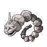

# Important Trainers

---

## Gym

### Leader Brock

| Pokémon | Attributes | Item | Moves |
|:-------:|------------|:----:|-------|
|  | **Lv. 58** Omastar **Ability:** Shell Armor | None | 1. Blizzard 2. Muddy Water 3. Toxic 4. Earth Power |
|  | **Lv. 57** Relicanth **Ability:** Rock Head | None | 1. Head Smash 2. Aqua Tail 3. Earthquake 4. Double-Edge |
|  | **Lv. 58** Kabutops **Ability:** Battle Armor | None | 1. Swords Dance 2. Aqua Tail 3. Stone Edge 4. Aqua Jet |
|  | **Lv. 59** Golem **Ability:** Sturdy |  Sitrus Berry | 1. Earthquake 2. Stone Edge 3. Sucker Punch 4. Explosion |
|  | **Lv. 59** Sudowoodo **Ability:** Rock Head | None | 1. Stone Edge 2. Wood Hammer 3. Low Kick 4. Explosion |
|  | **Lv. 61** Onix **Ability:** Sturdy |  Focus Sash | 1. Torment 2. Earthquake 3. Stone Edge 4. Explosion |

