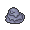

# Important Trainers

### Rival Silver

=== "Totodile"

	| Pokémon | Attributes | Item | Moves |
	|:-------:|------------|:----:|-------|
	|  | **Lv. 77** Honchkrow **Ability:** Insomnia | None | 1. Drill Peck 2. Dark Pulse 3. Nasty Plot 4. Heat Wave |
	|  | **Lv. 76** Gengar **Ability:** Levitate | None | 1. Shadow Ball 2. Thunderbolt 3. Destiny Bond 4. Energy Ball |
	|  | **Lv. 76** Alakazam **Ability:** Synchronize | None | 1. Psychic 2. Recover 3. Energy Ball 4. Focus Blast |
	|  | **Lv. 77** Magmortar **Ability:** Flame Body | None | 1. Fire Blast 2. Swagger 3. Thunderbolt 4. Focus Blast |
	|  | **Lv. 77** Kingdra **Ability:** Swift Swim | None | 1. Hydro Pump 2. Yawn 3. Dragon Pulse 4. Ice Beam |
	|  | **Lv. 77** Magmortar **Ability:** Flame Body | None | 1. Fire Blast 2. Swagger 3. Thunderbolt 4. Focus Blast |
	|  | **Lv. 78** Meganium **Ability:** Overgrow | None | 1. Swords Dance 2. Reflect 3. Seed Bomb 4. Earthquake |
	
=== "Chikorita"

	| Pokémon | Attributes | Item | Moves |
	|:-------:|------------|:----:|-------|
	|  | **Lv. 77** Honchkrow **Ability:** Insomnia | None | 1. Drill Peck 2. Dark Pulse 3. Nasty Plot 4. Heat Wave |
	|  | **Lv. 76** Gengar **Ability:** Levitate | None | 1. Shadow Ball 2. Thunderbolt 3. Destiny Bond 4. Energy Ball |
	|  | **Lv. 76** Alakazam **Ability:** Synchronize | None | 1. Psychic 2. Recover 3. Energy Ball 4. Focus Blast |
	|  | **Lv. 77** Magmortar **Ability:** Flame Body | None | 1. Fire Blast 2. Swagger 3. Thunderbolt 4. Focus Blast |
	|  | **Lv. 77** Kingdra **Ability:** Swift Swim | None | 1. Hydro Pump 2. Yawn 3. Dragon Pulse 4. Ice Beam |
	|  | **Lv. 77** Electivire **Ability:** Motor Drive | None | 1. Thunder 2. Ice Punch 3. Earthquake 4. Light Screen |
	|  | **Lv. 78** Typhlosion **Ability:** Blaze | None | 1. Fire Blast 2. Focus Blast 3. Thunder Punch 4. Low Kick |
	
=== "Cyndaquil"

	| Pokémon | Attributes | Item | Moves |
	|:-------:|------------|:----:|-------|
	|  | **Lv. 77** Honchkrow **Ability:** Insomnia | None | 1. Drill Peck 2. Dark Pulse 3. Nasty Plot 4. Heat Wave |
	|  | **Lv. 76** Gengar **Ability:** Levitate | None | 1. Shadow Ball 2. Thunderbolt 3. Destiny Bond 4. Energy Ball |
	|  | **Lv. 76** Alakazam **Ability:** Synchronize | None | 1. Psychic 2. Recover 3. Energy Ball 4. Focus Blast |
	|  | **Lv. 77** Magmortar **Ability:** Flame Body | None | 1. Fire Blast 2. Swagger 3. Thunderbolt 4. Focus Blast |
	|  | **Lv. 77** Magmortar **Ability:** Flame Body | None | 1. Fire Blast 2. Swagger 3. Thunderbolt 4. Focus Blast |
	|  | **Lv. 77** Electivire **Ability:** Motor Drive | None | 1. Thunder 2. Ice Punch 3. Earthquake 4. Light Screen |
	|  | **Lv. 78** Feraligatr **Ability:** Torrent | None | 1. Waterfall 2. Crunch 3. Ice Fang 4. Earthquake |
	
### (R1) Elite Four Will

 Elite Four Will")

| Pokémon | Attributes | Item | Moves |
|:-------:|------------|:----:|-------|
|  | **Lv. 53** Jynx **Ability:** Dry Skin | None | 1. Ice Beam 2. Psychic 3. Focus Blast 4. Lovely Kiss |
|  | **Lv. 52** Lunatone **Ability:** Levitate | None | 1. Ice Beam 2. Psychic 3. Earth Power 4. Charge Beam |
|  | **Lv. 52** Solrock **Ability:** Levitate | None | 1. Zen Headbutt 2. Stone Edge 3. Embargo 4. Earthquake |
|  | **Lv. 54** Slowbro **Ability:** Oblivious | None | 1. Amnesia 2. Surf 3. Flamethrower 4. Psychic |
|  | **Lv. 55** Gardevoir **Ability:** Synchronize | None | 1. Reflect 2. Psychic 3. Thunderbolt 4. Hypnosis |
|  | **Lv. 55** Xatu **Ability:** Synchronize |  Sitrus Berry | 1. Heat Wave 2. Air Cutter 3. Psychic 4. Thunder Wave |

### (R1) Elite Four Koga

 Elite Four Koga")

| Pokémon | Attributes | Item | Moves |
|:-------:|------------|:----:|-------|
|  | **Lv. 53** Venomoth **Ability:** Poison Heal | None | 1. Bug Buzz 2. Psychic 3. Sleep Powder 4. Giga Drain |
|  | **Lv. 52** Weezing **Ability:** Levitate | None | 1. Fire Blast 2. Toxic 3. Protect 4. Thunder |
|  | **Lv. 52** Toxicroak **Ability:** Anticipation | None | 1. Cross Chop 2. Poison Jab 3. Earthquake 4. Sucker Punch |
|  | **Lv. 54** Tentacruel **Ability:** Clear Body | None | 1. Swords Dance 2. Poison Jab 3. Waterfall 4. Protect |
|  | **Lv. 55** Muk **Ability:** Stench | None | 1. Substitute 2. Focus Punch 3. Gunk Shot 4. Rock slide |
|  | **Lv. 55** Crobat **Ability:** Inner Focus |  Sitrus Berry | 1. Double Team 2. Brave Bird 3. Heat Wave 4. X-Scissor |

### (R1) Elite Four Bruno

 Elite Four Bruno")

| Pokémon | Attributes | Item | Moves |
|:-------:|------------|:----:|-------|
|  | **Lv. 53** Hitmontop **Ability:** Intimidate | None | 1. Counter 2. Fake Out 3. High Jump Kick 4. Sucker Punch |
|  | **Lv. 52** Hitmonlee **Ability:** Limber | None | 1. Earthquake 2. Blaze Kick 3. High Jump Kick 4. Stone Edge |
|  | **Lv. 52** Hitmonchan **Ability:** Keen Eye | None | 1. Fire Punch 2. Ice Punch 3. High Jump Kick 4. Thunder Punch |
|  | **Lv. 54** Lucario **Ability:** Steadfast | None | 1. Aura Sphere 2. Dark Pulse 3. Psychic 4. Extreme Speed |
|  | **Lv. 55** Hariyama **Ability:** Thick Fat | None | 1. Substitute 2. Focus Punch 3. Thunder Punch 4. Payback |
|  | **Lv. 55** Machamp **Ability:** Guts |  Sitrus Berry | 1. Dynamic Punch 2. Stone Edge 3. Thunder Punch 4. Bullet Punch |

### (R1) Elite Four Karen

 Elite Four Karen")

| Pokémon | Attributes | Item | Moves |
|:-------:|------------|:----:|-------|
|  | **Lv. 53** Mightyena **Ability:** Intimidate | None | 1. Attract 2. Super Fang 3. Sucker Punch 4. Fire Fang |
|  | **Lv. 52** Spiritomb **Ability:** Pressure | None | 1. Embargo 2. Dark Pulse 3. Nasty Plot 4. Silver Wind |
|  | **Lv. 52** Absol **Ability:** Pressure | None | 1. Sucker Punch 2. Psycho Cut 3. Megahorn 4. Thunder Wave |
|  | **Lv. 54** Umbreon **Ability:** Synchronize | None | 1. Dark Pulse 2. Double Team 3. Protect 4. Toxic |
|  | **Lv. 55** Honchkrow **Ability:** Insomnia | None | 1. Swagger 2. Thunder Wave 3. Sucker Punch 4. Brave Bird |
|  | **Lv. 55** Houndoom **Ability:** Intimidate |  Sitrus Berry | 1. Heat Wave 2. Dark Pulse 3. Nasty Plot 4. Will-O-Wisp |

### (R1) Champion Lance

 Champion Lance")

| Pokémon | Attributes | Item | Moves |
|:-------:|------------|:----:|-------|
|  | **Lv. 56** Gyarados **Ability:** Intimidate | None | 1. Aqua Tail 2. Earthquake 3. Stone Edge 4. Payback |
|  | **Lv. 54** Garchomp **Ability:** Sand Veil | None | 1. Earthquake 2. Dragon Claw 3. Fire Fang 4. Aerial ace |
|  | **Lv. 54** Aerodactyl **Ability:** Rock Head | None | 1. Stone Edge 2. Tailwind 3. Aerial Ace 4. Torment |
|  | **Lv. 56** Dragonite **Ability:** Inner Focus | None | 1. Draco Meteor 2. Surf 3. Fire Blast 4. Blizzard |
|  | **Lv. 57** Charizard **Ability:** Blaze | None | 1. Swords Dance 2. Flare Blitz 3. Aerial Ace 4. Focus Blast |
|  | **Lv. 60** Dragonite **Ability:** Inner Focus |  Sitrus Berry | 1. Outrage 2. Wing Attack 3. Earthquake 4. Roost |

### (R2) Elite Four Will

 Elite Four Will")

| Pokémon | Attributes | Item | Moves |
|:-------:|------------|:----:|-------|
|  | **Lv. 78** Exeggutor **Ability:** Chlorophyll |  White herb | 1. Sleep Powder 2. Psychic 3. Trick Room 4. Leaf Storm |
|  | **Lv. 78** Bronzong **Ability:** Levitate |  Light Clay | 1. Earthquake 2. Psychic 3. Light Screen 4. Reflect |
|  | **Lv. 78** Jynx **Ability:** Filter | None | 1. Ice Beam 2. Psychic 3. Focus Blast 4. Lovely Kiss |
|  | **Lv. 80** Slowbro **Ability:** Own Tempo | None | 1. Trick Room 2. Psychic 3. Surf 4. Flamethrower |
|  | **Lv. 80** Gardevoir **Ability:** Trace | None | 1. Focus Blast 2. Psychic 3. Thunderbolt 4. Will-O-Wisp |
|  | **Lv. 81** Xatu **Ability:** Early Bird |  Sitrus Berry | 1. Heat Wave 2. Psychic 3. Air Cutter 4. Thunder Wave |

### (R2) Elite Four Koga

 Elite Four Koga")

| Pokémon | Attributes | Item | Moves |
|:-------:|------------|:----:|-------|
|  | **Lv. 78** Toxicroak **Ability:** Anticipation | None | 1. Cross Chop 2. Poison Jab 3. Ice Punch 4. Sucker Punch |
|  | **Lv. 78** Skuntank **Ability:** Aftermath | None | 1. Explosion 2. Sucker Punch 3. Poison Jab 4. Frustration |
|  | **Lv. 78** Venomoth **Ability:** Tinted Lens | None | 1. Bug Buzz 2. Psychic 3. U-Turn 4. Sleep Powder |
|  | **Lv. 80** Muk **Ability:** Sticky Hold |  Black Sludge | 1. Pain Split 2. Payback 3. Gunk Shot 4. Ice Punch |
|  | **Lv. 80** Swalot **Ability:** Sticky Hold |  Leftovers | 1. Rest 2. Sleep Talk 3. Sludge Bomb 4. Earthquake |
|  | **Lv. 81** Crobat **Ability:** Anticipation |  Sitrus Berry | 1. Brave Bird 2. Cross Poison 3. U-Turn 4. Heat Wave |

### (R2) Elite Four Bruno

 Elite Four Bruno")

| Pokémon | Attributes | Item | Moves |
|:-------:|------------|:----:|-------|
|  | **Lv. 78** Hitmontop **Ability:** Technician | None | 1. Fake Out 2. Close Combat 3. Mach Punch 4. Stone Edge |
|  | **Lv. 78** Hitmonlee **Ability:** Reckless | None | 1. High Jump Kick 2. Stone Edge 3. Blaze Kick 4. Mach Punch |
|  | **Lv. 78** Hitmonchan **Ability:** Iron Fist | None | 1. Close Combat 2. Ice Punch 3. Mach Punch 4. Thunder Punch |
|  | **Lv. 80** Lucario **Ability:** Inner Focus | None | 1. Close Combat 2. Crunch 3. Ice Punch 4. Extreme Speed |
|  | **Lv. 80** Infernape **Ability:** Iron Fist |  White Herb | 1. Close Combat 2. Grass Knot 3. Stone Edge 4. Overheat |
|  | **Lv. 81** Machamp **Ability:** No Guard |  Sitrus Berry | 1. Dynamic Punch 2. Payback 3. Stone Edge 4. Bullet Punch |

### (R2) Elite Four Karen

 Elite Four Karen")

| Pokémon | Attributes | Item | Moves |
|:-------:|------------|:----:|-------|
|  | **Lv. 78** Weavile **Ability:** Pressure |  Focus Sash | 1. Ice Punch 2. Fake Out 3. Low Kick 4. Night Slash |
|  | **Lv. 78** Absol **Ability:** Super Luck | None | 1. Sucker Punch 2. Psycho Cut 3. Stone Edge 4. Thunder Wave |
|  | **Lv. 78** Shiftry **Ability:** Early Bird | None | 1. Sucker Punch 2. Seed Bomb 3. Low Kick 4. Explosion |
|  | **Lv. 80** Umbreon **Ability:** Magic Guard |  Sitrus Berry | 1. Payback 2. Yawn 3. Curse 4. Wish |
|  | **Lv. 80** Honchkrow **Ability:** Super Luck |  White Herb | 1. Brave Bird 2. Thunder Wave 3. Superpower 4. Sucker Punch |
|  | **Lv. 81** Houndoom **Ability:** Flash Fire |  Sitrus Berry | 1. Nasty Plot 2. Dark Pulse 3. Fire Blast 4. Hidden Power |

### (R2) Champion Lance

 Champion Lance")

| Pokémon | Attributes | Item | Moves |
|:-------:|------------|:----:|-------|
|  | **Lv. 84** Gyarados **Ability:** Intimidate |  Life Orb | 1. Aqua Tail 2. Earthquake 3. Stone Edge 4. Bounce |
|  | **Lv. 80** Garchomp **Ability:** Sand Veil | None | 1. Earthquake 2. Dragon Claw 3. Fire Blast 4. Stone Edge |
|  | **Lv. 82** Tyranitar **Ability:** Sand Stream |  White Herb | 1. Stone Edge 2. Crunch 3. Fire Blast 4. Superpower |
|  | **Lv. 84** Flygon **Ability:** Levitate |  Yache Berry | 1. Outrage 2. U-Turn 3. Earthquake 4. Thunder Punch |
|  | **Lv. 84** Charizard **Ability:** Blaze |  White Herb | 1. Sunny Day 2. Overheat 3. Focus Blast 4. Air Slash |
|  | **Lv. 88** Dragonite **Ability:** Inner Focus |  Sitrus Berry | 1. Agility 2. Outrage 3. Earthquake 4. Fire Blast |

