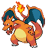

# Pokemon League — Important Trainers

### Rival Silver

=== "Totodile"

	| Pokémon | Attributes | Item | Moves |
	|:-------:|------------|:----:|-------|
	| | **Lv. 77** [Honchkrow](../../pokemon/honchkrow.md/) **Ability:** Insomnia   | None | 1. Drill Peck 2. Dark Pulse 3. Nasty Plot 4. Heat Wave |
	| | **Lv. 76** [Gengar](../../pokemon/gengar.md/) **Ability:** Levitate   | None | 1. Shadow Ball 2. Thunderbolt 3. Destiny Bond 4. Energy Ball |
	| | **Lv. 76** [Alakazam](../../pokemon/alakazam.md/) **Ability:** Synchronize  | None | 1. Psychic 2. Recover 3. Energy Ball 4. Focus Blast |
	| | **Lv. 77** [Magmortar](../../pokemon/magmortar.md/) **Ability:** Flame Body  | None | 1. Fire Blast 2. Swagger 3. Thunderbolt 4. Focus Blast |
	| | **Lv. 77** [Kingdra](../../pokemon/kingdra.md/) **Ability:** Swift Swim   | None | 1. Hydro Pump 2. Yawn 3. Dragon Pulse 4. Ice Beam |
	| | **Lv. 77** [Magmortar](../../pokemon/magmortar.md/) **Ability:** Flame Body  | None | 1. Fire Blast 2. Swagger 3. Thunderbolt 4. Focus Blast |
	| | **Lv. 78** [Meganium](../../pokemon/meganium.md/) **Ability:** Overgrow  | None | 1. Swords Dance 2. Reflect 3. Seed Bomb 4. Earthquake |
	
=== "Chikorita"

	| Pokémon | Attributes | Item | Moves |
	|:-------:|------------|:----:|-------|
	| | **Lv. 77** [Honchkrow](../../pokemon/honchkrow.md/) **Ability:** Insomnia   | None | 1. Drill Peck 2. Dark Pulse 3. Nasty Plot 4. Heat Wave |
	| | **Lv. 76** [Gengar](../../pokemon/gengar.md/) **Ability:** Levitate   | None | 1. Shadow Ball 2. Thunderbolt 3. Destiny Bond 4. Energy Ball |
	| | **Lv. 76** [Alakazam](../../pokemon/alakazam.md/) **Ability:** Synchronize  | None | 1. Psychic 2. Recover 3. Energy Ball 4. Focus Blast |
	| | **Lv. 77** [Magmortar](../../pokemon/magmortar.md/) **Ability:** Flame Body  | None | 1. Fire Blast 2. Swagger 3. Thunderbolt 4. Focus Blast |
	| | **Lv. 77** [Kingdra](../../pokemon/kingdra.md/) **Ability:** Swift Swim   | None | 1. Hydro Pump 2. Yawn 3. Dragon Pulse 4. Ice Beam |
	| | **Lv. 77** [Electivire](../../pokemon/electivire.md/) **Ability:** Motor Drive   | None | 1. Thunder 2. Ice Punch 3. Earthquake 4. Light Screen |
	| | **Lv. 78** [Typhlosion](../../pokemon/typhlosion.md/) **Ability:** Blaze  | None | 1. Fire Blast 2. Focus Blast 3. Thunder Punch 4. Low Kick |
	
=== "Cyndaquil"

	| Pokémon | Attributes | Item | Moves |
	|:-------:|------------|:----:|-------|
	| | **Lv. 77** [Honchkrow](../../pokemon/honchkrow.md/) **Ability:** Insomnia   | None | 1. Drill Peck 2. Dark Pulse 3. Nasty Plot 4. Heat Wave |
	| | **Lv. 76** [Gengar](../../pokemon/gengar.md/) **Ability:** Levitate   | None | 1. Shadow Ball 2. Thunderbolt 3. Destiny Bond 4. Energy Ball |
	| | **Lv. 76** [Alakazam](../../pokemon/alakazam.md/) **Ability:** Synchronize  | None | 1. Psychic 2. Recover 3. Energy Ball 4. Focus Blast |
	| | **Lv. 77** [Magmortar](../../pokemon/magmortar.md/) **Ability:** Flame Body  | None | 1. Fire Blast 2. Swagger 3. Thunderbolt 4. Focus Blast |
	| | **Lv. 77** [Magmortar](../../pokemon/magmortar.md/) **Ability:** Flame Body  | None | 1. Fire Blast 2. Swagger 3. Thunderbolt 4. Focus Blast |
	| | **Lv. 77** [Electivire](../../pokemon/electivire.md/) **Ability:** Motor Drive   | None | 1. Thunder 2. Ice Punch 3. Earthquake 4. Light Screen |
	| | **Lv. 78** [Feraligatr](../../pokemon/feraligatr.md/) **Ability:** Torrent  | None | 1. Waterfall 2. Crunch 3. Ice Fang 4. Earthquake |
	
### (R1) Elite Four Will

 Elite Four Will")

| Pokémon | Attributes | Item | Moves |
|:-------:|------------|:----:|-------|
| | **Lv. 53** [Jynx](../../pokemon/jynx.md/) **Ability:** Dry Skin   | None | 1. Ice Beam 2. Psychic 3. Focus Blast 4. Lovely Kiss |
| | **Lv. 52** [Lunatone](../../pokemon/lunatone.md/) **Ability:** Levitate   | None | 1. Ice Beam 2. Psychic 3. Earth Power 4. Charge Beam |
| | **Lv. 52** [Solrock](../../pokemon/solrock.md/) **Ability:** Levitate   | None | 1. Zen Headbutt 2. Stone Edge 3. Embargo 4. Earthquake |
| | **Lv. 54** [Slowbro](../../pokemon/slowbro.md/) **Ability:** Oblivious   | None | 1. Amnesia 2. Surf 3. Flamethrower 4. Psychic |
| | **Lv. 55** [Gardevoir](../../pokemon/gardevoir.md/) **Ability:** Synchronize   | None | 1. Reflect 2. Psychic 3. Thunderbolt 4. Hypnosis |
| | **Lv. 55** [Xatu](../../pokemon/xatu.md/) **Ability:** Synchronize   |  Sitrus Berry | 1. Heat Wave 2. Air Cutter 3. Psychic 4. Thunder Wave |

### (R1) Elite Four Koga

 Elite Four Koga")

| Pokémon | Attributes | Item | Moves |
|:-------:|------------|:----:|-------|
| | **Lv. 53** [Venomoth](../../pokemon/venomoth.md/) **Ability:** Poison Heal   | None | 1. Bug Buzz 2. Psychic 3. Sleep Powder 4. Giga Drain |
| | **Lv. 52** [Weezing](../../pokemon/weezing.md/) **Ability:** Levitate  | None | 1. Fire Blast 2. Toxic 3. Protect 4. Thunder |
| | **Lv. 52** [Toxicroak](../../pokemon/toxicroak.md/) **Ability:** Anticipation   | None | 1. Cross Chop 2. Poison Jab 3. Earthquake 4. Sucker Punch |
| | **Lv. 54** [Tentacruel](../../pokemon/tentacruel.md/) **Ability:** Clear Body   | None | 1. Swords Dance 2. Poison Jab 3. Waterfall 4. Protect |
| | **Lv. 55** [Muk](../../pokemon/muk.md/) **Ability:** Stench  | None | 1. Substitute 2. Focus Punch 3. Gunk Shot 4. Rock slide |
| | **Lv. 55** [Crobat](../../pokemon/crobat.md/) **Ability:** Inner Focus   |  Sitrus Berry | 1. Double Team 2. Brave Bird 3. Heat Wave 4. X-Scissor |

### (R1) Elite Four Bruno

 Elite Four Bruno")

| Pokémon | Attributes | Item | Moves |
|:-------:|------------|:----:|-------|
| | **Lv. 53** [Hitmontop](../../pokemon/hitmontop.md/) **Ability:** Intimidate  | None | 1. Counter 2. Fake Out 3. High Jump Kick 4. Sucker Punch |
| | **Lv. 52** [Hitmonlee](../../pokemon/hitmonlee.md/) **Ability:** Limber  | None | 1. Earthquake 2. Blaze Kick 3. High Jump Kick 4. Stone Edge |
| | **Lv. 52** [Hitmonchan](../../pokemon/hitmonchan.md/) **Ability:** Keen Eye  | None | 1. Fire Punch 2. Ice Punch 3. High Jump Kick 4. Thunder Punch |
| | **Lv. 54** [Lucario](../../pokemon/lucario.md/) **Ability:** Steadfast   | None | 1. Aura Sphere 2. Dark Pulse 3. Psychic 4. Extreme Speed |
| | **Lv. 55** [Hariyama](../../pokemon/hariyama.md/) **Ability:** Thick Fat  | None | 1. Substitute 2. Focus Punch 3. Thunder Punch 4. Payback |
| | **Lv. 55** [Machamp](../../pokemon/machamp.md/) **Ability:** Guts  |  Sitrus Berry | 1. Dynamic Punch 2. Stone Edge 3. Thunder Punch 4. Bullet Punch |

### (R1) Elite Four Karen

 Elite Four Karen")

| Pokémon | Attributes | Item | Moves |
|:-------:|------------|:----:|-------|
| | **Lv. 53** [Mightyena](../../pokemon/mightyena.md/) **Ability:** Intimidate  | None | 1. Attract 2. Super Fang 3. Sucker Punch 4. Fire Fang |
| | **Lv. 52** [Spiritomb](../../pokemon/spiritomb.md/) **Ability:** Pressure   | None | 1. Embargo 2. Dark Pulse 3. Nasty Plot 4. Silver Wind |
| | **Lv. 52** [Absol](../../pokemon/absol.md/) **Ability:** Pressure  | None | 1. Sucker Punch 2. Psycho Cut 3. Megahorn 4. Thunder Wave |
| | **Lv. 54** [Umbreon](../../pokemon/umbreon.md/) **Ability:** Synchronize  | None | 1. Dark Pulse 2. Double Team 3. Protect 4. Toxic |
| | **Lv. 55** [Honchkrow](../../pokemon/honchkrow.md/) **Ability:** Insomnia   | None | 1. Swagger 2. Thunder Wave 3. Sucker Punch 4. Brave Bird |
| | **Lv. 55** [Houndoom](../../pokemon/houndoom.md/) **Ability:** Intimidate   |  Sitrus Berry | 1. Heat Wave 2. Dark Pulse 3. Nasty Plot 4. Will-O-Wisp |

### (R1) Champion Lance

 Champion Lance")

| Pokémon | Attributes | Item | Moves |
|:-------:|------------|:----:|-------|
| | **Lv. 56** [Gyarados](../../pokemon/gyarados.md/) **Ability:** Intimidate   | None | 1. Aqua Tail 2. Earthquake 3. Stone Edge 4. Payback |
| | **Lv. 54** [Garchomp](../../pokemon/garchomp.md/) **Ability:** Sand Veil   | None | 1. Earthquake 2. Dragon Claw 3. Fire Fang 4. Aerial ace |
| | **Lv. 54** [Aerodactyl](../../pokemon/aerodactyl.md/) **Ability:** Rock Head   | None | 1. Stone Edge 2. Tailwind 3. Aerial Ace 4. Torment |
| | **Lv. 56** [Dragonite](../../pokemon/dragonite.md/) **Ability:** Inner Focus   | None | 1. Draco Meteor 2. Surf 3. Fire Blast 4. Blizzard |
| | **Lv. 57** [Charizard](../../pokemon/charizard.md/) **Ability:** Blaze   | None | 1. Swords Dance 2. Flare Blitz 3. Aerial Ace 4. Focus Blast |
| | **Lv. 60** [Dragonite](../../pokemon/dragonite.md/) **Ability:** Inner Focus   |  Sitrus Berry | 1. Outrage 2. Wing Attack 3. Earthquake 4. Roost |

### (R2) Elite Four Will

 Elite Four Will")

| Pokémon | Attributes | Item | Moves |
|:-------:|------------|:----:|-------|
| | **Lv. 78** [Exeggutor](../../pokemon/exeggutor.md/) **Ability:** Chlorophyll   |  White herb | 1. Sleep Powder 2. Psychic 3. Trick Room 4. Leaf Storm |
| | **Lv. 78** [Bronzong](../../pokemon/bronzong.md/) **Ability:** Levitate   |  Light Clay | 1. Earthquake 2. Psychic 3. Light Screen 4. Reflect |
| | **Lv. 78** [Jynx](../../pokemon/jynx.md/) **Ability:** Filter   | None | 1. Ice Beam 2. Psychic 3. Focus Blast 4. Lovely Kiss |
| | **Lv. 80** [Slowbro](../../pokemon/slowbro.md/) **Ability:** Own Tempo   | None | 1. Trick Room 2. Psychic 3. Surf 4. Flamethrower |
| | **Lv. 80** [Gardevoir](../../pokemon/gardevoir.md/) **Ability:** Trace   | None | 1. Focus Blast 2. Psychic 3. Thunderbolt 4. Will-O-Wisp |
| | **Lv. 81** [Xatu](../../pokemon/xatu.md/) **Ability:** Early Bird   |  Sitrus Berry | 1. Heat Wave 2. Psychic 3. Air Cutter 4. Thunder Wave |

### (R2) Elite Four Koga

 Elite Four Koga")

| Pokémon | Attributes | Item | Moves |
|:-------:|------------|:----:|-------|
| | **Lv. 78** [Toxicroak](../../pokemon/toxicroak.md/) **Ability:** Anticipation   | None | 1. Cross Chop 2. Poison Jab 3. Ice Punch 4. Sucker Punch |
| | **Lv. 78** [Skuntank](../../pokemon/skuntank.md/) **Ability:** Aftermath   | None | 1. Explosion 2. Sucker Punch 3. Poison Jab 4. Frustration |
| | **Lv. 78** [Venomoth](../../pokemon/venomoth.md/) **Ability:** Tinted Lens   | None | 1. Bug Buzz 2. Psychic 3. U-Turn 4. Sleep Powder |
| | **Lv. 80** [Muk](../../pokemon/muk.md/) **Ability:** Sticky Hold  |  Black Sludge | 1. Pain Split 2. Payback 3. Gunk Shot 4. Ice Punch |
| | **Lv. 80** [Swalot](../../pokemon/swalot.md/) **Ability:** Sticky Hold  |  Leftovers | 1. Rest 2. Sleep Talk 3. Sludge Bomb 4. Earthquake |
| | **Lv. 81** [Crobat](../../pokemon/crobat.md/) **Ability:** Anticipation   |  Sitrus Berry | 1. Brave Bird 2. Cross Poison 3. U-Turn 4. Heat Wave |

### (R2) Elite Four Bruno

 Elite Four Bruno")

| Pokémon | Attributes | Item | Moves |
|:-------:|------------|:----:|-------|
| | **Lv. 78** [Hitmontop](../../pokemon/hitmontop.md/) **Ability:** Technician  | None | 1. Fake Out 2. Close Combat 3. Mach Punch 4. Stone Edge |
| | **Lv. 78** [Hitmonlee](../../pokemon/hitmonlee.md/) **Ability:** Reckless  | None | 1. High Jump Kick 2. Stone Edge 3. Blaze Kick 4. Mach Punch |
| | **Lv. 78** [Hitmonchan](../../pokemon/hitmonchan.md/) **Ability:** Iron Fist  | None | 1. Close Combat 2. Ice Punch 3. Mach Punch 4. Thunder Punch |
| | **Lv. 80** [Lucario](../../pokemon/lucario.md/) **Ability:** Inner Focus   | None | 1. Close Combat 2. Crunch 3. Ice Punch 4. Extreme Speed |
| | **Lv. 80** [Infernape](../../pokemon/infernape.md/) **Ability:** Iron Fist   |  White Herb | 1. Close Combat 2. Grass Knot 3. Stone Edge 4. Overheat |
| | **Lv. 81** [Machamp](../../pokemon/machamp.md/) **Ability:** No Guard  |  Sitrus Berry | 1. Dynamic Punch 2. Payback 3. Stone Edge 4. Bullet Punch |

### (R2) Elite Four Karen

 Elite Four Karen")

| Pokémon | Attributes | Item | Moves |
|:-------:|------------|:----:|-------|
| | **Lv. 78** [Weavile](../../pokemon/weavile.md/) **Ability:** Pressure   |  Focus Sash | 1. Ice Punch 2. Fake Out 3. Low Kick 4. Night Slash |
| | **Lv. 78** [Absol](../../pokemon/absol.md/) **Ability:** Super Luck  | None | 1. Sucker Punch 2. Psycho Cut 3. Stone Edge 4. Thunder Wave |
| | **Lv. 78** [Shiftry](../../pokemon/shiftry.md/) **Ability:** Early Bird   | None | 1. Sucker Punch 2. Seed Bomb 3. Low Kick 4. Explosion |
| | **Lv. 80** [Umbreon](../../pokemon/umbreon.md/) **Ability:** Magic Guard  |  Sitrus Berry | 1. Payback 2. Yawn 3. Curse 4. Wish |
| | **Lv. 80** [Honchkrow](../../pokemon/honchkrow.md/) **Ability:** Super Luck   |  White Herb | 1. Brave Bird 2. Thunder Wave 3. Superpower 4. Sucker Punch |
| | **Lv. 81** [Houndoom](../../pokemon/houndoom.md/) **Ability:** Flash Fire   |  Sitrus Berry | 1. Nasty Plot 2. Dark Pulse 3. Fire Blast 4. Hidden Power |

### (R2) Champion Lance

 Champion Lance")

| Pokémon | Attributes | Item | Moves |
|:-------:|------------|:----:|-------|
| | **Lv. 84** [Gyarados](../../pokemon/gyarados.md/) **Ability:** Intimidate   |  Life Orb | 1. Aqua Tail 2. Earthquake 3. Stone Edge 4. Bounce |
| | **Lv. 80** [Garchomp](../../pokemon/garchomp.md/) **Ability:** Sand Veil   | None | 1. Earthquake 2. Dragon Claw 3. Fire Blast 4. Stone Edge |
| | **Lv. 82** [Tyranitar](../../pokemon/tyranitar.md/) **Ability:** Sand Stream   |  White Herb | 1. Stone Edge 2. Crunch 3. Fire Blast 4. Superpower |
| | **Lv. 84** [Flygon](../../pokemon/flygon.md/) **Ability:** Levitate   |  Yache Berry | 1. Outrage 2. U-Turn 3. Earthquake 4. Thunder Punch |
| | **Lv. 84** [Charizard](../../pokemon/charizard.md/) **Ability:** Blaze   |  White Herb | 1. Sunny Day 2. Overheat 3. Focus Blast 4. Air Slash |
| | **Lv. 88** [Dragonite](../../pokemon/dragonite.md/) **Ability:** Inner Focus   |  Sitrus Berry | 1. Agility 2. Outrage 3. Earthquake 4. Fire Blast |

