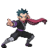

# Trainer Rosters

### Generic Trainers

| Trainer | P1 | P2 | P3 | P4 | P5 | P6 |
|:-------:|:--:|:--:|:--:|:--:|:--:|:--:|
|  Elite Four Will |  [Jynx](../../pokemon/jynx.md/) Lv. 53 |  [Lunatone](../../pokemon/lunatone.md/) Lv. 52 |  [Solrock](../../pokemon/solrock.md/) Lv. 52 |  [Slowbro](../../pokemon/slowbro.md/) Lv. 54 |  [Gardevoir](../../pokemon/gardevoir.md/) Lv. 55 |  [Xatu](../../pokemon/xatu.md/) Lv. 55 |
|  Elite Four Koga |  [Venomoth](../../pokemon/venomoth.md/) Lv. 53 |  [Weezing](../../pokemon/weezing.md/) Lv. 52 |  [Toxicroak](../../pokemon/toxicroak.md/) Lv. 52 |  [Tentacruel](../../pokemon/tentacruel.md/) Lv. 54 |  [Muk](../../pokemon/muk.md/) Lv. 55 |  [Crobat](../../pokemon/crobat.md/) Lv. 55 |
|  Elite Four Bruno |  [Hitmontop](../../pokemon/hitmontop.md/) Lv. 53 |  [Hitmonlee](../../pokemon/hitmonlee.md/) Lv. 52 |  [Hitmonchan](../../pokemon/hitmonchan.md/) Lv. 52 |  [Lucario](../../pokemon/lucario.md/) Lv. 54 |  [Hariyama](../../pokemon/hariyama.md/) Lv. 55 |  [Machamp](../../pokemon/machamp.md/) Lv. 55 |
|  Elite Four Karen |  [Mightyena](../../pokemon/mightyena.md/) Lv. 53 |  [Spiritomb](../../pokemon/spiritomb.md/) Lv. 52 |  [Absol](../../pokemon/absol.md/) Lv. 52 |  [Umbreon](../../pokemon/umbreon.md/) Lv. 54 |  [Honchkrow](../../pokemon/honchkrow.md/) Lv. 55 |  [Houndoom](../../pokemon/houndoom.md/) Lv. 55 |
|  Champion Lance |  [Gyarados](../../pokemon/gyarados.md/) Lv. 56 |  [Garchomp](../../pokemon/garchomp.md/) Lv. 54 |  [Aerodactyl](../../pokemon/aerodactyl.md/) Lv. 54 |  [Dragonite](../../pokemon/dragonite.md/) Lv. 56 |  [Charizard](../../pokemon/charizard.md/) Lv. 57 |  [Dragonite](../../pokemon/dragonite.md/) Lv. 60 |
|  Elite Four Will |  [Exeggutor](../../pokemon/exeggutor.md/) Lv. 78 |  [Bronzong](../../pokemon/bronzong.md/) Lv. 78 |  [Jynx](../../pokemon/jynx.md/) Lv. 78 |  [Gardevoir](../../pokemon/gardevoir.md/) Lv. 80 |  [Slowbro](../../pokemon/slowbro.md/) Lv. 80 |  [Xatu](../../pokemon/xatu.md/) Lv. 81 |
|  Elite Four Koga |  [Toxicroak](../../pokemon/toxicroak.md/) Lv. 78 |  [Skuntank](../../pokemon/skuntank.md/) Lv. 78 |  [Venomoth](../../pokemon/venomoth.md/) Lv. 78 |  [Muk](../../pokemon/muk.md/) Lv. 80 |  [Swalot](../../pokemon/swalot.md/) Lv. 80 |  [Crobat](../../pokemon/crobat.md/) Lv. 81 |
|  Elite Four Bruno |  [Hitmontop](../../pokemon/hitmontop.md/) Lv. 78 |  [Hitmonlee](../../pokemon/hitmonlee.md/) Lv. 78 |  [Hitmonchan](../../pokemon/hitmonchan.md/) Lv. 78 |  [Lucario](../../pokemon/lucario.md/) Lv. 80 |  [Infernape](../../pokemon/infernape.md/) Lv. 80 |  [Machamp](../../pokemon/machamp.md/) Lv. 81 |
|  Elite Four Karen |  [Weavile](../../pokemon/weavile.md/) Lv. 78 |  [Absol](../../pokemon/absol.md/) Lv. 78 |  [Shiftry](../../pokemon/shiftry.md/) Lv. 78 |  [Umbreon](../../pokemon/umbreon.md/) Lv. 80 |  [Honchkrow](../../pokemon/honchkrow.md/) Lv. 80 |  [Houndoom](../../pokemon/houndoom.md/) Lv. 81 |
|  Champion Lance |  [Gyarados](../../pokemon/gyarados.md/) Lv. 84 |  [Garchomp](../../pokemon/garchomp.md/) Lv. 80 |  [Tyranitar](../../pokemon/tyranitar.md/) Lv. 82 |  [Flygon](../../pokemon/flygon.md/) Lv. 84 |  [Charizard](../../pokemon/charizard.md/) Lv. 84 |  [Dragonite](../../pokemon/dragonite.md/) Lv. 88 |
| ") Rival Silver (MW) |  [Honchkrow](../../pokemon/honchkrow.md/) Lv. 77 |  [Gengar](../../pokemon/gengar.md/) Lv. 76 |  [Alakazam](../../pokemon/alakazam.md/) Lv. 76 |  [Magmortar](../../pokemon/magmortar.md/) Lv. 77 |  [Kingdra](../../pokemon/kingdra.md/) Lv. 77 |  [Meganium](../../pokemon/meganium.md/) Lv. 78 |
| ") Rival Silver (MW) |  [Honchkrow](../../pokemon/honchkrow.md/) Lv. 77 |  [Gengar](../../pokemon/gengar.md/) Lv. 76 |  [Alakazam](../../pokemon/alakazam.md/) Lv. 76 |  [Kingdra](../../pokemon/kingdra.md/) Lv. 77 |  [Electivire](../../pokemon/electivire.md/) Lv. 77 |  [Typhlosion](../../pokemon/typhlosion.md/) Lv. 78 |
| ") Rival Silver (MW) |  [Honchkrow](../../pokemon/honchkrow.md/) Lv. 77 |  [Gengar](../../pokemon/gengar.md/) Lv. 76 |  [Alakazam](../../pokemon/alakazam.md/) Lv. 76 |  [Magmortar](../../pokemon/magmortar.md/) Lv. 77 |  [Electivire](../../pokemon/electivire.md/) Lv. 77 |  [Feraligatr](../../pokemon/feraligatr.md/) Lv. 78 |

### Important Trainers

1. [(R1) Elite Four Will](important_trainers.md#r1-elite-four-will)
1. [(R1) Elite Four Koga](important_trainers.md#r1-elite-four-koga)
1. [(R1) Elite Four Bruno](important_trainers.md#r1-elite-four-bruno)
1. [(R1) Elite Four Karen](important_trainers.md#r1-elite-four-karen)
1. [(R1) Champion Lance](important_trainers.md#r1-champion-lance)
1. [(R2) Elite Four Will](important_trainers.md#r2-elite-four-will)
1. [(R2) Elite Four Koga](important_trainers.md#r2-elite-four-koga)
1. [(R2) Elite Four Bruno](important_trainers.md#r2-elite-four-bruno)
1. [(R2) Elite Four Karen](important_trainers.md#r2-elite-four-karen)
1. [(R2) Champion Lance](important_trainers.md#r2-champion-lance)
