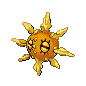
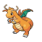

# Trainer Rosters

### Generic Trainers

| Trainer | P1 | P2 | P3 | P4 | P5 | P6 |
|:-------:|:--:|:--:|:--:|:--:|:--:|:--:|
|  Elite Four Will |  Jynx Lv. 53 |  Lunatone Lv. 52 |  Solrock Lv. 52 |  Slowbro Lv. 54 |  Gardevoir Lv. 55 |  Xatu Lv. 55 |
|  Elite Four Koga |  Venomoth Lv. 53 |  Weezing Lv. 52 |  Toxicroak Lv. 52 |  Tentacruel Lv. 54 |  Muk Lv. 55 |  Crobat Lv. 55 |
|  Elite Four Bruno |  Hitmontop Lv. 53 |  Hitmonlee Lv. 52 |  Hitmonchan Lv. 52 |  Lucario Lv. 54 |  Hariyama Lv. 55 |  Machamp Lv. 55 |
|  Elite Four Karen |  Mightyena Lv. 53 |  Spiritomb Lv. 52 |  Absol Lv. 52 |  Umbreon Lv. 54 |  Honchkrow Lv. 55 |  Houndoom Lv. 55 |
|  Champion Lance |  Gyarados Lv. 56 |  Garchomp Lv. 54 |  Aerodactyl Lv. 54 |  Dragonite Lv. 56 |  Charizard Lv. 57 |  Dragonite Lv. 60 |
|  Elite Four Will |  Exeggutor Lv. 78 |  Bronzong Lv. 78 |  Jynx Lv. 78 |  Gardevoir Lv. 80 |  Slowbro Lv. 80 |  Xatu Lv. 81 |
|  Elite Four Koga |  Toxicroak Lv. 78 |  Skuntank Lv. 78 |  Venomoth Lv. 78 |  Muk Lv. 80 |  Swalot Lv. 80 |  Crobat Lv. 81 |
|  Elite Four Bruno |  Hitmontop Lv. 78 |  Hitmonlee Lv. 78 |  Hitmonchan Lv. 78 |  Lucario Lv. 80 |  Infernape Lv. 80 |  Machamp Lv. 81 |
|  Elite Four Karen |  Weavile Lv. 78 |  Absol Lv. 78 |  Shiftry Lv. 78 |  Umbreon Lv. 80 |  Honchkrow Lv. 80 |  Houndoom Lv. 81 |
|  Champion Lance |  Gyarados Lv. 84 |  Garchomp Lv. 80 |  Tyranitar Lv. 82 |  Flygon Lv. 84 |  Charizard Lv. 84 |  Dragonite Lv. 88 |
| ") Rival Silver (MW) |  Honchkrow Lv. 77 |  Gengar Lv. 76 |  Alakazam Lv. 76 |  Magmortar Lv. 77 |  Kingdra Lv. 77 |  Meganium Lv. 78 |
| ") Rival Silver (MW) |  Honchkrow Lv. 77 |  Gengar Lv. 76 |  Alakazam Lv. 76 |  Kingdra Lv. 77 |  Electivire Lv. 77 |  Typhlosion Lv. 78 |
| ") Rival Silver (MW) |  Honchkrow Lv. 77 |  Gengar Lv. 76 |  Alakazam Lv. 76 |  Magmortar Lv. 77 |  Electivire Lv. 77 |  Feraligatr Lv. 78 |

### Important Trainers

1. [(R1) Elite Four Will](important_trainers.md#r1-elite-four-will)
1. [(R1) Elite Four Koga](important_trainers.md#r1-elite-four-koga)
1. [(R1) Elite Four Bruno](important_trainers.md#r1-elite-four-bruno)
1. [(R1) Elite Four Karen](important_trainers.md#r1-elite-four-karen)
1. [(R1) Champion Lance](important_trainers.md#r1-champion-lance)
1. [(R2) Elite Four Will](important_trainers.md#r2-elite-four-will)
1. [(R2) Elite Four Koga](important_trainers.md#r2-elite-four-koga)
1. [(R2) Elite Four Bruno](important_trainers.md#r2-elite-four-bruno)
1. [(R2) Elite Four Karen](important_trainers.md#r2-elite-four-karen)
1. [(R2) Champion Lance](important_trainers.md#r2-champion-lance)
