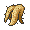
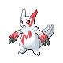

# Radio Tower — Important Trainers

### Executive Petrel

| Pokémon | Attributes | Item | Moves |
|:-------:|------------|:----:|-------|
| | **Lv. 44** [Raticate](../../pokemon/raticate.md/) **Ability:** Hustle  | None | 1. Double-Edge 2. Flame Wheel 3. Crunch 4. Toxic |
| | **Lv. 44** [Skuntank](../../pokemon/skuntank.md/) **Ability:** Stench   | None | 1. Toxic 2. Explosion 3. Crunch 4. Protect |
| | **Lv. 44** [Tangrowth](../../pokemon/tangrowth.md/) **Ability:** Chlorophyll  | None | 1. Toxic 2. Protect 3. Power Whip 4. Earthquake |
| | **Lv. 44** [Toxicroak](../../pokemon/toxicroak.md/) **Ability:** Anticipation   | None | 1. Cross Chop 2. Toxic 3. Protect 4. Stone Edge |
| | **Lv. 44** [Hypno](../../pokemon/hypno.md/) **Ability:** Insomnia  | None | 1. Disable 2. Toxic 3. Protect 4. Psychic |
| | **Lv. 45** [Weezing](../../pokemon/weezing.md/) **Ability:** Levitate  |  Sitrus Berry | 1. Sludge Bomb 2. Protect 3. Destiny Bond 4. Toxic |

### Executive Proton

| Pokémon | Attributes | Item | Moves |
|:-------:|------------|:----:|-------|
| | **Lv. 45** [Electrode](../../pokemon/electrode.md/) **Ability:** Aftermath  | None | 1. Rain Dance 2. Thunder 3. Explosion 4. Protect |
| | **Lv. 45** [Weezing](../../pokemon/weezing.md/) **Ability:** Levitate  | None | 1. Thunder 2. Sludge Bomb 3. Psybeam 4. Will-O-Wisp |
| | **Lv. 45** [Cacturne](../../pokemon/cacturne.md/) **Ability:** Sand Veil   | None | 1. Needle Arm 2. Sucker Punch 3. Focus Blast 4. Thunder Punch |
| | **Lv. 45** [Tauros](../../pokemon/tauros.md/) **Ability:** Intimidate  | None | 1. Take Down 2. Zen Headbutt 3. Earthquake 4. Payback |
| | **Lv. 45** [Camerupt](../../pokemon/camerupt.md/) **Ability:** Anger Point   | None | 1. Earth Power 2. Fire Blast 3. Protect 4. Stone Edge |
| | **Lv. 46** [Crobat](../../pokemon/crobat.md/) **Ability:** Inner Focus   |  Sitrus Berry | 1. Cross Poison 2. Brave Bird 3. Heat Wave 4. X-Scissor |

### Executive Ariana

| Pokémon | Attributes | Item | Moves |
|:-------:|------------|:----:|-------|
| | **Lv. 45** [Jynx](../../pokemon/jynx.md/) **Ability:** Dry Skin   | None | 1. Ice Beam 2. Psychic 3. Lovely Kiss 4. Shadow Ball |
| | **Lv. 45** [Arbok](../../pokemon/arbok.md/) **Ability:** Intimidate  | None | 1. Earthquake 2. Gunk Shot 3. Thunder Fang 4. Ice Fang |
| | **Lv. 45** [Purugly](../../pokemon/purugly.md/) **Ability:** Thick Fat  | None | 1. Body Slam 2. Protect 3. Aerial Ace 4. Hypnosis |
| | **Lv. 45** [Vileplume](../../pokemon/vileplume.md/) **Ability:** Chlorophyll   |  Big Root | 1. Giga Drain 2. Sleep Powder 3. Drain Punch 4. Sludge Bomb |
| | **Lv. 45** [Milotic](../../pokemon/milotic.md/) **Ability:** Marvel Scale  | None | 1. Surf 2. Sleep Talk 3. Toxic 4. Rest |
| | **Lv. 47** [Honchkrow](../../pokemon/honchkrow.md/) **Ability:** Insomnia   |  Sitrus Berry | 1. Sucker Punch 2. Roost 3. Brave Bird 4. Thunder Wave |

### Executive Archer

| Pokémon | Attributes | Item | Moves |
|:-------:|------------|:----:|-------|
| | **Lv. 46** [Zangoose](../../pokemon/zangoose.md/) **Ability:** Immunity  | None | 1. Close Combat 2. Disable 3. Shadow Claw 4. Crush Claw |
| | **Lv. 46** [Drapion](../../pokemon/drapion.md/) **Ability:** Battle Armor   |  Sitrus Berry | 1. Earthquake 2. Crunch 3. Cross Poison 4. Aqua Tail |
| | **Lv. 46** [Scizor](../../pokemon/scizor.md/) **Ability:** Swarm   | None | 1. X-Scissor 2. Swords Dance 3. Bullet Punch 4. Superpower |
| | **Lv. 46** [Machamp](../../pokemon/machamp.md/) **Ability:** Guts  | None | 1. Cross Chop 2. Earthquake 3. Stone Edge 4. Payback |
| | **Lv. 46** [Gyarados](../../pokemon/gyarados.md/) **Ability:** Intimidate   | None | 1. Waterfall 2. Bounce 3. Ice Fang 4. Earthquake |
| | **Lv. 48** [Houndoom](../../pokemon/houndoom.md/) **Ability:** Intimidate   |  Focus Sash | 1. Fire Blast 2. Dark Pulse 3. Sunny Day 4. Solar Beam |

### Rocket Boss Giovanni

| Pokémon | Attributes | Item | Moves |
|:-------:|------------|:----:|-------|
| | **Lv. 48** [Persian](../../pokemon/persian.md/) **Ability:** Limber  | None | 1. Hypnosis 2. Fake Out 3. Slash 4. Night Slash |
| | **Lv. 48** [Kangaskhan](../../pokemon/kangaskhan.md/) **Ability:** Early Bird  | None | 1. Double-Edge 2. Low Kick 3. Sucker Punch 4. Earthquake |
| | **Lv. 48** [Tauros](../../pokemon/tauros.md/) **Ability:** Intimidate  | None | 1. Earthquake 2. Double-Edge 3. Stone Edge 4. Payback |
| | **Lv. 49** [Nidoqueen](../../pokemon/nidoqueen.md/) **Ability:** Poison Point   | None | 1. Earth Power 2. Toxic 3. Ice Beam 4. Protect |
| | **Lv. 50** [Nidoking](../../pokemon/nidoking.md/) **Ability:** Poison Point   | None | 1. Earthquake 2. Ice Beam 3. Thunderbolt 4. Superpower |
| | **Lv. 50** [Rhyperior](../../pokemon/rhyperior.md/) **Ability:** Reckless   |  Sitrus Berry | 1. Earthquake 2. Megahorn 3. Stone Edge 4. Hammer Arm |

