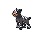
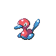

# Radio Tower — Trainer Rosters

### Generic Trainers

| Trainer | P1 | P2 | P3 | P4 | P5 | P6 |
|:-------:|:--:|:--:|:--:|:--:|:--:|:--:|
|  Team Rocket Grunt |  [Raticate](../../pokemon/raticate.md/) Lv. 42 |  [Beedrill](../../pokemon/beedrill.md/) Lv. 42 |
|  Team Rocket Grunt |  [Arbok](../../pokemon/arbok.md/) Lv. 43 |  [Weezing](../../pokemon/weezing.md/) Lv. 43 |
|  Team Rocket Grunt |  [Houndour](../../pokemon/houndour.md/) Lv. 41 |  [Mightyena](../../pokemon/mightyena.md/) Lv. 41 |  [Dunsparce](../../pokemon/dunsparce.md/) Lv. 41 |  [Swalot](../../pokemon/swalot.md/) Lv. 41 |
|  Team Rocket Grunt |  [Golbat](../../pokemon/golbat.md/) Lv. 43 |  [Muk](../../pokemon/muk.md/) Lv. 43 |
|  Team Rocket Grunt |  [Grimer](../../pokemon/grimer.md/) Lv. 42 |  [Bronzor](../../pokemon/bronzor.md/) Lv. 42 |  [Rhydon](../../pokemon/rhydon.md/) Lv. 42 |
|  Team Rocket Grunt |  [Machop](../../pokemon/machop.md/) Lv. 42 |  [Sandslash](../../pokemon/sandslash.md/) Lv. 43 |  [Graveler](../../pokemon/graveler.md/) Lv. 43 |  [Machoke](../../pokemon/machoke.md/) Lv. 43 |
|  Scientist Garett |  [Kadabra](../../pokemon/kadabra.md/) Lv. 43 |  [Magneton](../../pokemon/magneton.md/) Lv. 43 |  [Bronzong](../../pokemon/bronzong.md/) Lv. 43 |
|  Team Rocket Grunt |  [Muk](../../pokemon/muk.md/) Lv. 44 |
|  Team Rocket Grunt |  [Glameow](../../pokemon/glameow.md/) Lv. 42 |  [Nidoqueen](../../pokemon/nidoqueen.md/) Lv. 43 |  [Delcatty](../../pokemon/delcatty.md/) Lv. 43 |
|  Team Rocket Grunt |  [Nidorino](../../pokemon/nidorino.md/) Lv. 43 |  [Electrode](../../pokemon/electrode.md/) Lv. 43 |  [Loudred](../../pokemon/loudred.md/) Lv. 43 |
|  Scientist Trenton |  [Porygon2](../../pokemon/porygon2.md/) Lv. 44 |  [Exeggutor](../../pokemon/exeggutor.md/) Lv. 44 |
|  Team Rocket Grunt |  [Marowak](../../pokemon/marowak.md/) Lv. 43 |  [Victreebel](../../pokemon/victreebel.md/) Lv. 43 |

### Important Trainers

1. [Executive Petrel](important_trainers.md#executive-petrel)
1. [Executive Proton](important_trainers.md#executive-proton)
1. [Executive Ariana](important_trainers.md#executive-ariana)
1. [Executive Archer](important_trainers.md#executive-archer)
1. [Rocket Boss Giovanni](important_trainers.md#rocket-boss-giovanni)
