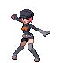
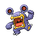

# Radio Tower — Trainer Rosters

### Generic Trainers

| Trainer | P1 | P2 | P3 | P4 | P5 | P6 |
|:-------:|:--:|:--:|:--:|:--:|:--:|:--:|
|  Team Rocket Grunt |  Raticate Lv. 42 |  Beedrill Lv. 42 |
|  Team Rocket Grunt |  Arbok Lv. 43 |  Weezing Lv. 43 |
|  Team Rocket Grunt |  Houndour Lv. 41 |  Mightyena Lv. 41 |  Dunsparce Lv. 41 |  Swalot Lv. 41 |
|  Team Rocket Grunt |  Golbat Lv. 43 |  Muk Lv. 43 |
|  Team Rocket Grunt |  Grimer Lv. 42 |  Bronzor Lv. 42 |  Rhydon Lv. 42 |
|  Team Rocket Grunt |  Machop Lv. 42 |  Sandslash Lv. 43 |  Graveler Lv. 43 |  Machoke Lv. 43 |
|  Scientist Garett |  Kadabra Lv. 43 |  Magneton Lv. 43 |  Bronzong Lv. 43 |
|  Team Rocket Grunt |  Muk Lv. 44 |
|  Team Rocket Grunt |  Glameow Lv. 42 |  Nidoqueen Lv. 43 |  Delcatty Lv. 43 |
|  Team Rocket Grunt |  Nidorino Lv. 43 |  Electrode Lv. 43 |  Loudred Lv. 43 |
|  Scientist Trenton |  Porygon2 Lv. 44 |  Exeggutor Lv. 44 |
|  Team Rocket Grunt |  Marowak Lv. 43 |  Victreebel Lv. 43 |

### Important Trainers

1. [Executive Petrel](important_trainers.md#executive-petrel)
1. [Executive Proton](important_trainers.md#executive-proton)
1. [Executive Ariana](important_trainers.md#executive-ariana)
1. [Executive Archer](important_trainers.md#executive-archer)
1. [Rocket Boss Giovanni](important_trainers.md#rocket-boss-giovanni)
