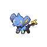

# Route 1 — Wild Pokémon

### Grass, Morning / Day

| Sprite | Pokémon | Encounter Type | Level | Chance |
|:------:|---------|:--------------:|-------|--------|
|  | Pidgey | {: style="max-width: 24px;"" } {: style="max-width: 24px;"" } {: style="max-width: 24px;"" } | 48 – 60 | 20% |
|  | Rattata | {: style="max-width: 24px;"" } {: style="max-width: 24px;"" } {: style="max-width: 24px;"" } | 48 – 60 | 20% |
|  | Sentret | {: style="max-width: 24px;"" } {: style="max-width: 24px;"" } {: style="max-width: 24px;"" } | 48 – 60 | 10% |
|  | Zigzagoon | {: style="max-width: 24px;"" } {: style="max-width: 24px;"" } {: style="max-width: 24px;"" } | 48 – 60 | 10% |
|  | Bidoof | {: style="max-width: 24px;"" } {: style="max-width: 24px;"" } {: style="max-width: 24px;"" } | 48 – 60 | 10% |
|  | Starly | {: style="max-width: 24px;"" } {: style="max-width: 24px;"" } {: style="max-width: 24px;"" } | 48 – 60 | 10% |
|  | Pidgeotto | {: style="max-width: 24px;"" } {: style="max-width: 24px;"" } {: style="max-width: 24px;"" } | 48 – 60 | 5% |
|  | Raticate | {: style="max-width: 24px;"" } {: style="max-width: 24px;"" } {: style="max-width: 24px;"" } | 48 – 60 | 5% |
|  | Furret | {: style="max-width: 24px;"" } {: style="max-width: 24px;"" } {: style="max-width: 24px;"" } | 48 – 60 | 5% |
|  | Staravia | {: style="max-width: 24px;"" } {: style="max-width: 24px;"" } {: style="max-width: 24px;"" } | 48 – 60 | 5% |

### Grass, Night

| Sprite | Pokémon | Encounter Type | Level | Chance |
|:------:|---------|:--------------:|-------|--------|
|  | Hoothoot | {: style="max-width: 24px;"" } {: style="max-width: 24px;"" } | 48 – 60 | 20% |
|  | Rattata | {: style="max-width: 24px;"" } {: style="max-width: 24px;"" } | 48 – 60 | 20% |
|  | Ponyta | {: style="max-width: 24px;"" } {: style="max-width: 24px;"" } | 48 – 60 | 10% |
|  | Zigzagoon | {: style="max-width: 24px;"" } {: style="max-width: 24px;"" } | 48 – 60 | 10% |
|  | Bidoof | {: style="max-width: 24px;"" } {: style="max-width: 24px;"" } | 48 – 60 | 10% |
|  | Shinx | {: style="max-width: 24px;"" } {: style="max-width: 24px;"" } | 48 – 60 | 10% |
|  | Noctowl | {: style="max-width: 24px;"" } {: style="max-width: 24px;"" } | 48 – 60 | 5% |
|  | Raticate | {: style="max-width: 24px;"" } {: style="max-width: 24px;"" } | 48 – 60 | 5% |
|  | Rapidash | {: style="max-width: 24px;"" } {: style="max-width: 24px;"" } | 48 – 60 | 5% |
|  | Luxio | {: style="max-width: 24px;"" } {: style="max-width: 24px;"" } | 48 – 60 | 5% |

### Meridian Sound

| Sprite | Pokémon | Encounter Type | Level | Chance |
|:------:|---------|:--------------:|-------|--------|
|  | Staraptor | {: style="max-width: 24px;"" } | 48 – 60 | 50% |
|  | Bibarel | {: style="max-width: 24px;"" } | 48 – 60 | 50% |

### Pastoral Sound

| Sprite | Pokémon | Encounter Type | Level | Chance |
|:------:|---------|:--------------:|-------|--------|
|  | Furret | {: style="max-width: 24px;"" } | 48 – 60 | 50% |
|  | Skiploom | {: style="max-width: 24px;"" } | 48 – 60 | 50% |

### Swarm

| Sprite | Pokémon | Encounter Type | Level | Chance |
|:------:|---------|:--------------:|-------|--------|
|  | Linoone | {: style="max-width: 24px;"" } | 48 – 60 | 100% |

