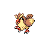

# Route 1 — Wild Pokémon

### Grass, Morning / Day

| Sprite | Pokémon | Encounter Type | Level | Chance |
|:------:|---------|:--------------:|-------|--------|
|  | [Pidgey](../../pokemon/pidgey.md) | {: style="max-width: 24px;"" } {: style="max-width: 24px;"" } {: style="max-width: 24px;"" }| 48 – 60 | 20% |
|  | [Rattata](../../pokemon/rattata.md) | {: style="max-width: 24px;"" } {: style="max-width: 24px;"" } {: style="max-width: 24px;"" }| 48 – 60 | 20% |
|  | [Sentret](../../pokemon/sentret.md) | {: style="max-width: 24px;"" } {: style="max-width: 24px;"" } {: style="max-width: 24px;"" }| 48 – 60 | 10% |
|  | [Zigzagoon](../../pokemon/zigzagoon.md) | {: style="max-width: 24px;"" } {: style="max-width: 24px;"" } {: style="max-width: 24px;"" }| 48 – 60 | 10% |
|  | [Bidoof](../../pokemon/bidoof.md) | {: style="max-width: 24px;"" } {: style="max-width: 24px;"" } {: style="max-width: 24px;"" }| 48 – 60 | 10% |
|  | [Starly](../../pokemon/starly.md) | {: style="max-width: 24px;"" } {: style="max-width: 24px;"" } {: style="max-width: 24px;"" }| 48 – 60 | 10% |
|  | [Pidgeotto](../../pokemon/pidgeotto.md) | {: style="max-width: 24px;"" } {: style="max-width: 24px;"" } {: style="max-width: 24px;"" }| 48 – 60 | 5% |
|  | [Raticate](../../pokemon/raticate.md) | {: style="max-width: 24px;"" } {: style="max-width: 24px;"" } {: style="max-width: 24px;"" }| 48 – 60 | 5% |
|  | [Furret](../../pokemon/furret.md) | {: style="max-width: 24px;"" } {: style="max-width: 24px;"" } {: style="max-width: 24px;"" }| 48 – 60 | 5% |
|  | [Staravia](../../pokemon/staravia.md) | {: style="max-width: 24px;"" } {: style="max-width: 24px;"" } {: style="max-width: 24px;"" }| 48 – 60 | 5% |

### Grass, Night

| Sprite | Pokémon | Encounter Type | Level | Chance |
|:------:|---------|:--------------:|-------|--------|
|  | [Hoothoot](../../pokemon/hoothoot.md) | {: style="max-width: 24px;"" } {: style="max-width: 24px;"" }| 48 – 60 | 20% |
|  | [Rattata](../../pokemon/rattata.md) | {: style="max-width: 24px;"" } {: style="max-width: 24px;"" }| 48 – 60 | 20% |
|  | [Ponyta](../../pokemon/ponyta.md) | {: style="max-width: 24px;"" } {: style="max-width: 24px;"" }| 48 – 60 | 10% |
|  | [Zigzagoon](../../pokemon/zigzagoon.md) | {: style="max-width: 24px;"" } {: style="max-width: 24px;"" }| 48 – 60 | 10% |
|  | [Bidoof](../../pokemon/bidoof.md) | {: style="max-width: 24px;"" } {: style="max-width: 24px;"" }| 48 – 60 | 10% |
|  | [Shinx](../../pokemon/shinx.md) | {: style="max-width: 24px;"" } {: style="max-width: 24px;"" }| 48 – 60 | 10% |
|  | [Noctowl](../../pokemon/noctowl.md) | {: style="max-width: 24px;"" } {: style="max-width: 24px;"" }| 48 – 60 | 5% |
|  | [Raticate](../../pokemon/raticate.md) | {: style="max-width: 24px;"" } {: style="max-width: 24px;"" }| 48 – 60 | 5% |
|  | [Rapidash](../../pokemon/rapidash.md) | {: style="max-width: 24px;"" } {: style="max-width: 24px;"" }| 48 – 60 | 5% |
|  | [Luxio](../../pokemon/luxio.md) | {: style="max-width: 24px;"" } {: style="max-width: 24px;"" }| 48 – 60 | 5% |

### Meridian Sound

| Sprite | Pokémon | Encounter Type | Level | Chance |
|:------:|---------|:--------------:|-------|--------|
|  | [Staraptor](../../pokemon/staraptor.md) | {: style="max-width: 24px;"" }| 48 – 60 | 50% |
|  | [Bibarel](../../pokemon/bibarel.md) | {: style="max-width: 24px;"" }| 48 – 60 | 50% |

### Pastoral Sound

| Sprite | Pokémon | Encounter Type | Level | Chance |
|:------:|---------|:--------------:|-------|--------|
|  | [Furret](../../pokemon/furret.md) | {: style="max-width: 24px;"" }| 48 – 60 | 50% |
|  | [Skiploom](../../pokemon/skiploom.md) | {: style="max-width: 24px;"" }| 48 – 60 | 50% |

### Swarm

| Sprite | Pokémon | Encounter Type | Level | Chance |
|:------:|---------|:--------------:|-------|--------|
|  | [Linoone](../../pokemon/linoone.md) | {: style="max-width: 24px;"" }| 48 – 60 | 100% |

