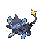
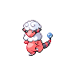
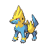

# Route 10 — Wild Pokémon

### Grass

| Sprite | Pokémon | Encounter Type | Level | Chance |
|:------:|---------|:--------------:|-------|--------|
|  | Fearow | {: style="max-width: 24px;"" } | 47 – 52 | 20% |
|  | Luxio | {: style="max-width: 24px;"" } | 47 – 52 | 20% |
|  | Electrode | {: style="max-width: 24px;"" } | 47 – 52 | 15% |
|  | Flaaffy | {: style="max-width: 24px;"" } | 47 – 52 | 10% |
|  | Raticate | {: style="max-width: 24px;"" } | 47 – 52 | 10% |
|  | Manectric | {: style="max-width: 24px;"" } | 47 – 52 | 10% |
|  | Electabuzz | {: style="max-width: 24px;"" } | 47 – 52 | 10% |
|  | Pikachu | {: style="max-width: 24px;"" } | 47 – 52 | 5% |

### Meridian Sound

| Sprite | Pokémon | Encounter Type | Level | Chance |
|:------:|---------|:--------------:|-------|--------|
|  | Luxray | {: style="max-width: 24px;"" } | 47 – 52 | 50% |
|  | Ampharos | {: style="max-width: 24px;"" } | 47 – 52 | 50% |

### Pastoral Sound

| Sprite | Pokémon | Encounter Type | Level | Chance |
|:------:|---------|:--------------:|-------|--------|
|  | Pichu | {: style="max-width: 24px;"" } | 47 – 52 | 50% |
|  | Elekid | {: style="max-width: 24px;"" } | 47 – 52 | 50% |

### Surf

| Sprite | Pokémon | Encounter Type | Level | Chance |
|:------:|---------|:--------------:|-------|--------|
|  | Fearow | {: style="max-width: 24px;"" } | 47 – 52 | 60% |
|  | Chinchou | {: style="max-width: 24px;"" } | 47 – 52 | 40% |

### Old Rod

| Sprite | Pokémon | Encounter Type | Level | Chance |
|:------:|---------|:--------------:|-------|--------|
|  | Chinchou | {: style="max-width: 24px;"" } | 10 | 100% |

### Good Rod

| Sprite | Pokémon | Encounter Type | Level | Chance |
|:------:|---------|:--------------:|-------|--------|
|  | Chinchou | {: style="max-width: 24px;"" } | 25 | 93% |
|  | Lanturn | {: style="max-width: 24px;"" } | 25 | 7% |

### Super Rod

| Sprite | Pokémon | Encounter Type | Level | Chance |
|:------:|---------|:--------------:|-------|--------|
|  | Lanturn | {: style="max-width: 24px;"" } | 50 | 100% |

