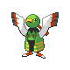
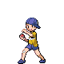
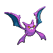
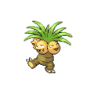

# Route 11 — Trainer Rosters

### Generic Trainers

| Trainer | P1 | P2 | P3 | P4 | P5 | P6 |
|:-------:|:--:|:--:|:--:|:--:|:--:|:--:|
|  Psychic Fidel |  Xatu Lv. 60 |
|  Youngster Owen |  Blaziken Lv. 60 |
|  Youngster Jason |  Fearow Lv. 59 |  Crobat Lv. 59 |
|  Psychic Herman |  Exeggcute Lv. 58 |  Chimecho Lv. 58 |  Exeggutor Lv. 58 |

