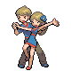
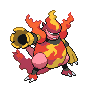

# Route 12 — Trainer Rosters

### Generic Trainers

| Trainer | P1 | P2 | P3 | P4 | P5 | P6 |
|:-------:|:--:|:--:|:--:|:--:|:--:|:--:|
| ") Fisherman Kyle [(!)](#rematches) |  Goldeen Lv. 58 |  Qwilfish Lv. 58 |  Seaking Lv. 59 |
|  Bird Keeper Justin |  Xatu Lv. 58 |  Noctowl Lv. 59 |
|  Fisherman Martin |  Octillery Lv. 60 |  Mantine Lv. 60 |
|  Young Couple Vic & Tara |  Sunflora Lv. 60 |  Magmortar Lv. 60 |
|  Fisherman Stephen |  Quagsire Lv. 58 |  Qwilfish Lv. 58 |  Tentacruel Lv. 58 |
|  Bird Keeper Gail |  Fearow Lv. 58 |  Chatot Lv. 58 |
|  Fisherman Barney |  Gyarados Lv. 50 |  Magikarp Lv. 84 |  Feebas Lv. 93 |
| ") Fisherman Kyler [(!)](#rematches) |  Poliwhirl Lv. 57 |  Seaking Lv. 57 |  Corsola Lv. 57 |

### Rematches

| Trainer | P1 | P2 | P3 | P4 | P5 | P6 |
|:-------:|:--:|:--:|:--:|:--:|:--:|:--:|
| ") Fisherman Kyle (W10a-8p) |  Seaking Lv. 62 |  Qwilfish Lv. 62 |  Seaking Lv. 62 |
| ") Fisherman Kyle (W10a-8p) |  Seaking Lv. 65 |  Qwilfish Lv. 65 |  Kingler Lv. 65 |  Seaking Lv. 65 |
| ") Fisherman Kyle (W10a-8p) |  Seaking Lv. 68 |  Qwilfish Lv. 68 |  Kingler Lv. 68 |  Seaking Lv. 68 |
| ") Fisherman Kyler (Th10a-8p) |  Poliwrath Lv. 62 |  Relicanth Lv. 62 |  Seaking Lv. 62 |  Corsola Lv. 62 |
| ") Fisherman Kyler (Th10a-8p) |  Poliwrath Lv. 65 |  Relicanth Lv. 65 |  Seaking Lv. 65 |  Corsola Lv. 65 |
| ") Fisherman Kyler (Th10a-8p) |  Poliwrath Lv. 69 |  Relicanth Lv. 69 |  Seaking Lv. 69 |  Corsola Lv. 69 |

